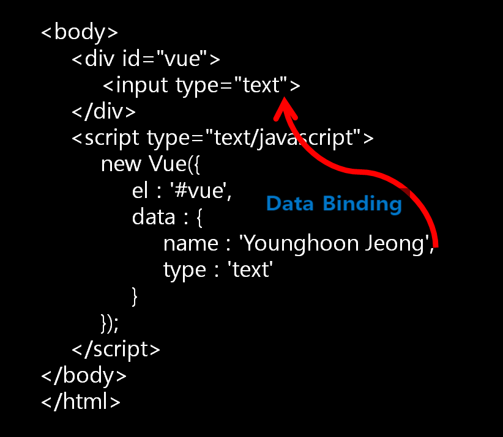

# 1.1.10 MVVM 패턴

## MVVM 패턴이란?
- Model + View + **View Model**를 합친 용어


## 구조


- **Model** : 어플리케이션에서 사용되는 데이터와 그 데이터를 처리하는 부분
- **View** : 사용자에서 보여지는 UI 부분
- **View Model** : View를 표현하기 위해 만든 **View를 위한 Model**, **View를 나타내 주기 위한 Model**이자 **View를 나타내기 위한 데이터 처리**를 하는 부분

## 동작

1. 사용자의 Action들은 View를 통해 들어오게 됨
2. View에 Action이 들어오면, **Command 패턴으로 View Model에 Action을 전달**
3. View Model은 Model에게 데이터를 요청
4. Model은 View Model에게 요청받은 데이터를 응답
5. View Model은 응답 받은 데이터를 가공하여 저장
6. **View는 View Model과 Data Binding**하여 화면을 나타냄


## 특징
- View Model은 View를 더 추상화한 계층
- MVVM 패턴은 Command 패턴과 Data Binding 두 가지 패턴을 사용하여 구현됨
- **Command 패턴과 Data Binding**을 이용하여 **View와 View Model 사이의 의존성을 없앴음**
- **View Model과 View는 1:n 관계**

## 장점
- MVVM 패턴은 **View와 Model 사이의 의존성이 없음**
- Command 패턴과 Data Binding을 사용하여 **View와 View Model 사이의 의존성 또한 없앤** 디자인패턴
- 각각의 부분은 독립적이기 때문에 **모듈화 하여 개발**할 수 있음
- **View와 View Model 사이의 양방향 데이터 바인딩**을 지원하며 UI를 별도의 코드 수정없이 재사용할 수 있고 단위 테스팅하기 쉬움


> [참고] 관련 용어
- **Command 패턴** :
  - 커맨드 패턴을 이용하면 요구 사항을 객체로 캡슐화 할 수 있으며, 매개변수를 써서 여러 가지 다른 요구 사항을 집어넣을 수도 있음
  - 또한 요청 내역을 큐에 저장하거나 로그로 기록할 수도 있으며, 작업취소 기능도 지원 가능함
  - 커맨드 패턴은 결과를 위한 계산과정의 각 부분들을 캡슐화 시킬 수 있음. 계산의 결과를 원하는 클라이언트는 사실 과정은 궁금하지 않고 결과만 올바르게 출력되면 됨
  - 이런 Needs에 의해 커맨드 패턴은 계산과정을 캡슐화하고, 클라이언트는 단순히 계산을 해달라는 명령만 수행함으로써 원하는 결과를 얻어낼 수 있음
  - 예시)
    - 식당에서 손님이 주문을 한다고 생각
    - 손님은 가게에서 주문서를 작성하고 웨이터에게 주문서를 넘김
    - 웨이터는 주문서를 받아서 주방으로 넘김
    - 주방장은 주문서를 보고 요리를 만듦
    - 손님은 주문만 할뿐 그 이후는 어떻게 되는지 알지 못하고 알 필요도 없음. 그냥 음식만 주문한대로 나오기만 하면됨 
    - 웨이터는 손님에게 주문서를 받고 주방장에게 넘기기만 하면됨. 요리를 어떤식으로 하든 상관없고 그냥 음식만 나오면 된됨 
    - 요리사는 밖에서 무슨일이 있던지 그냥 주문서에 있는 내용대로 요리만 하면됨 .어떤 고객이 주문을 했는지는 전혀 상관없음
    - 함수 표현으로 나타내면, 손님은 createOrder 메소드를 호출 (메소드를 호출할때 자신이 주문한 내용을 담은 객체를 파라미터로 전달)
    - 웨이터는 주문을 접수하고, orderUp 메소드를 호출
    - 주문서를 받은 주방장은 주문서에 따라 makeFood 메소드를 실행 
    - 손님부터 주방장까지 연결된 동작이지만 자신이 필요한 결과를 요청(명령)만 할뿐 그 과정에 대해서는 알지 못함 ( = 각 인물들의 동작은 분리되어있음)

- **데이터 바인딩 (Data-Binding)** :
  - 바인딩(Binding)이란 묶는다는 의미로, 웹 프로그래밍에서는 UI를 통해 표시하고자 하는 데이터를 실제 데이터와 연결해 주는 프로세스
  - ```html
    <!DOCTYPE html>
    <html>
    <head>
        <meta charset='utf-8'>
        <meta http-equiv='X-UA-Compatible' content='IE=edge'>
        <title>Page Title</title>
        <meta name='viewport' content='width=device-width, initial-scale=1'>
        <script src="https://cdn.jsdelivr.net/npm/vue"></script> <!-- Vue.js 라이브러리를 당겨옴 -->
    </head>
    <body>
        <div id="vue">
            <input type="text">
        </div>
        <script type="text/javascript">
            new Vue({
                el : '#vue',
                data : {
                    name : 'Younghoon Jeong',
                    type : 'text'
                }
            });
        </script>
    </body>
    </html>
    ```
  - 위 HTML 소스 안에는 id가 'vue'인 div 태그 안에 input 태그가 하나 있음
  - 그런데 개발자는 DB 단에서 혹은 사용자가 보고 싶은 데이터를 가져와서 input 태그에 표시해 주고 싶음
  - 이때, 사용자가 보고 싶은 데이터를 input 태그에 넣어주는 것, 즉 연결해 주는 것을 데이터 바인딩이라고 함
  - 데이터의 변화를 감지해 템플릿과 결합해 화면을 갱신, 화면 입력에 따라 데이터를 갱신하는 것
  - HTML -> JS, JS -> HTML 양쪽 모두 가능


## 예시 (Vue.js)
- 반응형이 특징인 프론트엔드 프레임워크
- watch와 computed 등으로 쉽게 반응형적인 값들 구축 가능
  - computed : 이미 정의된 계산식에 따라 결과값을 반환할 때 사용
  - watch : 어떤 특정 조건에서 함수를 실행시키기 위한 트리거로서 사용 가능
- 함수를 사용하지않고 값 대입만으로 변수가 변경
- 양방향 바인딩, html 토대로 컴포넌트 구축 가능
- 재사용 가능한 컴포넌트 기반으로 UI 구축 가능

### Vue.js에서의 데이터 바인딩



- Vue.js에서도 Vue 객체에서 정의된 데이터를 직접 요소에 연결할 수 있도록 지원
- HTML 소스의 input 박스에 Vue 객체에서 정의한 name 데이터를 바인딩
- 먼저, Vue.js에서 데이터를 바인딩 하기 위해 사용하는 예약어(v-bind:)가 있음
- ```html
    v-bind:속성명="데이터 혹은 함수"
  ```
- input 박스의 value 값에 Vue 객체에서 정의한 'name'이라는 데이터로 바인딩
- ```html
    <div id="vue">
    <input v-bind:value="name">
    </div>
  ```


 

