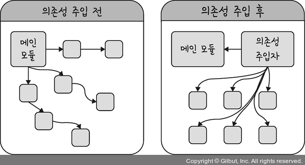

# 1.1.1 싱글톤 패턴(Singleton pattern)

## 1. 싱글톤 패턴이란?
- **하나의 클래스에 오직 하나의 인스턴스**만 가지는 패턴<br>

- 객체의 생성과 관련된 패턴
- 동일한 자원이나 데이터를 처리하는 객체가 불필요하게 여러 개 만들어지는 것을 방지
- 데이터베이스 연결 모듈에 많이 사용됨
- 하나의 인스턴스를 만들어 놓고 해당 인스턴스를 다른 모듈들이 공유하며 사용
<br><br>

---
## 2. 구현 with Python

```python
class Singleton(object):
  def __new__(cls):   
    # __new__: 인스턴스를 새로 만들 때 처음 실행되는 메서드
    
    if not hasattr(cls, 'Instance'):
      # hasattr(object, name): object에 name에 해당하는 attribute가 있다면 true, 없다면 false 반환
      print('create')  # 생성
      cls.instance = super(Singleton, cls).__new__(cls)
      # cls의 instance 변수에 새로운 인스턴스를 생성해서 담기
      # 없을 경우 새로운 객체를 생성해서 instance에 담아 반환
      # 클래스 내부에 instance가 존재하면 생성된 instance 반환
    
    else:
      print('recycle')  # 재사용
      return cls.instance
      # hasattr() 메소드로 True/False를 판별하기 때문에 생성 후에는 기존 인스턴스만 반환

print('1번째 생성')
s1 = Singleton() # create
print('2번째 생성')
s2 = Singleton() # recycle
print('s1 == s2')
print(s1==s2) # true
```
<br>

---
## 3. 장점
- 하나의 인스턴스를 다른 모듈과 공유하기 때문에 **인스턴스를 생성하는 비용이 줄어든다.**
  -  데이터베이스 연결 모듈에 사용한 경우, 데이터베이스 연결에 관한 인스턴스 생성 비용을 아낄 수 있다.
<BR><br>

- 다른 클래스 간에 **데이터 공유가 쉽다.**
  - 싱글톤 인스턴스가 전역으로 사용되는 인스턴스이기 때문에 다른 클래스의 인스턴스들이 접근하여 사용할 수 있다.

<br><br>

---
## 4. 단점
- TDD(Test Driven Devlopment)를 할 때 단위테스트를 주로 하는데, 이는 테스트가 독립이고, 순서의 영향을 받지 않아야 한다. 하지만 싱글톤 패턴은 독립적인 인스턴스를 만들기가 어렵다.
<BR><br>

- 의존성이 높아진다.
  - 종속성이라고도 하며, A가 B에 의존성이 있다는 것은 B의 변경사항에 대해 A도 변경되어야 한다는 것을 의미한다.

- 모듈 간의 결합을 강하게 만든다.
  - **의존성 주입**(DI, Dependency Injection)을 통해 해결할 수 있다.
  - 의존성 주입: 의존성 주입자가 개입하여 메인 모듈이 간접적으로 의존성을 주도록 하는 방식
  - 모듈들을 쉽게 교체할 수 있는 구조가 되며, 모듈 간의 관계들이 보다 명확해진다는 장점 있다.
  - 모듈들이 분리되어 클래스 수가 늘어나 복잡성이 증가될 수 있다. (런타임 증가)
  - 의존성 주입 원칙
    - (1) 상위 모듈은 하위 모듈에서 어떤 것도 가져와서는 안된다.
    - (2) 둘다 추상화에 의존해야하며, 세부 사항에 의존하지 말아야 한다.
<br><br>



---
## 참고
- [객체 vs. 인스턴스](https://gmlwjd9405.github.io/2018/09/17/class-object-instance.html)
- [구현 코드 출처](https://jroomstudio.tistory.com/41)
- [장단점](https://velog.io/@devroomie/CS-%EC%8A%A4%ED%84%B0%EB%94%94-1.1-%EB%94%94%EC%9E%90%EC%9D%B8-%ED%8C%A8%ED%84%B4)


---