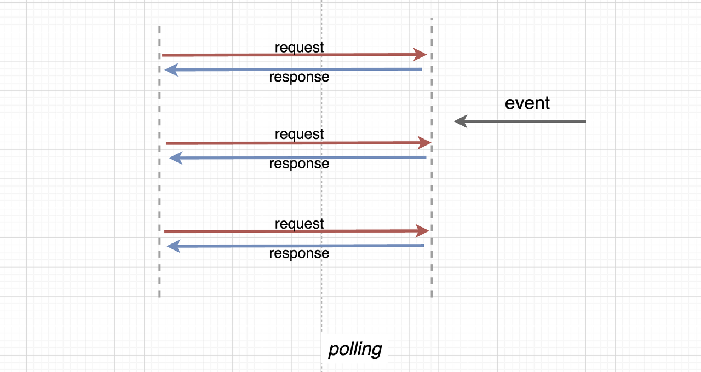

<h1> 1.1.4 옵저버 패턴(observer pattern)</h1>


- <mark> **주체(subject)**가 **어떤 객체의 상태 변화**가 있을 때마다 그 객체에 의존(구독)하는 옵저버 목록에 있는 **옵저버들에게** 변화를 **알려주는** 디자인 패턴</mark>
- **분산 이벤트 핸들링 시스템**을 구현하는데 사용
- **발행/구독 모델**이라 불리기도 함
- 일방적인 단방향성 통보

---

<h2> 1. 용어 </h2>

- <h3> 주체</h3>
  
  - 객체의 상태변화를 관찰하고 있는 관찰자
  - 데이터의 주인
  
- <h3>옵저버</h3>

  - 어떤 객체 상태변화를 전달받는 객체
  - update() 메서드를 통해 주체로부터 state를 전달받음
  - 의존성을 가짐

- <h3>발행 구독 모델</h3>

  - 비동기 메세징 패러다임
  - 발신자는 메세지를 구독자에게만 전달, 수신자는 발행자에 대한 지식 없이 원하는 메세지만 수신
  - 이러한 발행-구독 디커플링은 다이나믹한 네트워크 토폴로지와 높은 확장성 허용

- <h3> 프록시(proxy) 객체 </h3>
  - 대상의 기본적인 동작(속성 접근, 할당, 순회, 열거, 함수 호출 등)을 가로챌 수 있는 객체

- <h3> DOM(Document Object Model) </h3>
  - 문서 객체 모델, 웹브라우저상의 화면을 이루고 있는 요소를 지칭

---
<h2>2. 옵저버 패턴 형태</h2>

1. **객체와 주체**가 **분리**된 옵저버 패턴
2. **객체와 주체**가 **합쳐**진 옵저버 패턴
  
---
<h2>3. 구현</h2>

- > "니가바뀌는지 보는중이야!"[옵저버]=========(관찰중)========>[객체] "내가바뀌면 넌 자동으로 알아야해"
- >                 [옵저버구현N개] "바뀌면 나도알려줘!"

<h3><mark> 3.1 옵저버 패턴 with Python </mark><h3>

```python
from abc import ABCMeta, abstractmethod

# 주체 인터페이스 선언
## 주체 클래스는 3개의 함수가 필수
## 1. 구독자(옵저버) 등록/ 2. 구독자(옵저버) 제거/ 3. 구독자에게 변경사항 알림
class Subject:
    # 파이썬은 인터페이스가 없으므로  ABCMeta클래스를 사용해 추상 클래스를 인터페이스처럼 사용해야 함
    # 그렇지 않으면 강한 결합의 문제를 갖게 됨.
    __metaclass__ = ABCMeta                 # Subject type을 ABCMeta로 선언    

    @ abstractmethod                        # 자식 클래스에서 내장함수 overrding 강제하기 위한 코드
    def register_observer(self):
        pass
    
    @ abstractmethod
    def remove_observer(self):
        pass
    
    @ abstractmethod
    def notify_observers(self):
        pass
    
# 옵저버 인터페이스 선언
# 옵저버 필수 함수 : update()_주체에서 변경사항 전달할 떄 사용하는 함수
class Observer:
    __metaclass__ = ABCMeta

    @abstractmethod
    def update(self, temperature, humidity, pressure):
        pass

    @abstractmethod
    def register_subject(self, subject):
        pass

# 주체자 관찰대상인 객체인 클래스 선언
class Leewonil(Subject): # ConcreteSubject
    
    def __init__(self):
        self._observers_list = list()
        self.happiness = 0
        self.sadness = 0

    def register_observer(self, observer):
        if observer in self._observers_list:
            return "Already exist observer!"
        return "Success register"
    
    def remove_observer(self, observer):
        if observer in self._observers_list:
            return "Success remove"
        return "observer does not exist." 

    # 옵저버에 알리는 부분
    def notify_observers(self):
        for observer in self._observer_list:
            observer.update(self.happiness, self.sadness)

    def emotionalChange(self):                      # set_emotional() 실행시 자동 실행됨
        self.notify_observers()                     # 감정이 변하면 옵저버에게 알림

    def set_emotional(self, happiness, sadness):    # 감정을 설정하면
        self.happiness = happiness                  # happiness인자가 happiness에 저장
        self.sadness = sadness                      # sadness인자가 sadness변수에 저장
        self.emotionalChanged()                     # 감정변화 함수 실행

class Emotion(Observer):                            # 옵저버 클래스
    def update(self, happiness, sadness):           # 업데이터 메서드가 실행되면 구독한 객체의 변화된 감정내용이 실행됨
        self.happiness = happiness
        self.sadness = sadness
        self.display()

    def register_subject(self, subject):
        self.subject = subject                      # 구독할 객체 
        self.subject.register_observer(self)        # 객체 클래스에 register_observer()함수 실행

    def display(self):
        print('LeeWonil emotion happiness:', self.happiness, ', sadness:', self.sadness)

def test():
    lwi_object = Leewonil()                         # 주체이자 구독대상 객체
    EmotionObj = Emotion()                          # 옵저버 객체 생성
    EmotionObj.register_subject(lwi_object)         # 구독할 객체 등록

    lwi_object.set_emotional('good', 'fine')         # 구독 대상 객체 감정변화1
    lwi_object.set_emotional('soso', 'soso')         # 구독 대상 객체 감정변화2
    lwi_object.set_emotional('fine', 'good')         # 구독 대상 객체 감정변화3

    if __name__ == 'main':
        test()
    
'''
LeeWonil emotion happiness: good , sadness: fine
LeeWonil emotion happiness: soso , sadness: soso
LeeWonil emotion happiness: fine , sadness: good
'''

```

<h3><mark> 3.2 옵저버 패턴 with java </mark><h3>

```java

import java.util.ArrayList;
import java.util.List;

// 주체 클래스 인터페이스
//주요기능 4가지
interface Subject {
    public void register(Observer obj);         // 옵저버 리스트에 등록
    public void unregister(Observer obj);       // 옵저버 리스트에서 제거    
    public void notifyObservers();              // 옵저버에게 변경사항 알리기
    public Object getUpdate(Observer obj);      // 구독 객체로부터 변경사항 받아오기    
}

//옵저버 클래스 생성 인터페이스
interface Observer {
    public void update();                       // **주체**가 변경사항을 옵저버에 전달할 때 사용하는 함수
}

// 주체 인터페이스를 **재구현**
class Topic implements Subject {
    private List<Observer> observers;           
    private String message;

    public Topic() {                           
        this.observers = new ArrayList<>();     // 옵저버들 담을 리스트
        this.message = "";                      // 관찰 객체로 받은 메세지 
    }

    @Override
    public void register(Observer obj) {        // 옵저버리스트에 없으면 포함
        if (!observers.contains(obj)) observers.add(obj); 
    }

    @Override
    public void unregister(Observer obj) {      // 제거
        observers.remove(obj); 
    }

    @Override
    public void notifyObservers() {
        // 8. 옵저버 리스트에 저장된 옵저버들의 업데이트 함수 실행
        this.observers.forEach(Observer::update); 
    }

    @Override
    public Object getUpdate(Observer obj) {
        // 10. 메세지 내용 리턴
        return this.message;
    } 
    
    public void postMessage(String msg) {      
        // 5. 관찰 객체가 포스트한 메세지 프린트
        System.out.println("Message sended to Topic: " + msg);
        // 6. 메세지를 객체변수에 저장
        this.message = msg;
        // 7. 옵저버에게 알리기 함수 실행
        notifyObservers();
    }
}

class TopicSubscriber implements Observer {
    private String name;
    private Subject topic;

    public TopicSubscriber(String name, Subject topic) {
        this.name = name;
        this.topic = topic;
    }

    @Override
    public void update() {
        // 9. 주체의 업데이트 내용 받기
        String msg = (String) topic.getUpdate(this); 
        // 11. 옵저버에서 메세지 프린트
        System.out.println(name + ":: got message >> " + msg); 
    } 
}

public class HelloWorld { 
    public static void main(String[] args) {
        Topic topic = new Topic(); // 1. 관찰 객체이자 주체 생성
        // 2. 옵저버 생성
        Observer a = new TopicSubscriber("a", topic); 
        Observer b = new TopicSubscriber("b", topic);
        Observer c = new TopicSubscriber("c", topic);
        // 3. 주체에 옵저버 등록
        topic.register(a);
        topic.register(b);
        topic.register(c);
        // 4. 관찰 대상이 메세지 포스트
        topic.postMessage("amumu is op champion!!"); 
    }
}
/*
Message sended to Topic: amumu is op champion!!
a:: got message >> amumu is op champion!!
b:: got message >> amumu is op champion!!
c:: got message >> amumu is op champion!!
*/

```

 <h3> <mark> 3.3 옵저버 패턴 with java Script </mark><h3> 

 <h4>
- **프록시 객체**를 통해 구현
- 2개의 매개변수 가짐
  
  - **target** : 프록시할 대상
  - **handler** : 프록시할 객체의 target 동작을 가로채서 정의할 동작들을 정해져 있는 함수
    - get() : 속성과 함수에 대한 접근을 가로챔
    - has() : in연산자의 사용을 가로챔
    - set() : 속성에 대한 접근을 가로챔
</h4>


```javascript
// set()함수를 통해 속성에 대한 접근을 가로채서 형규라는 속성이 솔로에서 커플로 되는 것을 감시!ㄴ
function createReactiveObject(target, callback) { 
    const proxy = new Proxy(target, {           //프록시 객체의 인자 : target, handler
        set(obj, prop, value) {                 // set handler
            if (value !== obj[prop]) {          // 객체의 속성이 value와 다르다면?
                const prev = obj[prop]
                obj[prop] = value               // 변경되었을 때 속성을 가로챔
                callback(`${prop}가 [${prev}] >> [${value}] 로 변경되었습니다. `)
            }
            return true
        }
    })
    return proxy 
} 
const a = {
    "형규" : "솔로"
} 
const b = createReactiveObject(a, console.log)
b.형규 = "솔로"
b.형규 = "커플"
// 형규가 [솔로] >> [커플] 로 변경되었습니다.
```


---
<h2>4. 적용 사례 </h2>

<h3>(1) MVC 패턴 구조</h3>


- 하나의 모델에 대하여 다수의 뷰가 모델을 구독하는 형태
  - 컨트롤러의 중재를 받음
  1. 특정 뷰(객체)에서 클라이언트 데이터 수집
  2. 컨트롤러를 통해 모델에 전달
  3. 모델(주체)에서 변경사항이 생겨 update()메서드로 여러 view(옵저버들)에 state 데이터 통보
  4. view에서 state 데이터를 기반으로 controller 작동

<h3>(2) 과도한 polling 방지</h3>

**<h5>polling : 상태를 주기적으로 확인하고 만약 조건을 만족할 시 자료처리를 하는 방식</h5>**



> 짧은 주기로 관찰하면 부하가 발생하며 긴 주기로 관찰할 시, 실시간성이 떨어지는 문제

- 옵저버 패턴 적용으로, 관찰 대상의 상태 변경을 감지할 수 있으므로 polling 불필요!
- 불필요한 요청 제거를 통한 비용절감
  - 수시로 상태 변화에 대한 요청 시, 비용 발생
  - 여러 객체일 경우, 비용 급증
  
<h3>(3) 모듈간 의존성 낮출 때 유용</h3>

>하지만 만약 A, B 모듈이 서로의 데이터가 필요한 경우에는 어떻게 해야할까?

- A, B 모듈을 합치는 건 상호 의존성을 높이며, 이는 유지 보수 측면에서 좋지 않다.ㅡㅁ가
- 이 경우, 옵저버 패턴을 이용!
  1. A, B 모듈이 서로 필요로 하는 데이터의 변화를 감지하는 관찰자 객체(옵저버) 생성
  2. 데이터 변경마다 각 모듈은 주체에게 데이터와 상태 변경 통보
  3. 주체는 데이터 변경에 따른 로직을 실행.

  
<h3>(4) 분산 이벤트 핸들링 시스템</h3>
  
  - **이벤트 기반 분산 처리시스템**
    - 분산시스템에서는 싱크 일치가 중요!
    - 이벤트가 게시되면(이벤트 기반) 여러 시스템 간의 동작을 일관성 있게 처리하여 마치 하나의 프로세스가 처리하는 것처럼 수행하는 시스템(분산 핸들링 시스템)


<h2> 참고</h2>
<h3> 자바: 상속과 구현</h3>
<h4> 상속(extends)</h4>
- 자식클래스가 부모클래스의 메서드 등을 상속받아 사용
- 추가 및 확장할 수 있음
- 중복성 최소화와 재사용성 증가
  
<h4> 구현(implements)</h4>
- 부모의 인터페이스를 자식 클래스에서 재정의하여 구현

<h4> 차이점 </h4>
- 상속과 달리 <mark>구현은 부모 클래스의 메서드를 무조건 재정의하여 구현해야 함</mark>
- 상속은 일반클래스, abstract클래스를 기반으로 구현
- 구현은 인터페이스를 기반으로 구현
