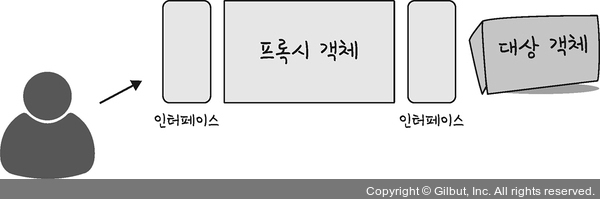
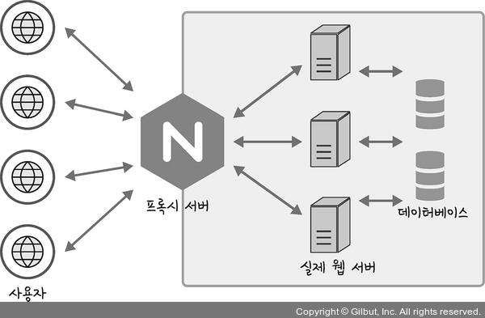

<h1> 프록시 패턴, Proxy Pattern</h1>
---

- **대상 객체**에 접근하기 전 그 **접근에 대한 흐름을 가로채** 대상 **객체 앞단의 인터페이스 역할**을 하는 디자인 패턴
- 객체의 속성, 변환 등을 보완
- 보안, 데이터 검증, 캐싱, 로깅에 사용
- 프록시 서버로도 활용됨
  
**<h2> 1. 용어 </h2>**

**<h3> 캐싱 </h3>**

- 캐시(Cache)라고 하는 좀 더 빠른 메모리 영역으로 데이터를 가져와서 접근하는 방식
- 프록시 서버에서 캐싱 : 캐시 안에 있는 정보를 멀리 있는 원격 서버에 요청하지 않고 캐시 안에 데이터를 활용하는 방법
- 트래픽을 줄일 수 있다는 장점
  
**<h3> 버퍼 오버플로우 </h3>**
- `버퍼` : 데이터가 저장되는 메모리 공간
- 버퍼를 벗어나는, 즉 `메모리 공간을 벗어나는 경우`
- 이때, 사용하지 않아야 할 영역에 데이터가 덮어씌워져 주소, 값이 바꾸는 공격이 발생하기도 함
  
**<h3> gzip </h3>**
- LZ77과 Huffman 코딩의 조합인 DEFLATE 알고리즘을 기반으로 한 압축 기술
- Gzip 사용 시, `데이터 전송량을 줄일` 수 있지만 압축해제할 때 `서버에서의 CPU 오버헤드`도 고려해야 함
  
  

**<h2> 2. 프록시 서버 </h2>**

<<<<<<< HEAD

- 서버와 클라이언트 사이에 **클라이언트가** 자신을 통해 **다른 네트워크 서비스에 간접적으로 접속****할 수 있게** 해주는 컴퓨터 시스템이나 응용 프로그램
=======
- 서버와 클라이언트 사이에 **클라이언트가** 자신을 통해 **다른 네트워크 서비스에 간접적으로 접속**할 수 있게 해주는 컴퓨터 시스템이나 응용 프로그램
>>>>>>> 3c143a80b8fbb7b53433bcf08527d8d40adc5666

**<h3> 2.1 프록시 서버 활용 사례 </h3>**

**<h4> 2.1.1 nginx </h4>**
- node.js의 `버퍼 오버플로우 취약점`을 예방하기 위해 `nginx 프록시 서버로 앞단`에 놓고 Node.js를 뒤쪽에 놓음
- 프록시 서버로 사용
- 비동기 이벤트 기반의 구조와 다수의 연결을 효과적으로 처리 가능한 웹 서버
- 주로 node.js 서버 앞단의 프록시 서버로 활용됨.
  - `익명 사용자의 직접적인 서버로의 접근을 차단`하고 간접적으로 `한 단계를 더 거침`으로써 `보안성을 더욱 강화`
- 위 그림처럼, `실제 포트를 숨기`거나 `정적자원을 gzip 압축`하거나 `메인 서버 앞단의 로깅`을 할 수 있음
 
**<h4> 2.1.2 CloudFlare </h4>**

- CDN(콘텐츠 전달 네트워크)서비스 : 전 세계적으로 분산된 서버를 통해 어떠한 시스템의 콘텐츠를 빠르게 전달하는 서비스
 
**<h4> 2.1.3 DDOS공격 방어 </h4>**
- 
- HTTPS 구축

