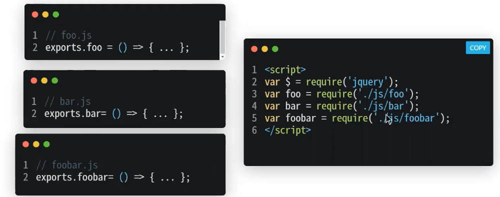

# 1.1.7 노출모듈 패턴 (Revealing Module Pattern)

- 자바스크립트의 문제점 중 하나가 **네임스페이스(Namespace)가 없다**는 것!
- private나 public같은 접근 제어자가 존재하지 않고 전역 범위에서 스크립트가 실행된다.
- **전역 범위에서 실행되는 프로그램**은 내부 application과 종속된 라이브러리 코드의 데이터들로 인해 **충돌이 발생**할 수 있다.
- 이 문제를 해결하기 위해 **노출식 모듈 패턴**을 사용해야 한다!
- 즉, 노출모듈 패턴이란 <mark>**즉시 실행 함수를 통해 private, public 같은 접근 제어자를 만드는 패턴**</mark>을 말한다!


---
## 용어

- <mark>모듈 패턴</mark> :
  - 관련이 있는 변수와 함수를 모아 **즉시 실행 함수로 감싸 하나의 모듈**을 만드는 것
  - 모듈 패턴의 특징은 **전역 변수의 억제**는 물론 캡슐화까지 구현 할 수 있다는 것
  - 캡슐화란 객체의 상태를 나타내는 프로퍼티와 프로퍼티를 참조하고 조직할 수 있는 동작인 메서드를 하나로 묶는 것을 말함
-  <mark>즉시 실행 함수</mark> :
   - Immediately-invoked function expression (IIFE)
   - ```python
      (function () {
      // statements
      })()
     ```  
   - 함수 표현(Function Expression)은 함수를 정의하고, 변수에 함수를 저장하고 실행하는 과정을 거친다.
   - 하지만 즉시 실행 함수는 함수를 정의하고 바로 실행하여 이러한 과정을 거치지 않는다.
   - 즉, **함수를 정의하자마자 바로 호출**하는 것!
-  <mark> 네임스페이스 </mark> :
   -  이름이 존재하는 공간
   -  즉, 이름들을 한 곳에 모아 충돌을 미리 방지하고 해당 이름으로 선언된 변수와 함수를 쉽게 가져다 쓸 수 있도록 만든 매커니즘
   -  **네임스페이스 패턴**은 애플리케이션 or 라이브러리를 위한 하나의 전역객체를 생성 후 그 안에 필요한 모든 기능을 프로퍼티로 정의하는 것
      -  Java : 패키지
      -  C++ : 네임스페이스
      -  Javascript : 따로 기능이 없는 대신, 객체 리터럴과 즉시 실행 함수를 통해 그 기능을 대신함 
-  <mark>전역 범위</mark> :
   -  JavaScript 함수 안에 선언된 변수는 그 함수에 대해서 지역(LOCAL) 이 된다.
   - 지역 변수(Local variables)는 지역 범위(local scope)를 가진다 -> 그들은 그 함수 안에서만 접근할 수 있다. 
   - 함수 바깥에 선언된 변수는 전역(GLOBAL)이 된다. 
   - 전역 변수는 전역 범위(global scope)를 가진다 -> 웹페이지의 모든 스크립트와 함수가 그것에 접근할 수 있다.
-  <mark>접근 제어자 (Access Modifier)</mark>:
   -  인스턴스의 멤버에 대한 접근 권한을 지정
    - **public** : 클래스 내부, 외부 모두 접근 가능
    - **protected** : 클래스 내부간 같은 상속 구조라면 접근이 가능
    - **private** : 같은 상속 구조라도 접근이 불가능하며 내부에서만 접근 가능
---
## 구현
```javascript
 const pukuba = (() => {
    const a = 1         // 이 영역은 private
    const b = () => 2
    const public = {    // 외부에 노출하고 싶은 변수나 함수
        c : 2, 
        d : () => 3
    }
    return public       // 노출하고 싶은 애들만 반환! (노출하고 싶지 않은 변수나 함수는 반환 객체에 추가 x) 
})() 
console.log(pukuba)
console.log(pukuba.a)
// { c: 2, d: [Function: d] }
// undefined
 ```
 - **자기 호출 함수**를 사용하여 **private 범위를 만들고** **공개될 부분만 반환**!
 - a와 b는 다른 모듈에서 사용할 수 없는 변수나 함수이며 private 범위를 가진다.
 - c와 d는 다른 모듈에서 사용할 수 있는 변수나 함수이며 public 범위를 가진다.
- 노출 모듈 패턴을 기반으로 만든 자바스크립트 모듈 방식으로는 CJS(CommonJS)모듈 방식이 있다.




  - CommonJS(http://www.commonjs.org/) 는 JavaScript를 브라우저에서뿐만 아니라, 서버사이드 애플리케이션이나 데스크톱 애플리케이션에서도 사용하려고 조직한 자발적 워킹 그룹
  - 기본적으로 자바스크립트의 서버사이드를 어떻게 범용적으로 모든 사람들이 잘 쓸 수 있을 것인가에 대한 논의에서 나온 방법이 모듈화
    - 모듈의 3가지 특징
      - scope를 가진다.
      - 모듈 정의는 exports 객체를 사용한다.
      - 모듈 사용은 require 함수를 사용한다.


