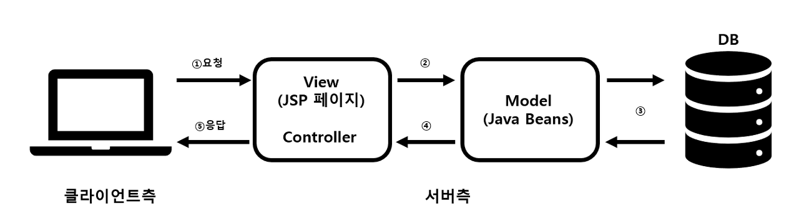
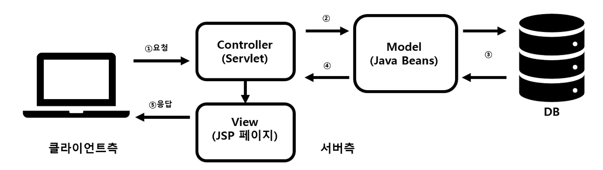
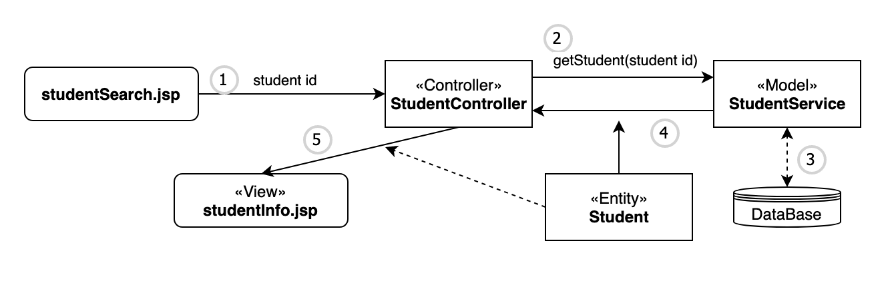

# 1.1.8 MVC 패턴

## MVC 패턴이란?

- MVC란 **Model-View-Controller**의 약자로 애플리케이션을 세 가지 역할로 구분한 개발 방법론
- MVC에서 **모델은 애플리케이션의 데이터**를 나타내며, **뷰는 텍스트, 체크박스 항목 등과 같은 사용자 인터페이스 요소**를 나타내고, **컨트롤러는 데이터와 비즈니스 로직 사이의 상호동작을 관리**
- **도메인(비즈니스 로직) 영역과 UI 영역이 분리**되어 서로 영향을 주지 않고 유지보수 가능
- 개발 프로세스에서 각각의 구성요소에만 집중해서 개발 가능
- **재사용성, 확장성** 용이
- 애플리케이션이 복잡해질수록 모델과 뷰의 관계가 복잡해지는 단점이 있음
- 아래 그림처럼 **사용자가 Controller를 조작**하면 **Controller는 Model을 통해 데이터를 가져오고** 그 **데이터를 바탕으로 View를 통해 시각적 표현을 제어하여 사용자에게 전달**
- 해당 패턴을 사용하면, 사용자 인터페이스로부터 비즈니스 로직을 분리하여 애플리케이션의 시작적 요소나 그 이면에서 실행되는 비즈니스 로직을 서로 영향 없이 쉽게 고칠 수 있는 애플리케이션을 만들 수 있게 됨
  

1. 사용자가 웹사이트에 접속 (Users)
2. Controller는 사용자가 요청한 웹페이지를 서비스하기 위해서 모델을 호출 (Manipulates)
3. Model은 데이터베이스나 파일과 같은 데이터 소스를 제어한 후 그 결과를 Return
4. Controller는 Model이 리턴한 결과를 View에 반영 (Updates)
5. 데이터가 반영된 View는 사용자에게 보여짐 (Sees)

### 위와 동일 내용
1. 사용자가 제출한 form 데이터가 Controller 에게 전달된다.
2. Controller 는 Model 에게 전달하고 새로운 데이터를 요청한다.
3. Model 은 로직을 처리하여 새로운 데이터를 연관된 View 에게 알린다.
4. View 는 받은 데이터를 통해 화면을 업데이트 한다.
5. 때로는 Controller 가 View 의 데이터를 직접 처리해서 View 에게 알리는 경우도 있다.
---

## 용어
- **Servlet(서블릿)**
  - 자바를 사용하여 웹을 만들기 위해 필요한 기술
  - 클라이언트가 어떠한 요청을 하면 그에 대한 결과를 다시 전송해주어야 하는데, 이러한 역할을 하는 자바 프로그램
  - **클라이언트의 요청에 대해 동적으로 작동하는 웹 어플리케이션 컴포넌트**
  - html을 사용하여 요청에 응답 (**자바 소스코드 속에 HTML코드**가 들어가는 형태)
  - MVC 패턴에서 **Controller**로 이용
  - 자바로 구현 된 ***CGI** (Common Gateway Interface)
    - 별도로 만들어 놓은 프로그램에 HTML의 Get or Post 방법으로 클라이언트의 데이터를 환경변수로 전달하고, 프로그램의 표준 출력 결과를 클라이언트에게 전송하는 것
    - 자바 어플리케이션 코딩을 하듯 웹 브라우저용 출력 화면을 만드는 방법
- **JSP(Java Server Page)**
  - **Java 코드가 들어가 있는 HTML 코드**
  - 자바 소스코드로 작성된 부분은 웹 브라우저로 보내는 것이아니라 웹 서버에서 실행되는 부분
  - 웹 프로그래머가 소스코드를 수정 할 경우에도 디자인 부분을 제외하고 자바 소스코드만 수정하면 되기에 효율을 높여줌
  - 컴파일과 같은 과정을 할 필요없이 JSP페이지를 작성하여웹 서버의 디렉토리에 추가만 하면 사용이 가능
  - JSP는 WAS(Web Application Server)에 의하여 서블릿 클래스로 변환하여 사용되어짐

- **DAO (Data Access Object)**
  - 데이터베이스와 연동을 위한 클래스
- **DO (Data Object, Entity 라고도 함)**
  - 데이터 구조를 표현하는 클래스 

- **DOM (Document Object Model)**

  - 문서 객체 모델
  - XML이나 HTML 문서에 접근하기 위한 일종의 인터페이스
  - 문서 내의 모든 요소를 정의하고, 각각의 요소에 접근하는 방법을 제공
  - DOM은 HTML, XML 등의 문서와 JavaScript를 이어준다.

- **데이터 바인딩 (Data Binding)**
  - 화면상에 보여지는 데이터(View)와 브라우저 메모리에 있는 데이터(Model)를 묶어서(Binding) 서로 간의 데이터를 동기화하는 것

---

## MVC 패턴 방식
- Model 1 방식 : JSP에서 출력과 로직을 전부 처리
- Model 2 방식 : JSP에서 출력만 처리

### Model 1 방식

- **Controller 영역에 View 영역을 같이 구현**하는 방식
- **사용자의 요청을 JSP가 전부 처리**
- 요청을 받은 JSP는 JavaBean Service Class를 사용하여 웹브라우저 사용자가 요청한 작업을 처리하고 그 결과를 출력
- 빠르고 쉽게 개발 가능하지만, **JSP파일이 너무 비대**해지며 **Controller와 View가 혼재**하므로 향후 **유지보수에 어려움**이 있음
- Model 1 방식으로 웹서비스를 개발하는 사례는 백엔드와 프론트엔드의 역할 분담이 모호해져 협업이 쉽지 않으며 실제 서비스들 중에서 거의 없다고 봐도 무방함

### Model 2 방식

- **웹브라우저 사용자의 요청을 서블릿이 받고** **서블릿은 해당 요청으로 View로 보여줄 것인지 Model로 보낼 것인지를 판단하여 전송**
- **HTML 소스와 JAVA소스를 분리**해놓았기 때문에 모델 1 방식에 비해 **확장시키기도 쉽고 유지보수 또한 쉬움**
- 디자이너와 개발자의 **분업이 가능**하며 유지보수 및 확장이 쉬우나, 설계가 어려우며 개발 난이도가 높음

---

## 모델(Model)
- **데이터를 가진 객체**를 모델이라 지칭
- 애플리케이션의 데이터인 **데이터베이스, 상수, 변수** 등을 뜻함
- 데이터는 내부에 상태에 대한 정보를 가질 수도 있고, 모델을 표현하는 이름 속성으로 가질 수 있음
- **뷰에서 데이터를 생성하거나 수정하면, 컨트롤러를 통해 모델을 생성하거나 갱신함**
- **데이터의 상태가 변경되면 모델은 일반적으로 뷰에게 알리게 되며, 가끔은 컨트롤러에게 알리기도 한다**(업데이트된 뷰를 제거하기 위해 다른 로직이 필요한 경우)
- 모델의 규칙
  1. **사용자가 편집하길 원하는 모든 데이터를 가지고 있어야만 한다.**
    - 화면에 네모 박스 안에 글자가 표현 된다면, 네모 박스의 화면 위치 정보, 네모 박스의 크기 정보, 글자 내용, 글자의 위치, 글자의 포멧 정보 등을 가지고 있어야 한다.
  2. **뷰(View)나 컨트롤러(Controller)에 대해서 어떤 정보도 알지 말아야 한다.**
    - 데이터 변경이 일어났을 때, 모델에서 화면 UI(View)를 직접 조정해서 수정할 수 있도록 뷰를 참조하는 내부 속성값을 가지면 안된다.
  3. **변경이 일어나면, 변경 통지에 대한 처리 방법을 구현해야만 한다.**
    - 모델의 속성 중 텍스트 정보가 변경되면, 이벤트를 발생시켜 누군가에게 전달해야 하며, 누군가 모델을 변경하도록 요청하는 이벤트를 보냈을때 이를 수신할 수 있는 처리 방법을 구현해야 한다. 이는 모델이 변경되는 방법을 다른 구성 요소들에게 알려주게 되는 방법이다.

## 뷰(View)
- **화면에 표시되는 글자, 체크박스, 윈도우와 같은 UI라는 시각적 데이터를 보여주는 방식을 정의**
- 뷰의 규칙
  1. **모델이 가지고 있는 정보를 따로 저장해서는 안된다.**
    - 화면에 글자를 표시 하기 위해, 모델 정보를 전달 받게 될텐데, 그 정보를 유지 하기 위해서 임의로 뷰 내부에 저장하면 안된다.
    - 단순히 네모 박스를 그리라는 명령을 받으면, 화면에 표시하기만 하고, 그 화면을 그릴 때 필요한 정보들은 저장하지 않는다는 것이다.
  2. **모델이나 컨트롤러와 같이 다른 구성요소를 몰라야 한다.**
    - 모델과 같이 자기 자신을 빼고는 다른 요소는 참조하거나 어떻게 동작하는지 알아서는 안된다. 그냥 뷰는 데이터를 받으면, 화면에 표시해주는 역할만 가진다고 보면 된다. 철저하게 자신의 역할만 수행해야한다.
  3. **변경이 일어나면, 변경 통지에 대한 처리 방법을 구현해야만 한다.**
    - 모델과 같이 변경이 일어났을때 이에 누군가에게 변경을 알려줘야하는 방법을 구현해야 한다.
    - 뷰에서는 화면에서 사용자가 화면에 표시된 내용을 변경하게 되면 이를 모델에게 전달해서, 모델을 변경해야 할 것이다.
    - 그 작업을 하기 위해 변경 통지를 구현한다.
    - 모델이나 뷰에서 변경이 일어났을때, 이를 컨트롤러에게 알리고, 컨트롤러는 어떻게 처리할지 결정해 다시 다른 구성 요소에서 변경을 알려주는 중재자 같은 역할을 위해 변경 통지 관련 처리 방법을 구현하는 이유이다.

## 컨트롤러(Controller)
- **모델과 뷰를 연결**해 주는 역할
- **사용자로부터 입력에 대한 응답**으로 **모델 및 뷰를 업데이트**하는 로직을 포함
- 주로 비즈니스 로직(문제를 해결하기 위**한 과정)을 컨트롤러에서 구현**하게 되어있다.
- 컨트롤러의 규칙
  1. **모델이나 뷰에 대해서 알고 있어야 한다.**
    - 모델이나 뷰는 서로의 존재를 모르고, 변경을 외부로 알리고, 수신하는 방법만 가지고 있는데, 이를 컨트롤러가 중재하기 위해 모델과 그에 관련된 뷰에 대해서 알고 있어야 한다.
  2. **모델이나 뷰의 변경을 모니터링 해야한다.**
    - 모델이나 뷰의 변경을 통지 받으면, 이를 해석해서 각각의 구성 요소에게 통지를 해야 하는 것이다.

---

## 구현

### 학생정보를 조회하는 간단한 앱을 MVC 패턴 기반으로 설계

- 기본 구성요소는 다음과 같다.

    - studentSearch.jsp: 메인 화면으로 학생정보 조회를 위해 학번을 입력한다.
    - studentInfo.jsp: 조회된 학생정보를 출력하는 화면이다.
    - Student.java: 학생정보 엔티티 클래스(DO)
    - StudentService.java: 학생정보 데이터 서비스 클래스(DAO를 포함한다고 가정)
    - studentController.jsp: 학생정보 조회 jsp 컨트롤러(추후구현)
    - StudentController.java: 학생정보 조회 servlet 컨트롤러(추후구현)

- 전체 구조와 흐름은 다음과 같다.

1. 입력 양식에서 학생 아이디를 입력 받아 컨트롤러에 전달
2. 컨트롤러는 StudentService 클래스의 getStudent() 호출
3. DAO와 DB와 연동 된다고 가정하고 1~3을 아이디로 가지는 가상의 데이터를 생성
4. 학생정보가 담긴 Student 타입의 객체를 리턴
5. 컨트롤러는 리턴받은 Student 객체를 request에 속성으로 저장후 studentInfo.jsp 로 포워딩

---

## MVC 패턴의 예 리액트

- 리액트 (React.js)는 **MVC 패턴을 이용**한 대표적인 **라이브러리**
  - 사실 리액트 자체는 MVC패턴이 아니다 (View만 담당)
- 유저 인터페이스를 구축하기 위한 라이브러리
- **'가상 DOM'**을 통해 실제 DOM을 조작하는 것을 추상화해서 성능을 높임
  - Instagram이나 Facebook, YouTube같은 서비스들은 스크롤이 무한에 가깝게 계속 내려가며 스크롤이 될 때마다 새로운 데이터들을 서버에서 불러옴
  - 불러온 데이터에 따라서 UI는 계속해서 업데이트 될 것
  - 수많은 Document의 elements를 가진 서비스들이 계속해서 데이터가 실제 DOM에 직접적으로 접근하여 업데이트 된다면 이는 분명 무리가 될 것이라고 판단되며 이는 곧 서비스의 이슈로 이어질 것
  - 가상 DOM은 실제 DOM에 직접 접근하는 대신에, 이를 자바스크립트 객체로 구성하여 DOM을 추상화하여 사용하는 방식
  - React를 사용할 때에는 React가 모두 처리를 해주기 때문에, DOM API를 직접 구현하지 않아도 됨
- **불변성 (immutable)**
  - 리액트는 상태값을 업데이트 할 때 얕은 비교를 수행
  - 즉 객체의 속성 하나하나를 비교하는게 아니라 참조값만 비교하여 상태 변화를 감지
  - 이런 이유로 배열이나 객체를 업데이트 할때 setState([...state, newState]), setState({...state, [key]: value}) 이런식으로 배열이나 객체를 새로 생성해서 새로운 참조값을 만들어서 상태를 업데이트
  - 이런 행위가 불변성을 지켜주는 것
  - 외부에 존재하는 원본데이터를 직접 수정하지 않고, 원본데이터의 복사본을 만들어서 값을 사용하기에 예상치 못한 오류를 사전에 방지
- **단방향 바인딩**
  

  - 컴포넌트 내에서 '단방향 데이터 바인딩'은 Javascript(Model)에서 HTML(View)로 한 방향으로만 데이터를 동기화하는 것을 의미
  - 단방향 데이터 바인딩이기에 역으로 HTML(View)에서 JS(Model)로의 직접적인 데이터 갱신은 불가능
  - '이벤트 함수(onClick, onChange,...)'를 주고 함수를 호출한 뒤 Javascript에서 HTML로 데이터를 변경해야 함 [HTML(View) -> JS(Model)]
  - 부모 컴포넌트에서 자식 컴포넌트로만 데이터가 전달되는 구조
- **높은 자유도** 
  - 리액트는 프레임워크가 아닌 라이브러리이기 때문에 리액트 자체만으로는 라우팅, 빌드 세팅, 전역 관리 등을 지원하지 않음
  - 반대로 해석하면 우리가 원하는 어떤 라이브러리도 리액트에 넣을 수 있게 됨. 즉, 높은 유연성 및 자유도가 제공

---

# Summary

## MVC 패턴이란?
- **Model + View + Controller**를 합친 용어

## 구조

- **Model** : 어플리케이션에서 사용되는 데이터와 그 데이터를 처리하는 부분
- **View** : 사용자에서 보여지는 UI 부분
- **Controller** : 사용자의 입력(Action)을 받고 처리하는 부분

## 동작

1. 사용자의 Action들은 Controller에 들어오게 됨
2. Controller는 사용자의 Action를 확인하고, Model을 업데이트
3. Controller는 Model을 나타내줄 View를 선택
4. View는 Model을 이용하여 화면을 나타냄

> [참고] MVC에서 View가 업데이트 되는 방법
1. View가 Model을 이용하여 직접 업데이트 하는 방법
2. Model에서 View에게 Notify 하여 업데이트 하는 방법
3. View가 Polling으로  주기적으로 Model의 변경을 감지하여 업데이트 하는 방법

## 특징

- **Controller는 여러개의 View를 선택**할 수 있는 **1:n 구조**
- **Controller는 View를 선택**할 뿐 **직접 업데이트 하지 않음** (View는 Controller를 알지 못함)

## 장점
- 널리 사용되고 있는 패턴이라는 점에 걸맞게 **가장 단순**함
- 단순하다 보니 보편적으로 많이 사용되는 디자인패턴임

## 단점
- MVC 패턴의 단점은 **View와 Model 사이의 의존성이 높다**는 것
- View와 Model의 높은 의존성은 어플리케이션이 커질 수록 복잡하지고 유지보수가 어렵게 만들 수 있음

