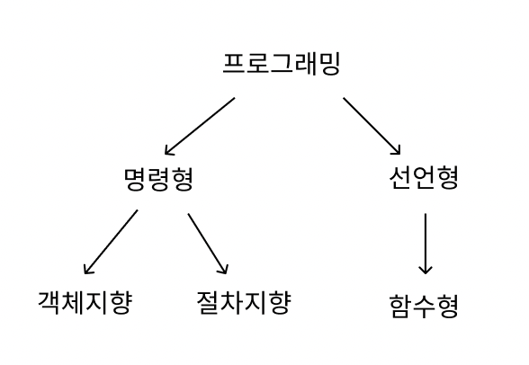
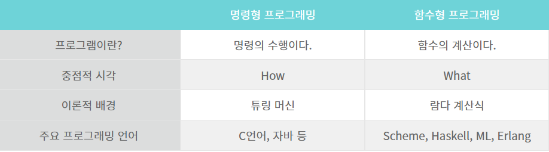

 # 프로그래밍 패러다임
- 프로그램을 어떻게 구성할 것인지 = 개발 방법론
- 프로그래밍 패러다임의 분류

- 프로그램 패러다임의 비교 (명령형 vs 함수형)

<hr>
## 1.2.1_선언형과 함수형 프로그래밍

### 선언형 프로그래밍(Declearative Programming) 
- 목표를 명시하고 알고리즘은 명시하지 않음
- 사용(Use)과 구현(Implemetation)을 분리하여 클래스 구현을 사용자로부터 숨김
- 명령형 방식을 추상화한 것이 선언형 프로그래밍
- ex) HTML, SQL
	- 웹페이지의 경우, 각 버튼이 어떤 알고리즘으로 돌아가는지는 중요하지 않음 = 구현을 숨기고 사용자가 원하는 기능만 드러냄
- 코드 예시 
	- replace(치환)을 사용하여 추상적으로 표현
```javascript
const str = 'HI CS STUDY'; 
const res = str.replace(/ /g, '-'); 
console.log(res);
```
- 명령형과의 비교
	-  루프를 돌면서 공백을 만날 때마다 하이픈으로 바꿔주는 로직으로 표현
```javascript
const str = 'HI CS STUDY'; 
const res = ''; 

for (let i=0; i<str.length; i++) { 
		if (str[i] === ' ') { 
		res += '-'; 
	} else { 
	res += str[i]
	 } 
} 

console.log(res);
```
- 순수 함수를 쌓아 로직을 구현하고, 고차 함수를 통해 재사용성을 높인 프로그래밍 패러다임이다

### 순수 함수(Pure function)
- 순수함수 : 출력이 입력에만 의존하는 함수
- 함수 내부에서 인자의 값을 변경하거나 프로그램 상태를 변경하는 Side Effect가 없
```js
const sum_v = (a, b) =>{
	return a + b
}
```
- 만약 다른 전역 변수 등이 출력에 영향을 주면 순수함수가 아니다

### 고차 함수
- 고차함수 : 함수가 함수를 값처럼 받아 사용할 수 있는 것
- 고차함수를 쓰기 위해서는 해당 언어가 일급 객체여야 한다
	- 일급 객체(First Class Object) : 다른 객체에 일반적으로 적용 가능한 연산을 모두 지원하는 객체
	- 일급 객체의 조건
		- 변수에 할당(assignment)할 수 있다
		-  다른 함수를 매개변수로 전달 받는다
		-  다른 함수의 결과로서 리턴될 수 있다
		- 즉, 함수를 데이터처럼 다룰 수 있다