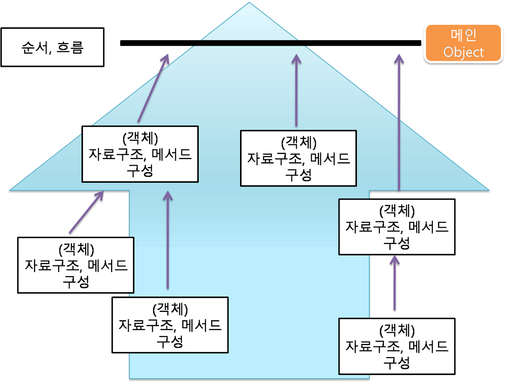

## 1.2.2_객체지향 프로그래밍
### 객체지향 프로그래밍(OOP, Object_Oriented Programming)
- 모든 데이터를 객체로 취급함
- 객체가 어떠한 처리 요청을 받았을 때, 객체 내부의 기능을 사용해 처리함
- 객체 중심의 프로그래밍
- Bottom-Up 방식(객체를 생성해 큰문제를 해결하는 방식)

<hr>
### 객체 지향의 특성
: 추상화, 캡슐화, 상속성, 다형성

- 추상화 : 객체의 공통된, 중요한 속성만을 간추려 모델화 하는 것
- 캡슐화 : 속성(변수)과 메서드(함수)를 하나로 묶어서 세부적인 내용은 감추는 것
- 상속성 : 상위 클래스의 특성(속성, 연산)을 하위 클래스가 물려받는 것
- 다형성 : 클래스가 연산을 수행할 때, 각 객체가 가지고 있는 고유한 방법으로 응답할 수 있는 것 ex) 오버로딩, 오버라이딩
	-  오버로딩 : 같은 이름을 가진 메서드를 여러 개 두고 객체의 유형에 따라 고유한 방법으로 응답함
	- 오버라이딩 : 상위 클래스로부터 상속답은 메서드를 하위 클래스에서 재정의
	
<hr>

### 설계 원칙 = SOLID 원칙
- 로버트 마틴이 명명한 객체 지향 프로그래밍의 다섯가지 기본 원칙
- S : 단일 책임 원칙(SRP, Single Responsibility Principle)
	- 모든 클래스는 각각 하나의 책임만 가진다
	- 여기서 책임 = 기능 즉, 한 클래스는 하나의 기능만을 수행해야 한다.
	- 한 개의 클래스에 책임이 많아지면 클래스 내부의 함수끼리 결합이 발생, 유지보수 비용이 증가할 수 있다.
	```python
class StudentScoreAndCourseManager:
    def __init__(self):
        scores = {}
        courses = {}
        
    def get_score(self, student_name, course):
        pass
    
    def get_courses(self, student_name):
        pass
	```
```python
class ScoreManager:
    def __init__(self):
        scores = {}
        
    def get_score(self, student_name, course):
        pass
    
    
class CourseManager:
    def __init__(self):
        courses = {}
    
    def get_courses(self, student_name):
        pass
```
- O : 개방-폐쇄 원칙(Open-Closed Principle)
	- 기존의 코드를 최소한으로 변경해서(Closed) 기능을 수정하거나 추가할 수 있도록(Open) 설계한다.
	- 자주 변경되는 내용은 수정하기 쉽게, 변경되지 않아야 하는 것은 수정되는 내용에 영향을 받지 않도록 설계
	- ex) 1.1.3_전략 패턴
```python
# Bad Case
class Rectangle:
    def __init__(self, width, height):
        self.width = width
        self.height = height
        
class Circle:
    def __init__(self, radius):
        self.radius = radius

class AreaCalculator:
    def __init__(self, shapes):
        self.shapes = shapes

    def total_area(self):
        total = 0
        for shape in self.shapes:
            total += shape.width * shape.height
        return total

>>> shapes = [Rectangle(2, 3), Rectangle(1, 6)]
>>> calculator = AreaCalculator(shapes)
```
```python
class Rectangle:
    def __init__(self, width, height):
        self.width = width
        self.height = height

    def area(self):
        return self.width * self.height
    
class Circle:
    def __init__(self, radius):
        self.radius = radius
        
    def area(self):
        return 3.14 * self.radius ** 2
    
class AreaCalculator:
    def __init__(self, shapes):
        self.shapes = shapes

    def total_area(self):
        total = 0
        for shape in self.shapes:
            total += shape.area()
        return total

>>> shapes = [Rectangle(1, 6), Rectangle(2, 3), Circle(5), Circle(7)]
>>> calculator = AreaCalculator(shapes)
```

- L : 리스코프 치환 원칙 (Liskov Substitution Principle)
	- 하위 클래스는 상위 클래스에서 가능한 행위를 수행할 수 있어야 한다.
	- 즉, 상위 클래스의 인스턴스 대신 하위 클래스의 인스턴스를 사용해도 문제가 없어야 함

```python
# Bad Case
class Event:
	def meets_condition(self, event_data: dict) -> bool:
		return False

class LoginEvent(Event):
	def meets_condition(self, event_data: list) -> bool:
		return bool(event_data)
```

- I : 인터페이스 분리 원칙(Interface Segregation Principle)
	- 하나의 일반적인 인터페이스보다, 여러개의 구체적인 인터페이스를 만들어야 한다.
	- 즉, 자신이 사용하지 않는 인터페이스에는 영향을 받아서는 안된다.

- D : 의존 역전 원칙(Dependency Inversion Principle)
	- 의존 관계를 맺을 때, 변화하기 쉬운 것 보다 변화하기 어려운 것에 의존하도록 설계한다.
	- 변화하기 쉬운 것 = 구체적인 클래스
	- 변화하기 어려운 것 = 추상적인 클래스

```python
# Bad Case
class MainClass:
    def __init__(self):
        subInstance = SubClass()
        subInstance.method_a()

class SubClass:
    def __init__(self):
        pass

    def method_a(self):
        pass
```
```python
class MainClass:
    def __init__(self, subInstance):
        self.setSubMethod(subInstance)
    
    def setSubMethod(self, subInstance):
        self.subMethod = subInstance
        
    def excuteMethod(self):
        self.subMethod.method()

class SubClassA:
    def __init__(self):
        pass

    def method(self):
        pass

class SubClassB:
    def __init__(self):
        pass

    def method(self):
        pass
```