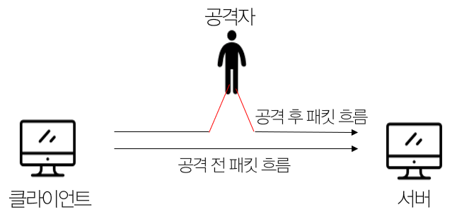
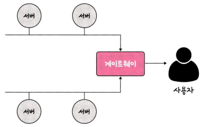
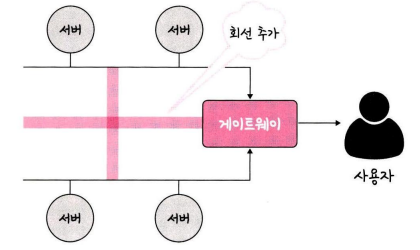

# 네트워크 토폴로지와 병목 현상
## 1. 네트워크 토폴로지
> **네트워크 토폴로지(netwrok topology)**: 노드와 링크가 어떻게 배치되어 있는지에 대한 방식이자 연결 형태

 

### **1-1 트리 토폴로지 (tree topology)**

- 계층형 토폴로지라고도 하며 트리 형태로 배치한 네트워크 구성 

- 장점: 노드의 추가, 삭제가 쉽다.
- 단점: 특정 노트에 트래픽이 집중될 때 하위 노드에 영향을 끼칠 수 있다.
  

### **1-2 버스 토폴로지 (bus topology)**

- **중앙 통신 회선 하나에 여러 개의 노드가 연결**되어 공유하는 네트워크 구성 

- 주로 **근거리 통신망**(LAN)에서 사용
- 장점: 설치 비용이 적고 신뢰성이 우수하다. 중앙 통신 회선에 노드를 추가하거나 삭제하기 쉽다.
- 단점: 스푸핑이 가능하다.
  

> **스푸핑**: LAN 상에서 송신부의 패킷을 관련 없는 수신부의 호스트로 가지 않도록 하는 스위칭 기능을 마비시키거나 속여서 특정 노드에 해당 패킷이 오도록 처리하는 것

  

### **1-3 스타 토폴로지 (star topology)**

- 중앙의 한 노드에 모든 노드가 연결된 네트워크 구성 

- 장점
  - 노드를 추가하거나 에러를 탐지하기 쉽다.
  - 패킷의 충돌 발생 가능성이 적다.
  - 어떠한 노드에 장애가 발생했을 때 쉽게 에러를 발견할 수 있다.
  - 장애 노드가 중앙 노드가 아닐 경우 다른 노드에 영향을 끼리는 것이 적다.
- 단점
  - 중앙 노드에 장애가 발생시, 전체 네트워크에 영향을 준다.
  - 설치 비용이 비싸다.
  

### **1-4 링형 토폴로지 (ring topology)**

- 각각의 노드가 양 옆의 두 노드와 연결하여 전체적으로 고리처럼 하나의 연속된 길을 통해 통신을 하는 망 구성 방식 

- 데이터는 노드에서 노드로 이동을 하게 되며, 각각의 노드는 고리 모양의 길을 통해 패킷을 처리
- 장점
  - 노드의 수가 늘어나도 네트워크 상의 손실이 거의 없다.
  - 충돌이 발생할 가능성이 적다.
  - 노드의 고장 발견을 쉽게 할 수 있다.
- 단점
  - 네트워크 구성 변경이 어렵다.
  - 한 노드 및 회선에 문제 발생 시, 전체 네트워크에 영향을 미친다.
  

### **1-5 메시 토폴로지 (mesh topology)**

- 망형 토폴로지라고도 하며 그물망처럼 연결되어 있는 구조 

- 장점: 한 노드에서 장애가 발생해도 경로가 여러 개이기 때문에 네트워크를 계속해서 사용할 수 있다.
- 단점: 노드의 추가 및 제거가 어렵고, 구축 및 운용 비용이 비싸다. 
   

## 2. 병목 현상
> **병목(bottleneck) 현상**: 전체 시스템의 성능이나 용량이 하나의 구성 요소로 인해 제한을 받는 현상

 

- 네트워크의 토폴로지가 중요한 이유는 이러한 병목 현상을 찾을 때, 중요한 기준이 되기 때문이다. 

- 병목현상이 일어났을 경우, 네트워크가 어떤 토폴로지를 갖는지, 또 어떠한 경로로 이루어져 있는지 안다면, 병목 현상에 좀 더 효율적으로 대처할 수 있다.
  

<병목 현상이 일어난 네트워크 토폴로지>

- 위와 같은 네트워크 토폴로지 상태에서 병목현상이 일어났다고 가정 

- 이런 상황에서 네트워크가 어떤 토폴로지를 갖는지 안다면 회선을 적절하게 추가시킴으로써 병목 현상 해결 가능

<적절한 회선 추가를 통한 병목 현상 해결>

   

---