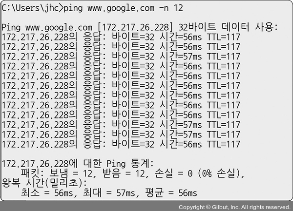
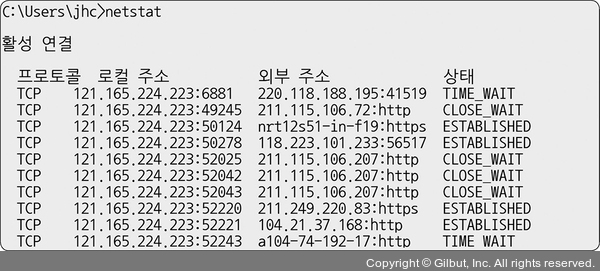
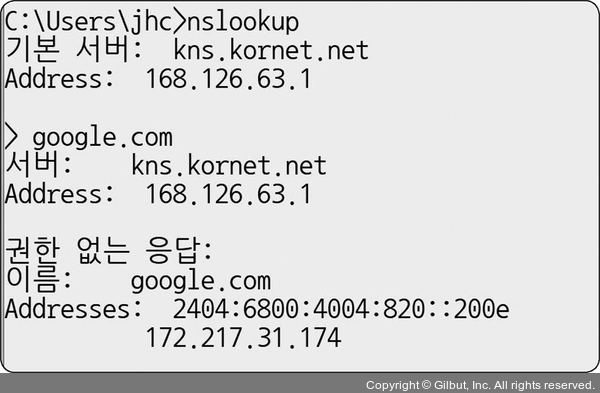
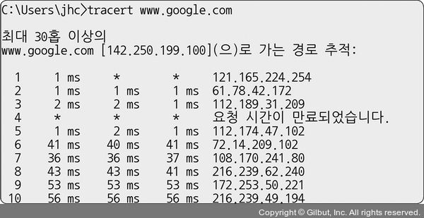

# 네트워크 성능 분석 명령어

- 네트워크 병목 현상의 주된 원인
  - 네트워크 대역폭 

  - 네트워크 토폴로지
  - 서버 CPU, 메모리 사용량
  - 비효율적인 네트워크 구성
 

- 네트워크 관련 테스트와 네트워크와 무관한 테스트를 통해 **네트워크로부터 발생한 문제점**인 것을 확인한 후 네트워크 성능 분석 실시
  

## 1. **ping**
- Packet INternet Groper 

- 네트워크 상태를 확인하려는 대상 노드를 향해 **일정 크기의 패킷을 전송**하는 명령어
- 해당 노드의 패킷 수신 상태와 도달하기까지 시간 등을 알 수 있으며 해당 노드까지 네트워크가 잘 연결되어 있는지 확인할 수 있다.
- TCP/IP 프로토콜 중에 ICMP 프로토콜을 통해 동작
- ICMP 프로토콜을 지원하지 않는 기기를 대상으로는 실행할 수 없거나 정책상 ICMP나 traceroute를 차단하는 대상의 경우 ping 테스팅 불가능
  

- `ping www.google.com -n 12`라는 명령어를 구동한 모습
- `-n 12` 옵션을 넣어서 12번의 패킷을 보내고 12번의 패킷을 받는 모습
   

## 2. **netstat**
- **접속되어 있는 서비스들**의 네트워크 상태를 표시하는 데 사용 

- 네트워크 접속, 라우팅 테이블, 네트워크 프로토콜 등 리스트 보여줌
- 주로 서비스의 포트가 열려 있는지 확인할 때 사용
  

- 지금 접속하고 있는 사이트 등에 관한 네트워크 상태 리스트 볼 수 있음
    

## 3. **nslookup**
- **DNS에 관련된 내용을 확인**하기 위해 쓰는 명령어 

- 특정 도메인에 매핑된 IP를 확인하기 위해 사용
  

- google.com의 DNS 확인하는 모습
    

## 4. **tracert**
- 윈도우 -> tracert  / 리눅스 -> traceroute 

- **목적지 노드까지 네트워크 경로를 확인**할 때 사용하는 명령어
- 목적지 노드까지 구간들 중 어느 구간에서 응답 시간이 느려지는 등 확인 가능
  

- 구글 사이트에 도달하기까지의 경로 추적하는 모습
    

---
