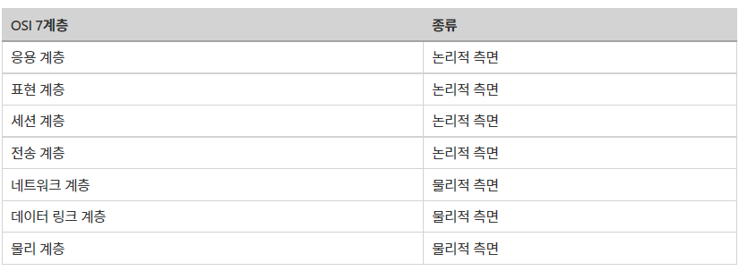
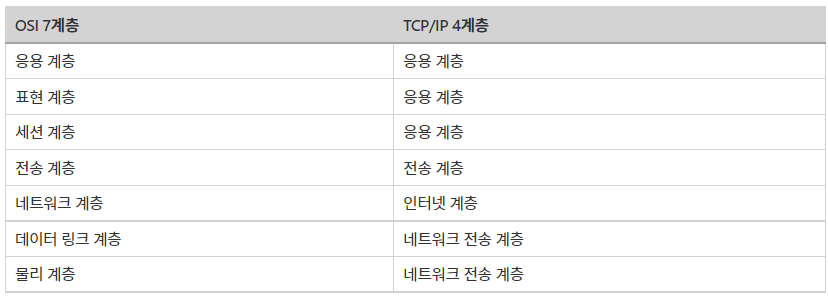
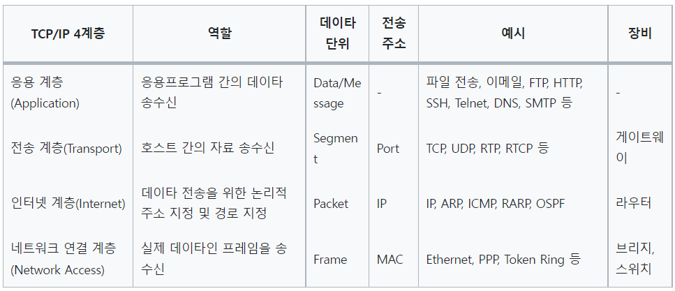
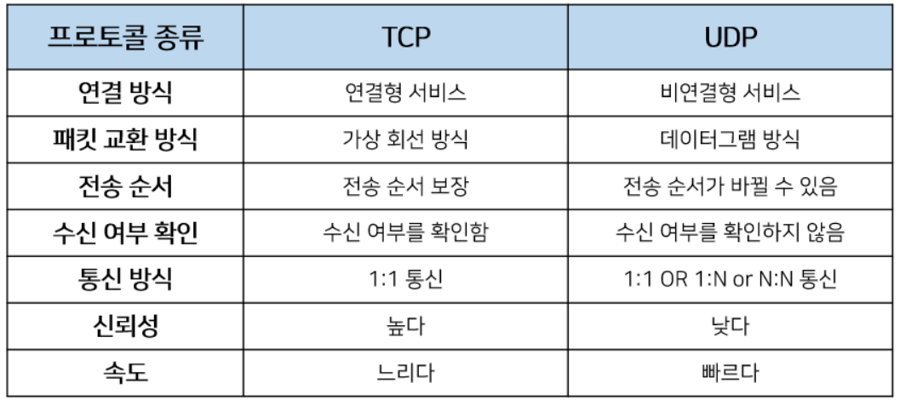
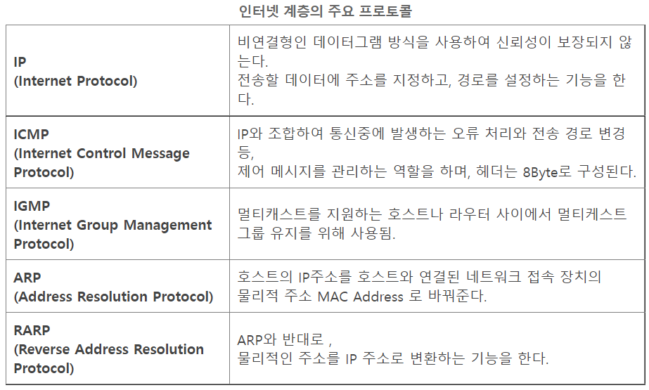
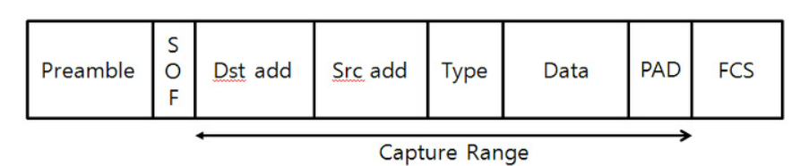

# 2.2.1 계층 구조

## 프로토콜
- 통신 규약
- 컴퓨터간 통신을 위한 규칙
- 언어가 달라 대화가 통하지 않는 한국인과 프랑스인이 국제 공용어인 영어를 사용하자는 규칙을 정하면 대화가 가능해지듯이, **서로 다른 컴퓨터 기기가 통신하기 위해 정한 규칙**이 바로 프로토콜!
- 상호간의 접속이나 전달방식, 통신방식, 주고받을 자료의 형식, 오류 검출 방식, 코드 변환방식, 전송속도 등을 규정

### 인터넷 프로토콜 스위트
- 인터넷에서 컴퓨터들이 서로 정보를 주고받는 데 쓰이는 프로토콜의 집합
- TCP/IP 4계층 모델로 설명하거나 OSI 7계층 모델로 설명

## OSI 7계층
- ISO(국제표준기구)에서 만든 네트워크를 7계층으로 만든 모델
- 컴퓨터 간 데이터를 통신하기 위한 과정을 7단계로 쪼갠것
- 각 단계를 계층, 또는 레이어라고 부르며, 각 계층마다 프로토콜(규칙)을 정함
- 네트워크 통신 과정을 7단계로 쪼개고 각 단계마다 규칙(프로토콜)을 정하여 서로 다른 환경의 서로 다른 기기의 컴퓨터가 대화가 통하도록, 즉, 통신할 수 있도록 하는 것
- OSI 7계층은 크게 두가지로 나눌 수 있음
  - 물리적 측면 : 접속 단자나, 회선 같은 물리적인 규격을 정한 단계
  - 논리적 측면 : 데이터(자료) 전송 절차나 데이터 형식을 정한 단계
- 응용계층에서 송신하고 물리계층으로 수신받음

---

## TCI/IP 4계층

- 네트워크에서 사용되는 통신 프로토콜의 집합으로 계층들은 프로토콜의 네트워킹 범위에 따라 네 개의 추상화 계층으로 구성
- OSI 7계층을 4계층으로 요약한 것
- 네트워크 통신 과정을 4단계로 쪼갠 것
- OSI 계층은 애플리케이션 계층(응용 계층)을 세 개로 쪼개고, 링크 계층(네트워크 전송 계층)을 데이터 링크 계층, 물리 계층으로 나눠서 표현하며, 인터넷 계층을 네트워크 계층으로 부름
- 계층들은 특정 계층이 변경되었을 때 다른 계층이 영향을 받지 않도록 설계됨

---

## L4 응용 계층(Application Layer)
- 데이타 단위: Data/Message
- 사용자와 가장 가까운 계층으로 사용자가 소프트웨어 application과 소통할 수 있게 해줌
- 응용프로그램(application)들이 데이터를 교환하기 위해 사용되는 프로토콜
- 사용자 응용프로그램 인터페이스를 담당
- 예시) 파일 전송, 이메일, FTP, HTTP, SSH, Telnet, DNS, SMTP 등
    - FTP : 장치와 장치 간의 파일을 전송하는 데 사용되는 표준 통신 프로토콜
    - SSH : 보안되지 않은 네트워크에서 네트워크 서비스를 안전하게 운영하기 위한 암호화 네트워크 프로토콜
    - HTTP : World Wide Web을 위한 데이터 통신의 기초이자 웹 사이트를 이용하는데 쓰는 프로토콜
    - SMTP : 전자 메일 전송을 위한 인터넷 표준 통신 프로토콜
    - DNS : 도메인 이름과 IP 주소를 매핑해주는 서버
---

## L3 전송 계층(Transport Layer)
- 데이타 단위: Segment
- 전송 주소: Port
- 송신자와 수신자를 연결하는 통신 서비스를 제공
- 연결 지향 데이터 스트림 지원, 신뢰성, 흐름 제어 제공
- 애플리케이션과 인터넷 계층 사이의 데이터가 전달될 때의 중계 역할
- 예시) TCP, UDP

### TCP
- 데이터를 보내기 위해 사용하는 프로토콜
- 인터넷상에서 데이터를 메세지의 형태로 보내기 위해 IP와 함께 사용하는 프로토콜
- 일반적으로 TCP와 IP를 함께 사용
- IP가 데이터의 배달을 처리한다면 TCP는 *패킷을 추적 및 관리
  - 패킷 : 인터넷 내에서 데이터를 보내기 위한 경로배정(라우팅)을 효율적으로 하기 위해서 데이터를 여러 개의 조각들로 나누어 전송을 하는데 이때, 이 조각을 패킷이라고 함
- TCP는 연결형 서비스를 지원하는 프로토콜로 인터넷 환경에서 기본으로 사용
- 패킷 사이의 순서를 보장하고 연결지향 프로토콜을 사용해서 연결을 하여 신뢰성을 구축해서 수신 여부를 확인하며 '가상회선 패킷 교환 방식'을 사용
- 3-way handshaking과정을 통해 연결을 설정하고 4-way handshaking을 통해 해제
- 흐름 제어 및 혼잡 제어
  - 흐름 제어 : 데이터를 송신하는 곳과 수신하는 곳의 데이터 처리 속도를 조절하여 수신자의 버퍼 오버플로우를 방지하는 것
  - 혼잡 제어 : 네트워크 내의 패킷 수가 넘치게 증가하지 않도록 방지하는 것
- 높은 신뢰성을 보장
- UDP보다 속도가 느림

> 보충 설명
- TCP가 가상 회선 방식을 제공한다는 것은 발신지와 수신지를 연결하여 패킷을 전송하기 위한 논리적 경로를배정한다는 말
- 3-way handshaking과정은 목적지와 수신지를 확실히 하여 정확한 전송을 보장하기 위해서 세션을 수립하는 과정을 의미
- TCP가 이러한 특징을 지니는 이유는 바로 TCP는 연결형 서비스로 신뢰성을 보장하기 때문
- 그래서 3-way handshaking의 과정도 사용하는 것이고, 데이터의 흐름제어나 혼잡 제어와 같은 기능도 함
- 하지만 이러한 기능때문에 UDP보다 속도가 느리게 됨
- 그렇기에 TCP는 연속성보다 신뢰성있는 전송이 중요할 때에 사용하는 프로토콜로 예를 들면 파일 전송과 같은 경우에 사용

### 가상회선 패킷 교환 방식

- 각 패킷에는 가상회선 식별자가 포함되며 모든 패킷을 전송하면 가상회선이 해제되고 패킷들은 전송된 '순서대로' 도착하는 방식
- 위 그림을 보면 3,2,1 로 이루어진 패킷이 어떠한 회선을 따라 순서대로 도착하는 것을 알 수 있음
- 데이터는 패킷단위로 나누어 같은 목적지(IP계층)으로 전송됨
- 예를 들어 한줄로 서야하는 A,B,C라는 사람(패킷)들이 서울(발신지)에서 출발하여 부산(수신지)으로 간다고 가정 
- 그런데 A,B,C가 순차적으로 가는 상황에서 B가 길을 잘못 들어서 분실된 상황 
- 하지만 목적지에서는 A,B,C가 모두 필요한지 모르고 A,C만 보고 다 왔다고 착각할 수 있음
- 그렇기 때문에 A,,B,C라는 패킷에 1,2,3이라는 번호를 부여하여 패킷의 분실 확인과 같은 처리를 하여 목적지에서 재조립을 함
- 이런 방식으로 TCP는 패킷을 추적하며, 나누어 보내진 데이터를 받고 조립을 할 수 있음

### UDP
- 데이터를 데이터그램 (독립적인 관계를 지니는 패킷) 단위로 처리하는 프로토콜
- TCP와 달리 UDP는 비연결형 프로토콜
  - 연결을 위해 할당되는 논리적인 경로가 없음
  - 각각의 패킷은 다른 경로로 전송되고, 각각의 패킷은 독립적인 관계를 지니게 됨
  - 데이터를 서로다른 경로로 독립적으로 처리하게 되고, 이러한 프로토콜을 UDP라고 함
- 비연결형 서비스로 데이터그램 방식을 제공
- 정보를 주고 받을 때 정보를 보내거나 받는다는 신호절차를 거치지 않음
- UDP헤더의 CheckSum 필드를 통해 최소한의 오류만 검출
- 신뢰성이 낮음
- TCP보다 속도가 빠름

> 보충 설명
- UDP는 비연결형 서비스이기 때문에, 연결을 설정하고 해제하는 과정이 존재하지 않음
- 서로 다른 경로로 독립적으로처리함에도 패킷에 순서를 부여하여 재조립을 하거나 흐름 제어 또는 혼잡 제어와 같은 기능도 처리하지 않기에 TCP보다속도가 빠르며 네트워크 부하가 적다는 장점 존재
- 하지만 신뢰성있는 데이터의 전송을 보장하지는 못함
- 그렇기 때문에신뢰성보다는 연속성이 중요한 서비스 예를 들면 실시간 서비스(streaming)에 자주 사용

### 데이터그램 패킷 교환 방식

- 패킷이 독립적으로 이동하며 최적의 경로를 선택하여 감
- 하나의 메세지에서 분할된 여러 패킷은 서로 다른 경로로 전송될 수 있음
- 도착한 '순서가 다를 수' 있는 방식
- 위 그림을 보면 3,2,1로 이루어진 패킷이 순서도 다르고 어떠한 회선을 중심으로 가는 것이 아니라 따로따로 이동하며 순서도 다르게 도착하는 것을 알 수 있음

### TCP vs UDP

### TCP 연결 성립 과정
- TCP는 신뢰성을 확보할 때 '3-웨이 핸드셰이크'라는 작업을 진행
- 클라이언트와 서버가 통신할 때 세 단계의 과정을 거침
- 3-웨이 핸드셰이크 과정 이후 신뢰성이 구축되고 데이터 전송을 시작
- TCP는 이 과정이 있기때문에 신뢰성이 있는 계층이라고 하며, UDP는 이과정이 없기에 신뢰성이 없는 계층이라고 함

### 3-way Handshake란?
- TCP는 장치들 사이에 논리적인 접속을 성립(establish)하기 위하여 three-way handshake를 사용
- TCP 3 Way Handshake는 TCP/IP프로토콜을 이용해서 통신을 하는 응용프로그램이 데이터를 전송하기 전에 먼저 정확한 전송을 보장하기 위해 상대방 컴퓨터와 사전에 세션을 수립하는 과정
- Client > Server : TCP SYN (연결 요청 플래그)
- Server > Client : TCP SYN ACK (응답 플래그)
- Client > Server : TCP ACK

### 3-way Handshake 역할
- 양쪽 모두 데이타를 전송할 준비가 되었다는 것을 보장하고, 실제로 데이타 전달이 시작하기전에 한쪽이 다른 쪽이 준비되었다는 것을 알수 있도록 함
- 양쪽 모두 상대편에 대한 초기 순차일련변호를 얻을 수 있도록 함

### 3-way Handshake의 과정

1. A클라이언트는 B서버에 접속을 요청하는 SYN 패킷을 보낸다 (ISN 포함 - 새로운 TCP 연결의 첫번째 패킷에 할당된 임의의 시퀀스 번호). 이때 A클라이언트는 SYN 을 보내고 SYN/ACK 응답을 기다리는SYN_SENT 상태가 되는 것
2. B서버는 SYN요청을 받고 A클라이언트에게 요청을 수락한다는 ACK 와 SYN flag 가 설정된 패킷을 발송하고 A가 다시 ACK으로 응답하기를 기다린다. 이때 B서버는 SYN_RECEIVED 상태가 된다.
3. A클라이언트는 B서버에게 ACK을 보내고 이후로부터는 연결이 이루어지고 데이터가 오가게 되는것이다. 이때의 B서버 상태가 ESTABLISHED 이다. 위와 같은 방식으로 통신하는것이 신뢰성 있는 연결을 맺어 준다는 TCP의 3 Way handshake 방식

### 4-way Handshake란?
- 4-Way handshake는 세션을 종료하기 위해 수행되는 절차

### 4-way Handshake의 과정

1. 클라이언트가 연결을 종료하겠다는 FIN 플래그 세그먼트를 전송
2. 서버는 일단 확인 메세지를 보내고 자신의 통신이 끝날때까지 기다리는데 이 상태가 TIME_WAIT
3. 서버가 통신이 끝났으면 연결이 종료되었다고 클라이언트에게 FIN 플래그를 전송
4. 클라이언트는 확인했다는 메세지를 보냄

- 그런데 만약 "Server에서 FIN을 전송하기 전에 전송한 패킷이 Routing 지연이나 패킷 유실로 인한 재전송 등으로 인해 FIN패킷보다 늦게 도착하는 상황"이 발생한다면?
- Client에서 세션을 종료시킨 후 뒤늦게 도착하는 패킷이 있다면 이 패킷은 Drop되고 데이터는 유실될 것
- 이러한 현상에 대비하여 Client는 Server로부터 FIN을 수신하더라도 일정시간(디폴트 240초) 동안 세션을 남겨놓고 잉여 패킷을 기다리는 과정을 거치게 되는데 이 과정을 "TIME_WAIT" 라고 함

> TIME_WAIT
- 소켓이 바로 소멸되지 않고 일정 시간 유지되는 상태
- 지연 패킷이 발생할 경우를 대비
  - 패킷이 뒤늦게 도달하고 이를 처리하지 못한다면 데이터 무결성(데이터의 정확성과 일관성을 유지하고 보증하는 것) 문제가 발생
- 두 장치가 연결이 닫혔는지 확인하기 위함

---

## L2 인터넷 계층(Internet Layer)
- 데이타 단위: 패킷
- 전송 주소: IP
- 장치로부터 받은 네트워크 패킷을 IP 주소로 지정된 목적지로 전송하기 위해 사용되는 계층
- 패킷을 수신해야 할 상대의 주소를 지정하여 데이터를 전달
- 상대방이 제대로 받았는지에 대해 보장하지 않는 비연결형적인 특징
- 예시) IP, ARP, ICMP
  - 

---

## L1 링크 계층 or 네트워크 접근 계층 (Network Access Layer/Network Interface Layer)
- 데이타 단위: 프레임
- 전송 주소: MAC
- 전선, 광섬유, 무선 등으로 실질적으로 데이터를 전달하며 장치 간에 신호를 주고받는 '규칙'을 정하는 계층
- 물리 계층과 데이터링크 계층으로 나누기도 함
  - 물리 계층 : 무선 LAN과 유선 LAN을 통해 0과 1로 이루어진 데이터를 보내는 계층
  - 데이터링크 계층 : '이더넷 프레임'을 통해 에러 확인, 흐름 제어, 접근 제어를 담당하는 계층

### 유선 LAN(IEEE802.3)
- 유선 LAN을 이루는 이더넷은 IEEE802.3이라는 프로토콜을 따르며 전이중화 통신을 씀
  - 이더넷 : LAN(Local Area Network)를 위해 개발된 근거리 유선 네트워크 통신망 기술로 IEEE 802.3에 표준으로 정의

### 전이중화 통신
- 전이중화(full duplex) 통신은 양쪽 장치가 동시에 송수신할 수 있는 방식
- 송신로와 수신로로 나눠서 데이터를 주고받으며 현대의 고속 이더넷은 이 방식을 기반으로 통신

> [참고] CSMA/CD
- 이전에는 유선 LAN에 '반이중화 통신' 중 하나인 CSMA/CD 방식을 씀
- 데이터를 보낸 이후 충돌이 발생한다면 일정 시간 이후 재전송하는 방식
- 수신로와 송신로를 각각 두지 않고 한 경로를 기반으로 데이터를 보내기 때문에 데이터를 보낼 때 충돌에 대해 대비해야 했기 때문

### 유선 LAN을 이루는 케이블
- TP 케이블이라고 하는 트위스트 페어 케이블 / 광섬유 케이블

### 트위스트 페어 케이블
- 하나의 케이블 처럼 보이지만 실제로는 여덟개의 구리선을 두개씩 꼬아서 묶은 케이블
- 구리선을 실드 처리하지 않고 덮은 UTP 케이블과 실드 처리하고 덮은 STP로 나눠짐
- UTP 케이블이 흔히 LAN 케이블이라 불리는 것
- LAN 케이블을 꽂을 수 있는 커넥터를 RJ-45 커넥터라고 함

### 광섬유 케이블
- 광섬유로 만든 케이블
- 레이저를 이용해서 통신
- 구리선과는 비교할 수 없을 만큼의 장거리 및 고속 통신 가능
- 보통 100 Gbps의 데이터를 전송
- 광섬유 내부와 외부를 다른 밀도를 가지는 유리나 플라스틱 섬유로 제작해서 한번 들어간 빛이 내부에서 계속적으로 반사하며 전진하여 반대편 끝까지 가는 원리 이용
  - 빛의 굴절률이 높은 부분을 코어 / 낮은 부분을 클래딩

### 무선 LAN
- 수신과 송신에 같은 채널을 사용하기 때문에 반이중화 통신을 사용

### 반이중화 통신
- 반이중화 통신(half duplex)은 양쪽 장치는 서로 통신할 수 있지만, 동시에는 통신할 수 없으며 한번에 한 방향만 통신할 수 있는 방식
- 일반적으로 장치가 신호를 수신하기 시작하면 응답하기 전에 전송이 완료될 때까지 기다려야 함
- 둘 이상의 장치가 동시에 전송하면 충돌이 발생하여 메세지가 손실되거나 왜곡될 수 있기때문에 충돌 방지 시스템이 필요

### CSMA/CA
- 반이중화 통신 중 하나로 장치에서 데이터를 보내기 전에 캐리어 감지 등으로 사전에 가능한 한 충돌을 방지하는 방식을 사용함
- 1. 데이터를 송신하기 전에 무선 매체를 살핌
- 2. 캐리어 감지: 회선이 비어있는지 판단
- 3. IFS(Inter FrameSpace): 랜덤 값을 기반으로 정해진 시간만큼 기다리며, 만약 무선매체가 사용 중이면 점차 그 간격을 늘려가며 기다림
- 4. 이 후에 데이터를 송신함
- 이와 반대되는 전이중화 통신은 양방향 통신이 가능하므로 충돌 가능성이 없기 때문에 충돌을 감지하거나 방지하는 메커니즘이 필요하지 않음

### 무선 LAN을 이루는 주파수
- 무선 LAN은 무선 신호 전달 방식을 이용하여 2대 이상의 장치를 연결하는 기술
- 비유도 매체인 공기에 주파수를 쏘아 무선 통신망을 구축
- 주파수 대역은 2.4GHz 또는 5GHz 대역 중 하나를 써서 구축
  - 2.4GHz 는 장애물에 강한 특성을 가지고 있지만, 전자레인지, 무선 등 전파 간섭이 일어나는 경우가 많음
  - 5.4GHz 는 사용할 수 있는 채널 수도 많고 동시에 사용할 수 있기때문에 상대적으로 깨끗한 전파 환경을 구축 가능

### 와이파이
- 전자기기들이 무선 LAN 신호에 연결할 수 있게 하는 기술
- 이를 사용하려면 무선 접속 장치 (AP)가 필요
- 흔히 이를 공유기라고 하며, 유선 LAN에 흐르는 신호를 무선 LAN 신호로 바꿔주어 신호가 닿는 범위 내에서 무선 인터넷을 사용할 수 있게 됨

### BSS
- 기본 서비스 집합
- 단순 공유기를 통해 네트워크에 접속하는 것이 아닌, 동일 BSS 내에 있는 AP들과 장치들이 서로 통신이 가능한 구조를 말함
- 근거리 무선 통신을 제공하고, 하나의 AP만을 기반으로 구축이 되어있어 사용자가 한 곳에서 다른 곳으로 자유롭게 이동하며 네트워크에 접속하는 것은 불가능

### ESS
- 하나 이상의 연결된 BSS 그룹
- 장거리 무선 통신을 제공
- BSS 보다 더많은 가용성과 이동성 지원
- 사용자는 한 장소에서 다른 장소로 이동하며 중단 없이 네트워크에 계속 연결 가능

### 이더넷 프레임
- 데이터 링크 계층은 이더넷 프레임을 통해 전달 받은 데이터의 에러를 검출하고 캡슐화하며 다음과 같은 구조를 가짐

- Premable : 이더넷 프레임이 시작됨을 알림
- SFD(Start Frame Delimiter) : 다음 바이트부터 MAC 주소 필드가 시작됨을 알림
- DMAC, SMAC : 수신, 송신 MAC 주소
- EtherType : 데이터 계층 상위 계층인 IP 프로토콜을 정의
- Payload : 전달받은 데이터
- CRC : 에러 확인 비트

> [참고] MAC 주소
- 컴퓨터나 노트북 등 각 장치에는 네트워크에 연결하기 위한 장치(LAN 카드)가 있는데, 이를 구별하기 위한 식별 번호.
- 6바이트 (48비트)로 구성됨

---

## 계층 간 데이터 송수신 과정

- 네트워크를 통해 데이터를 보낼 때는 캡슐화와 역캡슐화 과정이 이루어짐
- 왜냐하면 데이터를 보내기 위해선 데이터의 앞부분에 전송하는데 필요한 정보를 붙여서 다음 계층으로 보내기 때문
- 이처럼 헤더를 붙여나가는 것을 캡슐화라고 함
- **데이터 송신 측에서 캡슐화를 통해 데이터를 전송한다면, 수신 측에서는 역캡슐화를 통해 최초로 보낸 데이터 형태로 받을 수 있는 것**

### 캡슐화

- 먼저 송신 측 컴퓨터에서 요청 데이터가 만들어짐
- 데이터는 응용 계층에서 전송계층으로 전달되는데, 전송계층에서 신뢰할 수 있는 통신이 이루어지도록 응용계층에서 만들어진 데이터에 헤더를 붙임
- 전송계층에서 만들어진 데이터를 다른 네트워크와 통신하기 위해 네트워크 계층에서 헤더를 붙임
- 또 네트워크 게층에서 만들어진 데이터를 물리적인 통신 채널을 연결하기 위해 데이터 링크 계층에서 헤더와 트레일러를 붙임
- 데이터 링크 계층에서 트레일러가 처음 등장했는데, 트레일러는 데이터를 전달할 때 데이터의 마지막에 추가하는 정보를 말함
- 이렇게 응용 게층에서의 요청 데이터는 전송 계층 헤더, 네트워크 계층 헤더, 데이터 링크 계층 헤더와 트레일러가 추가됨
- 데이터 링크 계층에서 만들어진 데이터는 최종적으로 전기 신호로 변환돼서 수식 측에 도착함
- 정리하자면 필요한 데이터를 추가해 나가는 것을 캡슐화라고 할 수 있음

### 역캡슐화

- 수신 측에서는 헤더를 제거함
- 캡슐화와 반대로 데이터 링크 계층부터 순서대로 상위 계층으로 전달함
- 이처럼 데이터 한 개를 전달하는데도 네트워크 통신의 내부에서는 캡슐화와 역캡슐화 과정이 일어남
- 복잡해 보이는 과정이지만 이러한 여러 규칙 덕분에 데이터를 문제없이 전달할 수 있는 것!

