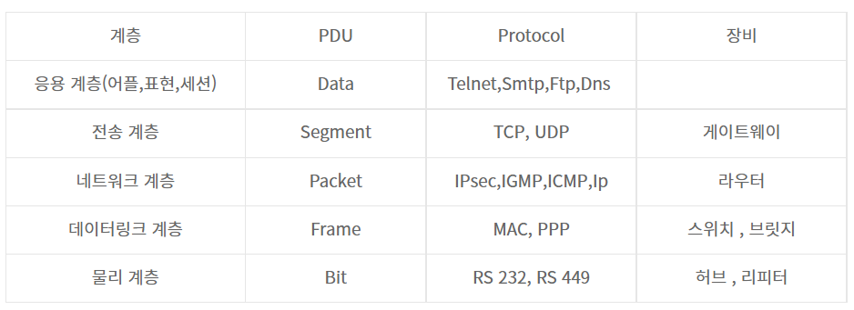

# 2.2.2 PDU

- 네트워크의 어떠한 계층에서 계층으로 데이터가 전달될 때 한 덩어리의 단위를 PDU (Protocol Data Unit)이라고 함
- 제어 관련 정보들이 포함된 '헤더'와 데이터를 의미하는 '페이로드'로 구성되어있음
- 계층마다 부르는 명칭이 다름
- 애플리케이션 계층 : 메세지
- 전송 계층 : 세그먼트(TCP), 데이터그램(UDP)
- 인터넷 계층 : 패킷
- 링크 계층 : 프레임(데이터 링크 계층), 비트(물리 계층)
- 예시) 애플리케이션 계층은 '메세지'를 기반으로 데이터를 전달하는데, HTTP의 헤더가 문자열임

> [참고]
- PDU 중 아래 계층인 비트로 송수신하는 것이 모든 PDU 중 가장 빠르고 효율성이 높음
- 하지만 애플리케이션 계층에서는 문자열을 기반으로 송수신
- 그 이유는 헤더에 authorization 값 등 다른 값들을 넣는 확장이 쉽기 때문