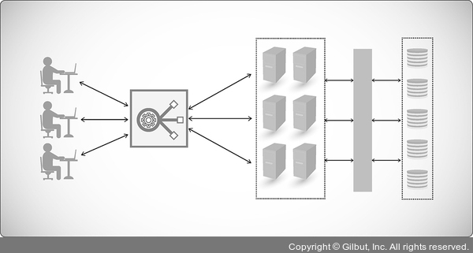
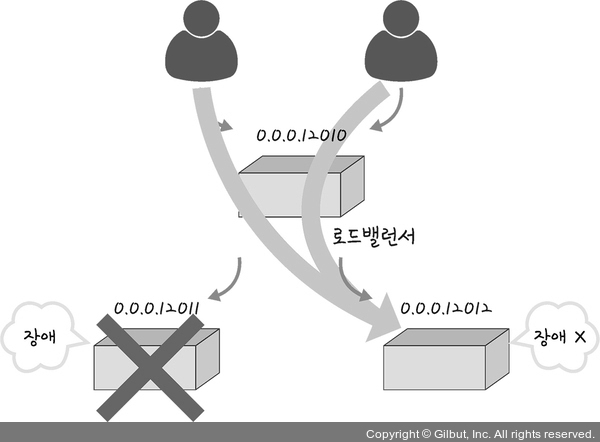

# 애플리케이션 계층을 처리하는 기기

- 스위치
  - 통신 네트워크 장비
  - 여러 장비를 연결
  - 데이터 통신을 중재
  - 목적지가 연결된 포트로만 전기신호를 보내 데이터를 전송

<h2>1. L7 스위치</h2>

- `로드밸런서`라고도 함
- `서버의 부하`를 `분산`하는 기기
- 클라이언트로부터 오는 `요청들`을 뒤쪽의 `여러 서버로 나누`는 역할
- `목적` : 시스템이 처리할 수 있는 `트래픽 증가`
- URL, 서버, 캐시, 쿠키들을 기반으로 트래픽을 분산

<h3> 1.1 기능 </h3>

- `필터링 기능` : 바이러스, 불필요한 외부 데이터 등을 걸러냄
- `트래픽 모니터링` : 장애가 발생한 서버가 있을 때 정기적으로 `헬스 체크(health check)`를 이용하여 `트래픽 분산 대상에서 제외`시킴

<h3> 1.2 L4 스위치와 L7 스위치 차이 </h3>

- L4 스위치
  - 로드 밸런서
  - 인터넷 계층을 처리하는 기기

- 차이
  - L4 스위치 : IP, 포트를 기반으로 트래픽을 분산함(스트리밍관련 서비스에서 사용 못하고 메시지를 기반으로 인식하지 못함)
  - L7 스위치 : IP, 포트 외에도 URL, HTTP 헤더, 쿠키 등을 기반으로 트래픽을 분산함

>[참고] 클라우드 서버(AWS)에서 로드밸런싱
> 1. ALB(Application Load Balancer) : L7스위치 사용
> 2. NLB(Network Load Balancer) : L4 스위치 사용

<h3> 1.3 헬스 체크 </h3>

- 헬스 체크를 통해 서버의 상태를 판별
- 전송 주기외 재전송 횟수 등을 설정한 후 반족적으로 서버에 요청을 보내는 것
  - 서버에 부하가 되지 않을 만큼의 요청 횟수 설정이 중요
- **요청방법**
  -  TCP, HTTP 등
> [예시] TCP 요청 방법
> - 3-웨이 핸드 셰이크가 정상적으로 일어나지 않았다면 정상이 아닌 것

<h3> 1.4 로드밸런서를 이용한 서버 이중화 </h3>

- 서비스를 안정적으로 운용하기 위해서는 2대 이상의 서버는 필수적
- 로드밸런서는 2대 이상의 서버를 기반으로 가상 IP를 제공하고 이를 기반으로 안정적인 서비스 제공

