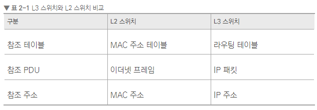

<h1> 인터넷 계층을 처리하는 기기</h1>

<h2> 1. 기기 종류</h2>

- 라우터, L3 스위치

<h3> 1.1 라우터(router)</h3>

- 여러 개의 네트워크를 연결, 분할, 구분시켜주는 역할
- 다른 네트워크에 존재하는 장치끼리 서로 데이터를 주고 받을 때 패킷 소모를 최소화
- 경로를 최적화하여 최소 경로 패킷을 포워딩하는 라우팅 장비
  
<h4> 라우터 종류</h4>

1. 소프트웨어 기반 라우팅
2. 하드웨어 기반 라우팅
   - L3스위치가 담당
   
<h3> 1.2 L3 스위치</h3>

- L3 스위치란 L2 스위치의 기능과 라우팅 기능을 갖춘 하드웨어 기반 라우팅 장비
- 라우터라고해도 무방함

## [용어]
### 1. 패킷
*
- 정보기술에서 패킷 방식의 컴퓨터 네트워크가 전달하는 데이터의 형식화된 블럭
- 네트워크 전송의 용량 단위
- 제어정보와 사용자 데이터로 구성됨
  
### 2. MAC(Media Access Control)
- 매체 접근 제어 : 자료 전송 프로토콜의 하부 계층
- 7계층의 OSI모델에 규정된 데이터 링크 계층의 일부
