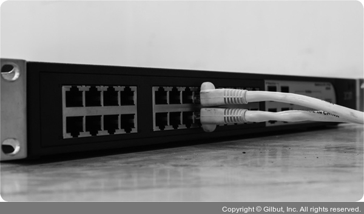

<h1>데이터 링크 계층을 처리하는 기기</h1>

1. L2스위치
2. 브릿지

<h2>L2 스위치</h2>

- 장치들의 MAC주소를 MAC 주소 테이블을 통해 관리
- 연결된 장치로부터 패킷이 왔을 때 패킷 전송을 담당
- IP주소 기반 라우팅 불가능(IP 주소 이해 못함ㅜ)
- 단순히 패킷의 MAC주소를 읽어 스위칭 하는 역할
- 목적지가 MAC 주소 테이블에 없다면 전체 포트에 전달
- MAC 주소 테이블의 주소는 일정 시간 이후 삭제하는 기능도 있음
-

<h2>브릿지</h2>

- 두 개의 근거리 통신망(LAN)을 상호 접속할 수 있도록 하는 통신망 연결 장치
- 포트와 포트 사이의 다리 역할
- 장치에서 받아온 MAC 주소를 MAC 주소 테이블로 관리
- `통신망 범위를 확장`하고 `서로 다른 LAN 등으로 이루어진 하나의 통신망을 구축`