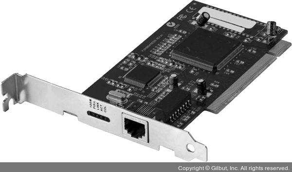
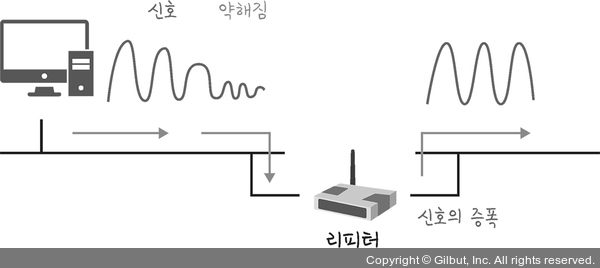
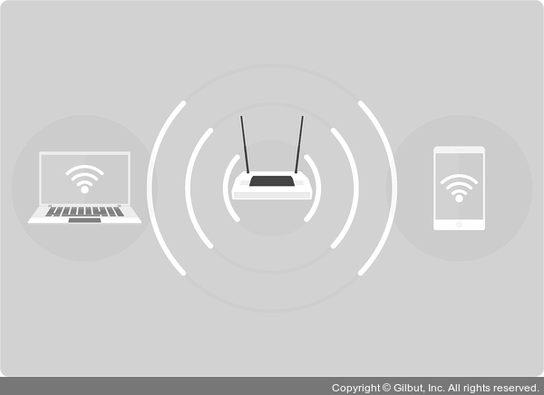

<h1>물리 계층을 처리하는 기기</h1>
- NIC
- 리피터
- AP

<h2>1. NIC(Network Interface Card)</h2>

- LAN카드라고 하는 네트워크 인터페이스 카드
- 2대 이상의 컴퓨터 네트워크를 구성하는데 사용
- 네트워크와 빠른 속도로 데이터를 송수신할 수 있도록 컴퓨터 내에 설치하는 확장카드
- 각 LAN 카드에는 주민등록번호처럼 각각을 구분하기 위한 고유의 식별번호(MAC주소)가 있음

<h2>2. 리피터(repeater)</h2>

- 약해진 신호 정도를 증폭하여 다른 쪽으로 전달하는 장치
- 패킷을 더 멀리 전송
- 광케이블이 보급됨에 따라 현재는 잘 쓰지 않음

<h2>3. AP(Access Point)</h2>

- 패킷을 복사하는 기기
- AP에 유선 LAN을 연결한 후 다른 장치에서 무선 LAN 기술(와이파이 등)을 사용하여 무선 네트워크 연결할 수 있음

##[용어]
### 1. MAC 주소
- LAN에 연결하는 모든 포트나 장치에 필요한 표준화된 데이터 링크 계층의 주소
- 네트워크 상의 다른 장치들은 이 주소를 사용하여 네트워크 내에 특정한 포트를 찾고 라우팅 테이블과 데이터 구조를 만들거나 업데이트 함
- **네트워크 기기의 각 포트에 고유하게 할당된 번호로 데이터 전송 시 `통신 상대를 식별하기 위해 이용`**
- 종류
  1. 글로벌 어드레스(global address)
  2. 로컬 어드레스(local address)

