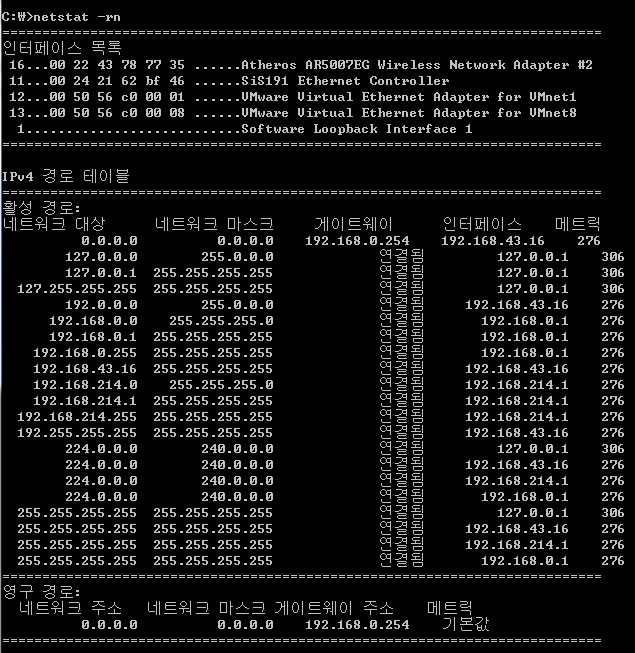

# 홉바이홉 통신
## 1. 홉바이홉(hop by hop)
### 1.1 홉바이홉
- 홉(hop) : 건너 뛰는 모습 (각 패킷이 여러 개의 라우터를 건너가는 모습)
- 통신 장치에 있는 라우팅 테이블의 IP를 통해 패킷(네트워크 데이터 블록)이 최종 목적지까지 도달하는 통신

## 2 라우팅 테이블
### 2.1 라우팅(Routing)
- 한 네트워크에서 다른 네트워크로 패킷을 이동시키는 과정과 네트워크 안의 호스트에게 패킷들을 전달하는 과정

### 2.2 라우팅 테이블(Routing Table)
- 패킷이 목적지, 목적지까지의 거리와 가는 방법 등을 명시하고 있는 테이블 
- 시간에 따라 주기적으로 업데이트하며 라우터기기의 손상이나 새로운 경로 생성이나 제거에 따라 변화함

### 2.3 게이트웨이(Gateway)
- 한 네트워크(segment)에서 다른 네트워크로 이동하기 위하여 거쳐야 하는 지점
- 서로 다른 네트워크의 프로토콜이 다를 경우에 중재 역할
- 홉 수(hop count) : 네트워크에 접속할 때까지 거치는 게이트 웨이의 수

### 2.4 라우팅 테이블 읽는 법
- 라우팅 테이블 확인하는 법 : 명령 프롬프트에서 netstart -r

- 원리 : 
	1. 도착하고자 하는 목적지의 IP 주소와 네트워크 마스크를 AND 연산함
	2. 계산값이 네트워크 대상과 일치할 때 게이트 웨이로 전달

- 라우팅 테이블 예시
|네트워크 대상|네트워크 마스크|게이트웨이|인터페이스|메트릭|
|---|---|---|---|---|
|0.0.0.0|0.0.0.0|192.168.0.254|192.168.43.16|276|
|127.0.0.1|255.255.255.255|연결됨|127.0.0.1|306|
|192.168.43.16|255.255.255.255|연결됨|192.168.43.16|276|
|192.168.214.0|255.255.255.0|연결됨|192.168.214.1 |276|
	
   1. 들어온 패킷과 네트워크 마스크(0.0.0.0)을 AND연산하여 네트워크 대상(0.0.0.0)이 나올 경우,
	- 인터페이스(192.168.43.16)를 통해서, 게이트웨이(192.168.0.254)로 패킷을 전달
	- 메트릭 값은 라우팅 할 때의 우선순위에 영향을 미침

   2. 들어온 패킷과 네트워크 마스트(255.255.255.255)을 AND연산하여 네트워크 대상(127.0.0.1)이 나올 경우
	- 인터페이스(127.0.0.1)를 통해서 패킷을 자신이 받음

   3. 들어온 패킷과 네트워크 마스트(255.255.255.255)을 AND연산하여 네트워크 대상(192.168.43.16)이 나올 경우
   - 인터페이스(192.168.43.16)를 통해서 패킷을 자신이 받음

   4. 들어온 패킷과 네트워크 마스트(255.255.255.0)을 AND연산하여 네트워크 대상(192.168.214.0)이 나올 경우
   - 인터페이스(192.168.214.1)를 통해서 패킷을 자신이 받음