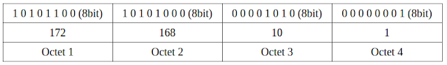
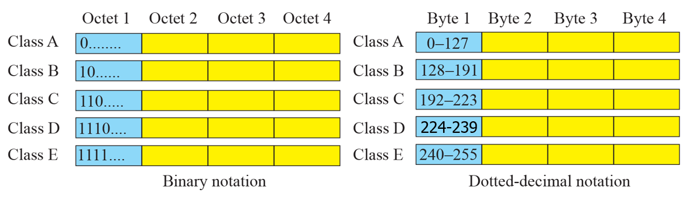
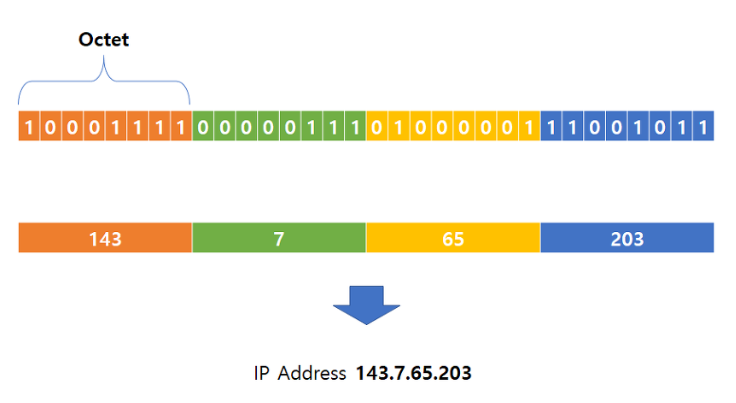
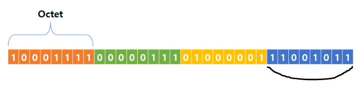
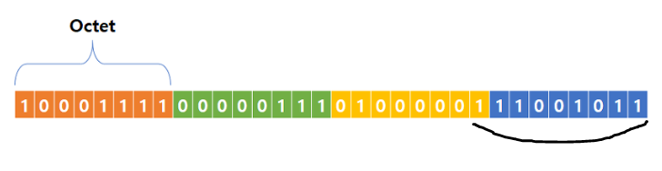
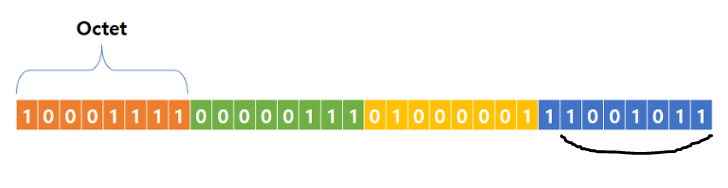
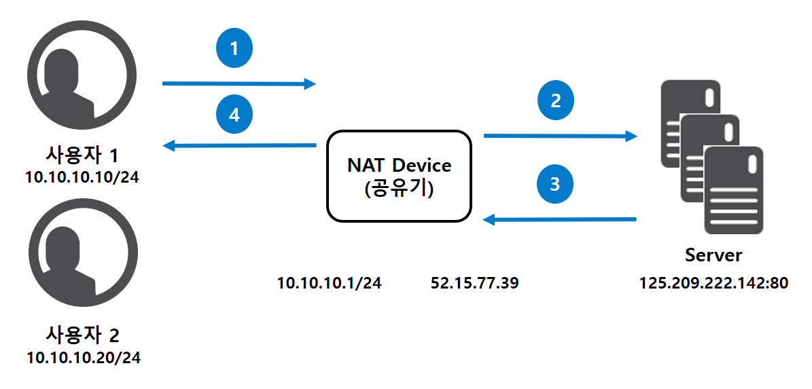
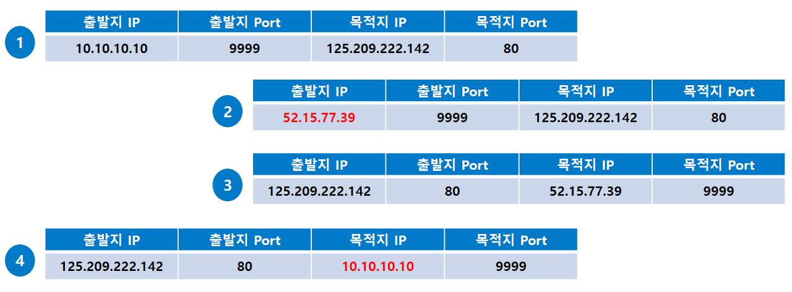
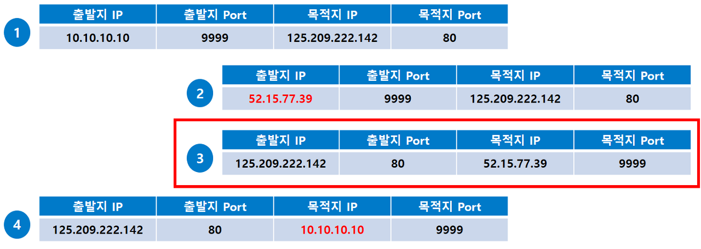
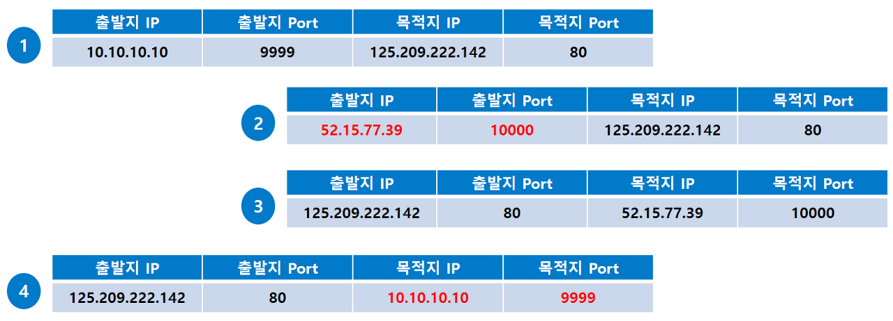

# IP 주소 체계
## 1. IP 주소의 구조
### 1.1 IPv4
- 총 32비트로 각 8비트씩 4자리로 되어 있으며, 각 자리는 ‘.’(dot)으로 구분함
-  실제 IP는 2진수로 표기되어 xxxxxxxx.xxxxxxxx.xxxxxxxx.xxxxxxxx (x는 0 또는 1)와 같은 형태로 구분되지만 간편하게 10진수로 나타내는 표기법으로 사용함
- 이후 설명할 IP 주소 구분은 IPv4 기반
	ex) 121.151.211.7

### 1.2 IPv6
- 총 128비트로 각 16비트씩 8자리로 각 자리는 ‘:’(콜론)으로 구분함
- 각 필드의 맨 앞에 연속되는 0은 생략할 수 있음
	- ex ) 2001:0DB8:1000:0000:0000:0000:1111:2222
		== 2001:DB8:1000::1111:2222

## 2. 클래스 기반 주소 지정
### 2.1 IP 클래스
- IP 주소를 5개의 클래스 (Class A, B, C, D, E)로 나누어서 배분하는 방식
- TCP/IP 체계 도입 초반에 제안된 주소 지정 개념
- IP의 클래스는 상위 Bit의 주소 시작값을 보고 판별할 수 있음

- 각 클래스 별로 호스트 주소의 범위가 다름

### 2.2 시작 주소, 브로드캐스트 주소
- 네트워크 주소 : 해당 네트워크의 첫번째 IP 주소
- 브로드캐스트 주소 : 해당 네트워크의 마지막 주소
- 실제 IP 주소로 할당되는 영역은 대역의 시작, 끝을 제외한 중간 영역

### 2.3 예시
- 만약 어떤 기업이 144.123.123.123을 사용하고 있다면, 사용 가능한 아이피의 범위?
	- 144로 시작하므로 ClassB이다
	- 즉, 144.n.0.0 ~ 144.n.255.255 까지 사용 가능함
	- 사용 가능한 아이피 개수는 256 * 256 - 2 = 65,534개

### 2.3 단점
- 호스트가 낭비됨 (매우 비효율적)
	- ex) 111.nnn.nnn.nnn : 256 * 256 * 256 -2 = 총16,777,214개
		해당 기관이 100개의 호스트를 사용하면, 16,777,114개의 호스트가 낭비됨

## 3. CIDR
### 3.1 CIDR(Classless Inter-Domain Routing)
- 클래스 없는 도메인간의 라우팅 기법
- 클래스가 없다 == 네트워크 구분을 클래스로 하지 않는다
- 서브넷 개념을 사용함 (호스트 범위를 줄이기)
- ex) 192.168.10.0/24
- **CIDR 숫자(/n)이후 비트의 최솟값과 최댓값이 사용 가능 범위가 됨**

### 3.2 예시
- 기본 IP 주소 : 143.7.65.203의 이진 표기

**ex 1) 143.7.65.203/24** : 24비트 이후에 오는 비트부터 모두 사용할 수 있음

 == 143.7.65.0 ~ 143.7.65.255 까지 사용
 
 **ex 2) 143.7.65.203/23** : 23비트 이후에 오는 비트부터 모두 사용할 수 있음

 == 143.7.64.0 ~ 143.7.65.255 까지 사용
 
 **ex 3) 143.7.65.203/25** : 25비트 이후에 오는 비트부터 모두 사용할 수 있음

 == 143.7.65.128 ~ 143.7.65.255 까지 사용

## 3.3 장단점
1. 장점
	- 표기법을 한 줄로 할 수 있다
	- CIDR 숫자를 조절하며 필요에 따라 서브넷팅(더 적게 쓰기)과 슈퍼넷팅(더 많이 쓰기)이 가능함
2. 단점
	- 여전히 버리는 주소가 많음

## 4. 동적 호스트 구성 프로토콜(DHCP)
### 4.1 DHCP(Dynamic Host Configuration Protocol)
- IP 주소 및 기타 통신 매개변수를 네트워크에 연결된 장치에 자동으로 할당함
- 수동으로 설정 할 필요없이 인터넷에 접속할 때마다 자동으로 할당

### 4.2 동작 과정
1. 장치는 네트워크에 연결 시 IP 주소를 요청
2. 요청은 DHCP 서버로 전달되고, 서버는 주소를 할당하고 주소의 이용을 모니터링함
3. 장치의 연결이 해제되면 주소를 다시 가져옴 (회수)
4. 해당 IP 주소는 다른 장치에 재할당할 수 있으며, 장치는 IP 주소를 이용해 내부 및 공용 네트워크와 통신할 수 있음

### 4.3 장단점
1. 장점
	- 신뢰성 : 동일한 IP 주소를 이용하는 두 명의 사용자 사이의 충돌을 방지
	- 높은 이동성
	- 효율적인 네트워크 관리
	- IP 체계의 유연성
2. 단점
	- 보안 문제 (인증 과정을 거치지 않음)

## 5. NAT
### 5.1 NAT(Network Address Translation)
- 패킷이 라우팅 장치를 통해 전송되는 동안 IP 주소와 포트를 변환시켜 사용하는 것
- 라우터에 내장된 기능 중 하나 ex) 공유기
- 쉽게 말해, 출발지 혹은 목적지의 IP 주소 또는 포트를 바꾸는 것

### 5.2 NAT 사용 배경-1 : 사설망-공인망 통신
- 사설망 :  특정 대역을 공인 인터넷이 아닌 가정, 기업 등의 한정된 공간에 사용한 네트워크
	- 사설망에 소속된 IP인 사설 IP 대역은 다음과 같으며 오로지 **사설망(내부망)에서만 사용 가능**, 공인망(외부망, 인터넷)에선 사용할 수 없음
	- 사설 IP는 사설망에 해당한다면 어디에서나 사용할 수 있음
- 문제점 : 사설망에서 공인 인터넷으로 나가고자 할 때 자신의 출발지 IP(Source IP)를 그대로 쓸 수 없음
- 해결 : **사설 IP를 공인 IP로 변환함**

### 5.2 NAT 사용 배경-1 : 사설망 간 통신
- 문제점 : 기업의 경우, 자사의 실제 IP를 노출시키지 않아야 함
- 해결 : **대외망을 통해 통신 (IP 변환)**

### 5.3 예시 : 공유기와 NAT
- 공유기의 역할 : 자신과 연결된 컴퓨터들이 Public IP로 인터넷 연결을 할 수 있도록 중개함

- NAT 과정
	1.  NAT 장비가 공인망의 웹서버에게 보내기 위해 사용자의 사설 IP를 자신의 공인 IP로 변환하여 웹서버에게 전달
	2. 웹서버가 사용자가 보낸 요청을 처리하고 응답을 사용자에게 보냄
	3. 응답 패킷을 받아든 NAT 장비가 과거 사용자가 보낸 요청에 대한 응답임을 기억함
	4. 목적지 IP를 공인 IP에서 사용자의 실제 사설 IP로 변환하여 전달

- **NAPT(**Network Address Port Translation**)** : NAT의 문제를 해결
	- 만약 사용자2의 출발지 Port도 9999인 경우? > 출발지 Port도 임의로 변경
	- 출발지 Port를 변경해주는 이유
		- NAT의 3번 과정에서 사용자간 구분을 해주기 위해
		
	- 출발지 Port 변경 후 (9999 -> 10000)
	

### 5.4 NAT 종류
- IP 변환 방식에 따라
	- Static NAT : 1:1
	- Dynamic NAT : N:N
- 변환 대상에 따라
	- SNAT : 출발지 IP(Source IP)를 변환
	- DNAT : 도착지 IP(Destiny IP)를 변환
	- NAPT : IP + Port까지 같이 변환

### 5.5 장단점
1. 장점
	- 인터넷의 공인 IP주소를 절약할 수 있음
	    - 공인 IP를 다수가 함께 사용할 수 있으므로 이를 절약할 수 있습니다.
    -  공공망과 사설망 사이에 방화벽을 설치하여 외부공격으로부터 사용자의 통신망을 보호할 수 있음
    -  NAT 설정 시, 라우터는 자신에게 할당된 공인 IP주소만 외부로 알려지고 내부에서는 사설 IP를 사용하기 때문에 외부침입자는 사설 IP를 몰라 공격이 힘들어짐
2. 단점
	- 사설 네트워크와 인터넷을 오갈 때마다 주소 변환을 다시 계산해야 하므로 성능 감소의 우려가 있음
	- NAT는 데이터그램의 IP헤더 필드만을 수정하고, 어플리케이션 데이터 영역은 수정하지 않기 때문에 특정 어플리케이션에서 호환성 문제가 발생할 수 있음