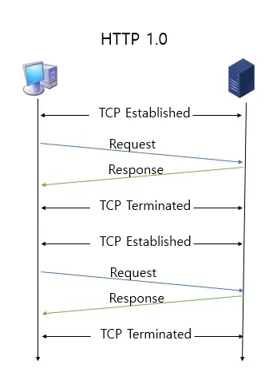

# 2.5.1 HTTP/1.0

## HTTP란?
- 애플리케이션 계층
- 웹 서비스 통신에 사용됨
- TCP를 이용하여 통신함
- HTTP/1.0에서 시작해 현재는 HTTP/3임

## HTTP/1.0



- 기본적으로 한 열결당 하나의 요청을 처리하도록 설계됨
- TCP 세션을 유지하지 않는 None-persistent HTTP
- 매번 데이터를 요청하고 수신할 때마다 새로운 TCP 세션을 맺어야 함
- RTT 증가를 불러옴

> [참고] RTT란?
- 패킷이 목적지에 도달하고 나서 다시 출발지로 돌아오기까지 걸리는 시간이며, 패킷 왕복 시간

## RTT 증가
- 서버로부터 파일을 가져올 때마다 TCP의 3-웨이 핸드셰이크를 계속해서 열어야 하기 때문에 RTT가 증가한다는 단점이 있음

## RTT 증가를 해결하기 위한 방법

### 이미지 스플리팅
- 많은 이미지를 다운로드받게 되면 과부하가 걸리기 때문에 많은 이미지가 합쳐 있는 하나의 이미지를 다운로드받고, 이를 기반으로 background-image의 position을 이용하여 이미지를 표기하는 방법
- background-image: url("icons.png");, background-position 등을 기반으로 이미지를 설정

```css
#icons>li>a {
    background-image: url("icons.png");
    width: 25px;
    display: inline-block;
    height: 25px;
    repeat: no-repeat;
}

#icons>li:nth-child(1)>a {
    background-position: 2px -8px;
}
#icons>li:nth-child(2)>a {
    background-position: -29px -8px;
}
```

### 코드 압축
- 코드를 압축해서 개행 문자, 빈칸을 없애서 코드의 크기를 최소화하는 방법
- 개행 문자, 띄어쓰기 등이 사라져 코드가 압축되면 코드 용량이 줄어든다

```javascript
//before
const express = require('express')
const app = express()
const port = 3000
app.get('/', (req, res) => {
    res.send('Hello World!')
})
app.listen(port, () => {
    console.log(`Example app listening on port ${port}`)
})

//after
const express=require("express"),app=express(),port=3e3;app.get("/",(e,p)=>{p.send("Hello World!")}),app.listen(3e3,()=>{console.log("Example app listening on port 3000")});
```

### 이미지 Base64 인코딩
- 이미지 파일을 64진법으로 이루어진 문자열로 인코딩하는 방법
- 서버와의 연결을 열고 이미지에 대해 서버에 HTTP 요청을 할 필요가 없다는 장점이 있음
- But, Base64 문자열로 변환할 경우 37% 정도 크기가 더 커지는 단점이 있음

> [참고] 인코딩
- 정보의 형태나 형식을 표준화, 보안, 처리 속도 향상, 저장 공간 절약 등을 위해 다른 형태나 형식으로 변환하는 처리 방식

