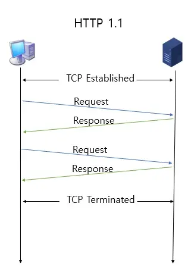

# 2.5.2 HTTP/1.1

## HTTP/1.1
- HTTP/1.0에서 발전한 것
- 매번 TCP 연결을 하는 것이 아니라
- 한번 TCP 초기화 후에, keep-alive라는 옵션으로 여러 개의 파일을 송수신 가능
- 참고로, HTTP/1.0에서도 keep-alive가 있었지만 표준화가 되어있지 않았고 HTTP/1.1부터 표준화가 되어 기본 옵션으로 설정되었음
- 아래 그림처럼 한번 TCP 3-웨이 핸드셰이크가 발생하면 그 다음부터 발생하지 않는 것을 확인 가능
- But, 문서 안에 포함된 다수의 리소스 (이미지, css파일, script파일)을 처리하려면 요청할 리소스 개수에 비례해서 대기 시간이 길어진다는 단점 존재



## HOL Blocking
- 1개의 TCP 커넥션 상에서 3개의 이미지 (a.png, b.png, c.png)를 받는 경우, HTTP 리퀘스트는 다음과 같이 됨

```
|---a.png---|
            |---b.png---|
                        |---c.png---|
```

- 하나의 요청이 처리되고 응답을 받은 후에 다음 요청을 보냄

- 이전의 요청이 처리되지 않았다면 그 다음 요청은 보낼 수 없다는 것

- 만약 a.png의 요청이 막혀버리게 되면 b,c가 아무리 빨리 처리될 수 있더라도 전체적으로 느려지게 됨

```
|------------a.png------------|
                              |-b.png-|
                                      |---c.png---|
```


## 무거운 헤더 구조
- HTTP/1.1의 헤더에는 쿠키 등 많은 메타데이터가 들어 있고 압축이 되지 않아 무거웠음