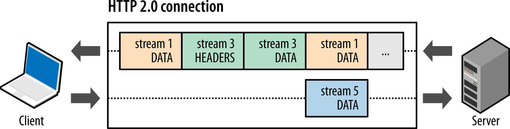
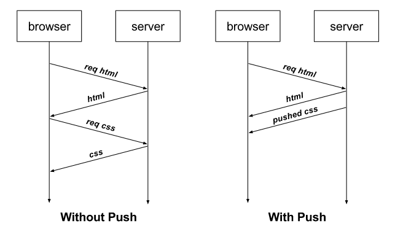

# 2.5.3 HTTP/2

## HTTP/2
- 구글의 SPDY를 기반으로 HTTP/1.1의 단점을 개선한 차세대 웹 프로토콜
- HTTP/1.x 보다 지연 시간을 줄이고 응답 시간을 더 빠르게 할 수 있으며 멀티플렉싱, 헤더 압축, 서버 푸시, 요청의 우선순위 처리를 지원하는 프로토콜

> [참고] SPDY란?
- 웹 콘텐츠를 전송할 목적으로 구글이 개발한 비표준 개방형 네트워크 프로토콜

## 멀티플렉싱
- 여러 개의 스트림을 사용하여 송수신한다는 것
- 특정 스트림의 패킷이 손실되었다고 하더라도 해당 스트림에만 영향을 미치고 나머지 스트림은 멀쩡하게 동작 가능

> [참고] 스트림(stream)이란?
- 시간이 지남에 따라 사용할 수 있게 되는 일련의 데이터 요소를 가리키는 데이터 흐름

- 하나의 연결 내 여러 스트림의 모습
- 병렬적인 스트림들을 통해 데이터를 서빙
- 스트림내의 데이터들도 쪼개져 있음
- 애플리케이션에서 받아온 메세지를 독립된 프레임으로 조각내어 서로 송수신한 이후 다시 조립하며 데이터를 주고 받음

- 이를 통해 단일 연결을 사용하여 병렬로 여러 요청을 받을 수 있고 응답을 줄 수 있음
- HTTP/1.x에서 발생하는 HOL Blocking 문제 해결 가능

## 헤더 압축
- HTTP/1.x에는 크기가 큰 헤더라는 문제가 있었음
- 이를 HTTP/2에서는 헤더 압축을 써서 해결하는데, 허프만 코딩 압축 알고리즘을 사용하는 HPACK 압축 형식을 가짐
- 웹 페이지와 그 의존 개체를 내려받는 데는 많은 요청이 필요
- 이 요청 수는 웹 페이지 하나에 보통 수백 개에 달하며, 이 요청들은 대개 매우 유사한 경향이 있음
- 다음 두 개의 요청은 전체 웹 페이지를 요청하느라 하나의 브라우저 세션에서 연이어 전송
- 두 번째 요청 중 많은 부분이 첫 번째 요청을 반복하고 있음을 볼 수 있음
- 차이가 나는 부분만 전송한다면 전송 바이트 수를 많이 줄일 수 있을 것

> [참고] 허프만 코딩
- 문자열을 문자 단위로 쪼개 빈도수를 세어 빈도가 높은 정보는 적은 비트 수를 사용하여 표현하고, 빈도가 낮은 정보는 비트 수를 많이 사용하여 표현해서 전체 데이터의 표현에 필요한 비트양을 줄이는 원리

## 서버 푸시
- HTTP/1.1에서는 클라이언트가 서버에 요청을 해야 파일을 다운로드받을 수 있었다면, HTTP/2는 클라이언트 요청 없이 서버가 바로 리소스를 푸시할 수 있음
- HTTP/1.1에서는 브라우저에서 HTML을 수신하여, 해석하면서 필요한 리소스를 재요청하는데,
- HTTP/2에서는 사전에 리소스 요청을 예측하여, 서버에서 푸쉬를 해줌으로써 성능을 개선함

- html에는 css나 js파일이 포함되기 마련인데, html을 읽으면서 그 안에 들어있던 css 파일을 서버에서 푸시하여 클라이언트에게 먼저 줄 수 있음