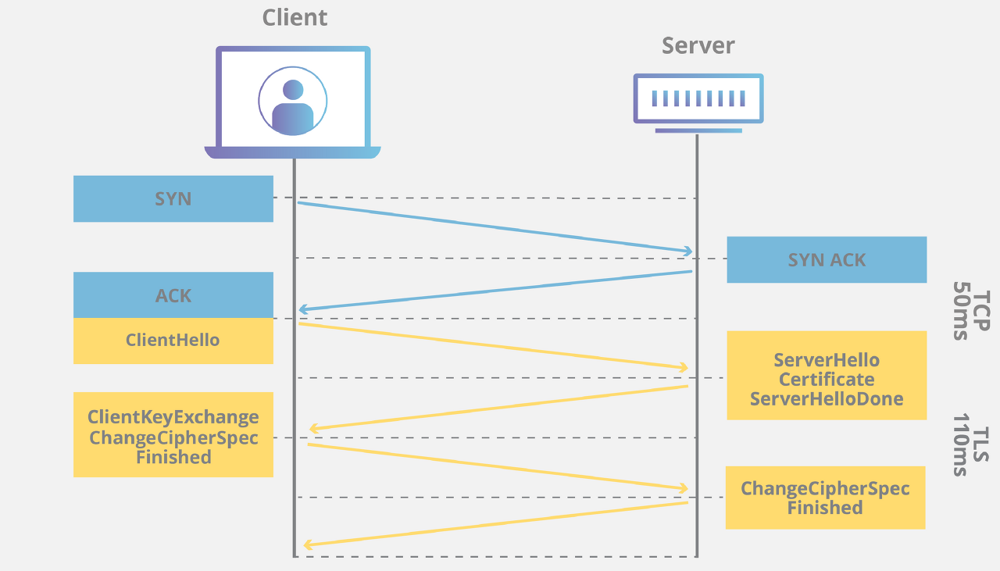

# HTTPS

## 1. HTTPS
### 1.1 HTTPS란
- 애플리케이션 계층과 전송 계층 사이에 신뢰 계층인 SSL/TLS 계층을 넣은 신뢰할 수 있는 HTTP 요청
- HTTP는 정보를 텍스트로 주고 받기 때문에 네트워크에서 전송 신호를 인터셉트 하는 경우 원하지 않는 데이터 유출이 발생할 수 있음
- 이러한 보안 취약점을 해결하기 위한 프로토콜이 **HTTP에 S(Secure Socket)가 추가된 형식이 HTTPS**

### 1.2 HTTPS 특징
- HTTPS는 기본 골격이나 사용 목적 등은 HTTP와 거의 동일하지만, 데이터를 주고 받는 과정에 ‘보안’ 요소가 추가되었다는 것이 가장 큰 차이점
- HTTPS를 사용하면 **서버와 클라이언트 사이의 모든 통신 내용이 암호화**됨

### 1.3 SSL/TLS
- SSL(Secure Socket Layer) / TLS(Transport Layer Security Protocol)
- 전송계층 상에서 클라이언트, 서버에 대한 인증 및 데이터 암호화를 수행하는 프로토콜
- TLS은 SSL의 향상된, 더욱 안전한 버전임, 하지만 SSL이 더욱 일반적인 용어라서 통칭 SSL

### 1.4 사이퍼 슈트(Cipher Suite)
- 암호화 스위트 (Cipher Suite) 는 일반적으로 다음과 같은 구조를 가지고 있음

- 다음과 같이 SL/TLS 암호화 통신에 사용할 여러가지 알고리즘을 선택하게 되며, 이러한 협의 및 선택된 알고리즘의 집합을 Cipher Suite 라고 함

1. **프로토콜 (Protocol)**
	- SSLv3, TLSv1, TLSv1.1, TLSv1.2 와 같이 암호화 통신에 사용할 프로토콜을 명시하는 부분

2. **키교환 (Key Exchange)**

	- WITH 앞쪽 부분이 보통 키교환과 인증 (전자서명을 통한 인증서 검증) 을 담당하는 부분입니다. 
	- 종류 : RSA, DH, DHE, ECDH, ECDHE 등

		-   RSA : 비대칭키를 이용한 키교환 방식
		-   DH : 디피 헬만 (Diffie Hellman) 방식
		-   DHE : Ephermeral 을 지원하는 디피 헬만 (Diffie Hellman) 방식 (PFS, Perfect Foward Secrecy  지원)
		-   ECDH : Elliptic Curve Diffie Hellman, Propose Cheme 방식
		-   ECDHE : Elliptic Curve 및 Ephermeral 을 지원하는 디피 헬만 (Diffie Hellman) 방식 (PFS, Perfect Foward Secrecy  지원)

3. **인증 (Authentication)**

	- 키를 교환할 상대방이 교부한 인증서가 정말 내가 접속하고자 하는 상대방이 맞는지 상위 인증기관 (CA)를 통하여 확인하게 되는데, 이 때 사용되는 알고리즘을 의미 
	- 종류 : RSA, DSS, ECDSA, ANON 등
	- 인증서를 만들때 인증서 서명 요청 (CSR)을 작성하여 상위 인증기관 (CA)에 요청하게 되는데, 이 때 알고리즘이 선택됨

	- ex) Cipher Suite 예시
		-   RSA : 키교환 및 인증을 모두 RSA 알고리즘을 이용
		-   DH-RSA : 키교환은 디피 헬만 (Diffie Hellman), 인증은 RSA
		-   ECDHE-RSA : 키교환은 ECDHE, 인증은 RSA

4. **암호화 (Encryption)**

	- 실제 데이터를 암호화 하는 부분은 WITH 뒷쪽에 표현된 Cipher Suite 값을 이용하여 처리
	- 종류 : 3DES, AES, AES128 등

5. **블록 암호 운용 방식 (Block Cipher Operation Mode)**

	- 실데이터를 암호화 할 때 실데이터를 일률적으로 암호화 하는 것이 아니라 블록 단위로 쪼개서 암호화
	- 이 때 암호화 된 암호문을 가지고 실데이터를 추측하는 것을 방지하기 위하여 특정한 블록 암호 운용방식을 선택하게 됨

		-   CBC : Chipher Block Chaining, 암호 블록 체인 모드, CTR과 CBC-MAC을 조합하여 계산, 느림
		-   GCM : Galois/Counter Mode, 갈르와 카운터 모드, CTR과 GHASH를 조합하여 계산, 빠름
- 
6. 메시지 인증 (Message Authentication)

	- 블록 단위로 암호화 된 메시지들이 상대방이 암호화 한 것이 맞는지 확인하기 위하여 무결성을 검증
	-  MAC (Message Authentication Code) 라고도 하는데, 여기에 해쉬 알고리즘 (SHA, SHA256, SHA384, MD5 등) 을 이용하기 때문에 HMAC이라고 부름

### 1.5 SSL Handshake 과정

- 순서
	1. ClientHello(암호화 알고리즘 나열 및 전달) 
	2. Serverhello(암호화 알고리즘 선택)
	3.  Server Certificate(인증서 전달) 
	4. Client Key Exchange(데이터를 암호화할 대칭키 전달) 
	5. Client / ServerHello done (정보 전달 완료)
	6. Fisnied (SSL Handshake 종료) 

- 과정이 끝나면 Client와 Server는 데이터를 암호화할 동일한 대칭키(비밀키)를 갖게 되며, 서로에게 각자 갖고 있는 동일한 대칭키를 통해 데이터를 암호화하여 전송하거나 데이터를 복호화 함
- 대칭키 > 하단 3. 암호 알고리즘 참고



1. **Client Hello**

	- Client가 Server에 연결을 시도하며 전송하는 패킷
	- 자신이 **사용 가능한 Cipher Suite 목록, Session ID, SSL Protocol Version, Random byte** 등을 전달함

2. **Server Hello**

	- Client가 보내온 ClientHello Packet을 받아 Cipher Suite 중 하나를 선택한 다음 Client에게 이를 알리고, 자신의 SSL Protocol Version 등도 같이 보냄

3. **Certificate**

	- Server가 자신의 SSL 인증서를 Client에게 전달함
	- 인증서 내부에는 Server가 발행한 **공개키(+개인키는 Server가 소유)** 가 들어있음
	- Client는 Server가 보낸 **CA(Certificate Authority, 인증기관)의 개인키**로 암호화된 이 SSL 인증서를 이미 모두에게 공개된 **CA의 공개키**를 사용하여 복호화
	- Client는 데이터 암호화에 사용할 **대칭키(비밀키)** 를 생성한 후 SSL 인증서 내부에 들어 있던 (Server가 발행한) 공개키를 이용해 암호화하여 Server에게 전송

4. **Server Key Exchange / ServerHello Done**

	- Server Key Exchange : Server의 **공개키**가 SSL 인증서 내부에 없는 경우, Server가 직접 전달함
	- **공개키**가 SSL 인증서 내부에 있을 경우 Server Key Excahnge는 생략
	- 인증서 내부에 공개키가 있다면 Client가 **CA(Certificate Authority, 인증기관)의 공개키**를 통해 인증서를 복호화한 후 Server의 공개키를 확보하고, Server가 행동을 마쳤음을 알림

5. **Client Key Exchange**

	- **대칭키(비밀키, 데이터를 실제로 암호화하는 키)** 를 Client가 생성하여 SSL 인증서 내부에서 추출한 Server의 공개키를 이용해 암호화한 후 Server에게 전달
	- 여기서 전달된 '대칭키'가 바로 **SSL Handshake의 목적**이자 가장 중요한 수단인 데이터를 실제로 암호화할 **대칭키(비밀키**)입니다
	- 키를 통해 Client와 Server가 교환하고자 하는 데이터를 암호화

6. **ChangeCipherSpec / Finished**

	- Client, Server 모두가 서로에게 보내는 Packet으로 교환할 정보를 모두 교환한 뒤 통신할 준비가 다 되었음을 알리고 'Finished' Packet을 보내어 SSL Handshake를 종료


## 2. 인증 매커니즘
### 2.1 CA(Certification Authority)
- 공개키와 공개 DNS명(ex.`www.example.com`)의 연결을 보장하는 기관
- CA는 자신만의 암호화 키로 웹사이트의 공개키를 암호학적으로 사인하는 데 사용함으로써 특정 공개키가 특정 사이트의 공개키라는 것을 보장

### 2.2 인증 매커니즘
1.  인터넷 사이트(서버)는 공개키와 개인키를 만들고, 신뢰할 수 있는 인증 기관(CA)에 자신의 정보와 공개키를 관리해달라고 계약
2.  이 때, 계약을 완료한 인증 기관은 기관만의 공개키와 개인키가 있음. 인증 기관은 사이트가 제출된 데이터를 검증하고, 인증 기관의 개인키로 사이트에서 제출한 정보를 암호화해서 인증서를 만들어 제공
3.  인증 기관은 웹 브라우저에게 자신의 공개키를 제공


## 3. 암호화 알고리즘
### 3.1 대칭키, 공개키 암호화
1. **대칭키**
	
	- 대칭 키 암호화 방법은 암호화, 복호화에 같은 키를 사용
	- ex) 자물쇠를 잠그고 풀 때 같은 키를 사용하는 것

2. 공개키 암호화 
	- 위 예시에서 키를 도난당한다면? > 이런 위험을 방지하기 위해 만든 방식![[HTTP_03.jpg]]
	- 자물쇠를 잠그고 풀 때 같은 키 를 사용했던 대칭 키 알고리즘과 달리, 공개 키 암호화 방식에서는 자물쇠를 잠글 때 는 누구에게나 공개되어 있는 공개 키를, 자물쇠를 풀 때 에는 자물쇠의 주인 만이 가지고 있는 비밀키를 사용
	- 대칭키 알고리즘 과 달리 공개키를 누구에게나 공개해도 상관 없으며 비밀키만 잘 관리하면 됨

3. 대칭키와 공개키 
	- 일반적으로 대칭키 알고리즘은 암호화, 복호화에 2개의 키를 사용하는 공개 키 알고리즘과 달리 하나의 대칭 키를 사용하기 때문에 계산 속도가 더 빠르다는 장점이 있어 현대에서도 공개키와 대칭키 암호화 알고리즘이 그 목적에 따라 같이 쓰이기도 함
	- `https://` 로 시작하는 URL 의 웹 사이트를 접속 할 때, 웹사이트 인증에는 공개 키 암호화 알고리즘을, 데이터 송수신 에서의 암호화 에는 속도가 더 빠른 대칭 키 암호화 알고리즘을 사용

- 대칭키 예시

	- 대칭키가 동일하면 유출의 위험이 크다 

- 개선된 대칭키

- 서로 온전한 대칭키를 가지고 있는 것이 아닌 반쪽 키 만 가지고 있고, 서로의 반쪽 키를 합쳐서 대칭키를 만듦
- 특징
	-   중간에 다른 사람이 반 쪽 키 두개를 모두 탈취 한다고 해도 온전한 대칭 키를 만들 수 없다.
	-   반쪽 키를 합쳐서 온전한 키를 만드는 방법은 공개되어 있어야 한다.

### 3.2 디피 헬만 키 교환 알고리즘

1. 양방향 함수
	- 거꾸로 계산하기 쉬움

2. 일방향 함수
	- 거꾸로 계산하기 어려움
	- `Y = a^x mod b`는  a, b 는 알고 있고 x 가 주어졌을때 y를 구하기는 쉽지만, y 가 주어져 있을 때 역으로 x 를 구하기는 어려움
	- 일방향 함수의 특징을 디피 헬만 키 교환 알고리즘 에서는 송수신자 둘 만 생성 가능한 대칭 키를 만드는데 사용함!
```
Y = 2X  // 양방향 함수
```
```
y = a**x mod b  // 일방향 함수
```


- 공개키 : g, p
- 반쪽짜리 대칭키 : a, b
- 그 후, 서로의 반쪽짜리 키로 `g^a mod p` 와 `g^b mod p` 를 만들어 서로에게 보냄
- 서로가 교환한 `g^a mod p`, `g^b mod p` 와 자기만 알고있는 반쪽짜리 키 인 a, b 로 `(g^a)^b mod p` = `(g^b)^a mod p` = **`g^ab mod p`** 를 만들 수 있음
- 송수신자는 서로 반쪽짜리 키 인 `a, b` 를 **직접 교환한 것 이 아닌** `g^a mod p` 와 `g^b mod p` 를 교환
- 따라서 중간에 다른 사람이 `g^a mod p` 와 `g^b mod p` 를 탈취해도, 이를 통해 서로를 곱한 `g^(a+b) mod p` 까지 만 얻을 수 있음

## 4. 해싱 알고리즘
### 4.1 SHA-256
- SHA(Secure Hash Algorithm) 알고리즘의 한 종류로서 256비트로 구성되며 64자리 문자열을 반환
- 블록체인에서 가장 많이 채택하여 사용
- SHA-256 해시 함수는 어떤 길이의 값을 입력하더라도 256비트의 고정된 결과값을 출력한다
- 이름에 내포되어 있듯 2^256만큼 경우의 수를 만들수 있다.
- 아주 작은 확률로 입력값이 다름에도 불구하고 출력값이 같은 경우가 발생하는데 이것을 충돌이라고 함
	- 이러한 충돌의 발생 확률이 낮을수록 좋은 함수라고 평가되는데, SHA-256이 이에 해당함

- 현재까지 안정성 문제에서도 큰 단점이 발견되지 않았고, 속도가 빠르기 때문에 인증서, 블록체인 등 많이 사용되고 있으며, 상용화가 잘 되어있음

## 5. SEO와 알고리즘
### 5.1 **SEO**(검색 엔진 최적화)
- 웹사이트가 검색 결과에 더 잘 보이도록 최적화하는 과정
- SEO 커뮤니티는 구글 HTTPS를 우선순위 신호로 발표한 다음에, 보안에 대해서 더 관심을 가지게 됨
- 구글의 장기적인 목표, 즉 사용자를 위해 웹을 보다 안전하게 만들고 사용자를 보호할 목적에 따라 바뀌게 됨 

### 5.2 캐노니컬 태그 (Canonical tag)

- 사이트 내 URL 주소는 다르지만 동일한 내용의 중복된 페이지가 있을 때 페이지에 코드를 삽입하여 검색엔진에 대표가 되는 URL 주소를 알려주는 역할을 하는 태그
- 만약 이런 중복 페이지의 경우 캐노니컬(Canonical) 태그를 적용하지 않을 경우 검색엔진은 자기 마음대로 원본 URL을 판단하여 적용하며 중복되는 다른 페이지들은 덜 크롤링을 하게 됨

```
<head>
   <link rel="canonical" href="https://www.mysite.com/shop">
</head>
```


### 5.3 메타(Meta)
-  html이라는 컴퓨터 언어로 된 문서를 설명하는 정보입니다.  
- 이 페이지의 내용은 무엇이고 중요 키워드가 어떤 것인지, 대표하는 이미지가 뭔지를 적어놓는 것
- 자동으로 내용을 읽어들이는 것에 비해서 의도하는 대로 검색 노출을 유도
- ex) 홈페이지에 A, B, C, D라는 내용이 들어있는데, 집중해서 검색엔진에 노출시킬 내용은 A, C라면 meta 태그에 A와 C에 대한 내용을 중점적으로 입력해서 검색 노출을 유도