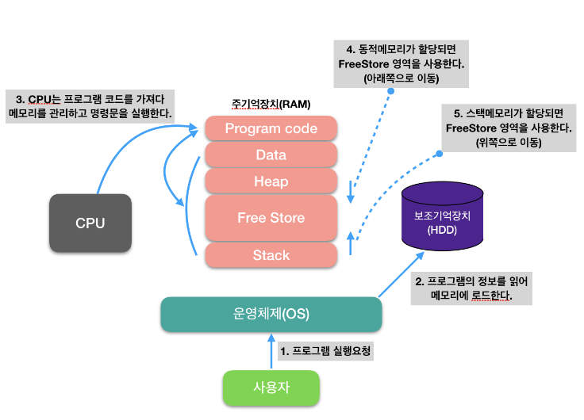
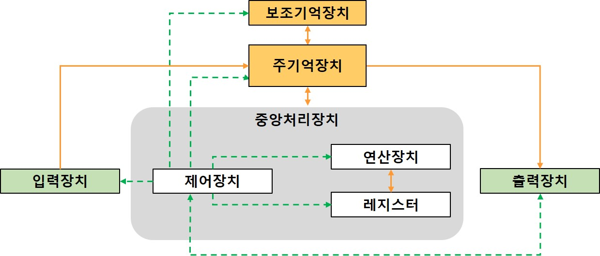

# 컴퓨터 요소

1. CPU
2. DMA 컨트롤러
3. 메모리
4. 타이머
5. 디바이스 컨트롤러 

# 메모리상의 프로세스

1. 사용자 프로그램 실행 요청
2. 운영체제가 메모리에 프로그램을 로드하여 프로세스를 만듦
3. CPU는 프로그램 코드를 가지고 프로세스에 따라 작업

# 1. CPU(Central Programming Unit)

- 산술논리연산장치, 제어장치, 레지스터로 구성되어있는 컴퓨터 장치
- 메모리에서 클럭마다 명령을 하나씩 읽어와 실행하는 역할
- 기본적으로 운영체제의 커널이 메모리에 프로그램을 올려 프로세스로 만들면 CPU가 처리
- `*인터럽트`에 의해 단순히 메모리에 존재하는 명령어를 해석해서 실행하는 일꾼

## 1.1 인터럽트(interrupt)

- 끼어듦, 가로막기로 프로그램을 실행하고 있을 때 입출력하드웨어 등의 장치에 예외 상황이 발생하여 처리가 필요할 때 CPU에 알려 처리할 수 있도록 하는 것

### 1.1.1 왜 하는걸까?

- CPU와 I/O장치의 속도 차이를 극복하기 위함
- 입출력 연산이 CPU명령 수행속도보다 현저히 느리기 때문
  - 운영체제(악덕 사장)는 CPU(고급인력)이 쉬지않고 일하길 바람
  - 오래걸리는 입출력 연산을 CPU가 매번 기다리게 하지 않고 다른 업무를 할당 !
  - 입출력 연산이 끝나면 CPU에 다시 알려 작업 마무리하도록 함

### 1.1.2 종류

1. 하드웨어 인터럽트
   1. **외부인터럽트(**
      - 키보드 마우스 등 CPU가 아닌 다른 하드웨어 장치가 하드웨어가 CPU에 지시를 요구할 때 사용하는 인터럽트
      - 예) 전원 이상, 기계 착오, 입출력
   2. **내부 인터럽트**
      - 내부 인터럽트는 CPU 내부에서 인터럽트에 걸리는 경우
      - 예) ZERO_DIVISION_ERROR, 명령어 오류, Overflow/Underflow
2. **소프트웨어 인터럽트**
   - 소프트웨어에 의해 호출되는 인터럽트
   - 예) 시스템 콜, 감시프로그램 호출, 소프트웨어 이용 중 다른 프로세스를 실행

> 우선순위
> - 전원 이상(Power fail) > 기계 착오(Machine Check) > 외부 신호(External) > 입출력(I/O) > 명령어 잘못 > 프로그램 검사(Program Check) > SVC(SuperVisor Call)

### 1.1.3 발생 방법

- 하드웨어/소프트웨어은  CPU내에 있는 `인터럽트 라인`을 세팅하여 발생시킴
  - CPU는 다음 수행할 명령어를 수행하기 전에 인터럽트 라인을 먼저 확인

### 1.1.4 과정

- process A 실행 중 디스크에 서 어떤 데이터를 읽어오라는 명령을 받았다고 가정
  - process A는 `system call`을 통해서 인터럽트를 발생시킴
    - system call : 커널 영역의 기능을 사용자 모드가 사용 가능하게, 즉 프로세스가 하드웨어에 직접 접근해서 필요한 기능을 사용할 수 있게 해줌
  - CPU는 현재 진행중인 기계어 코드를 완료함
  - 현재까지 수행중이던 상태를 해당 process의 `PCB(Process Control Block)`에 저장(수행중이던 memory 주소, 레지스터 값, 하드웨어 상태 등)

  - PC(Programming Counter, IP)에 다음에 실행할 명령의 주소를 저장함()
  - 인터럽트 백터를 읽고 `ISR(Interrupt Service Routine)` 주소값을 얻어 ISR로 점프하여 루틴을 실행
  - 해당 코드 실행
  - 해당 일을 다 처리하면 대피시킨 래지스터 복원
  - ISR 끝에 IRET 명령어에 의해 인터럽트 해제
  - IRET 명령어가 실행되면 대피시킨 PC값을 복원하여 이전 실행 위치로 복원

> **PCB(Process Control Block)**
> - 운영체제가 프로세스에 대한 유용한 정볼르 저장해놓을 수 있는 저장장소
> - 프로세스의 현재상태, 프로세스의 고유한 식별자, 프로세스의 우선순위, 프로세스가 적재된 기억장치 부분을 가르키는 포인터, 프로세스에 할당된 자원을 가르키는 포인터, 레지스터 내용을 저장하는 장소 등에 관한 정보를 갖는다.
> - 운영체제가 CPU를 다른 프로세스에 넘겨주고자 할 때 해당 프로세스의 PCB에 여러 정보를 저장하여 차후에 이 프로세스가 실행될 때 사용할 수 있도록 함

## 1.2 CPU 구성

### 1.2.1 제어장치(CU, Control Unit)

- 프로세스 조작을 지시하는 CPU의 한 부품
- 입출력 장치간 통신을 제어하고 명령어들을 읽고 해석하여 데이터 처리를 위한 순서 결정

### 1.2.2 레지스터(register)

- CPU안에 있는 `매우 빠른 임시기억장치`
- CPU에 직접 연결되어 있으므로 `연산속도`가 메모리보다 수십배에서 수백배 `빠름`
- CPU 자체로 데이터 저장 방법이 없기 때문에 레지스터를 통해 `데이터를 전달`

### 1.2.3 산술논리연산장치(ALU, Arithmetic Logic Unit)

- 덧셈, 뺄셈같은 두 숫자의 산술 연산과 배타적 논리합, 논리곱 같은 논리 연산을 계산하는 디지털 회로
- CPU의 기본 설계 블록
- 제어 장치의 지시에 따라 지시에 따라 실제 자료 처리가 이루어 지는 곳

## 1.3 CPU 연산 처리

1. 제어장치가 메모리에 있는 계산할 값을 로드하고 레지스터에도 로드함
2. 제어장치가 레지스터에 있는 값을 계산하라고 산술 논리 연산 장치에 명령
3. 제어장치가 계산된 값을 레지스터에 로드함으로써 메모리에 로드함

# 2. DMA(Direct Memory Access) 컨트롤러

- 특정 하드웨어가 메모리의 데이터에 접근할 수 있게 해주는 컴퓨터 시스템 기능
- 메모리 버퍼, 포인터, 카운터를 사용하여 `디바이스 컨트롤러가` CPU 도움없이 DMA컨트롤러를 이용하여 `데이터를 직접 메모리로 전송`하는 입출력 방식
- CPU는 DMA컨트롤러와 상태정보 및 제어정보만 전송

## 2.1  필요성

- 디스크 같은 많은 데이터를 입출력하는 장치를 위해 CPU가 매번 전송을 제어하는 것은 비효율적
- `CPU 인터럽트 발생 횟수를 최소화`할 수 있음

# 3. 메모리
 
- 전자회로에서 데이터나 상태, 명령어 등을 기록하는 장치
- 보통 RAM(Random Access Memory)을 일컬음
  - 응용프로그램의 일지석 로딩, 데이터의 일시적 저장 등에 사용됨
- CPU가 작업자라면, 메모리는 작업장!
  - 메모리가 크면 많은 일을 동시에 수행 가능

# 4. 타이머

- 몇 초 안에  작업이 끝나야 한다는 것을 정하고 특정 프록그램에 제한을 다는 역할
- 시간이 많이 걸리는 프로그램이 작동할 때 제한을 걸기 위해 존재

# 5. 디바이스 컨트롤러

- 디바이스 컨트롤러는 컴퓨터와 연결되어 있는 IO 디바이스들의 작은 CPU