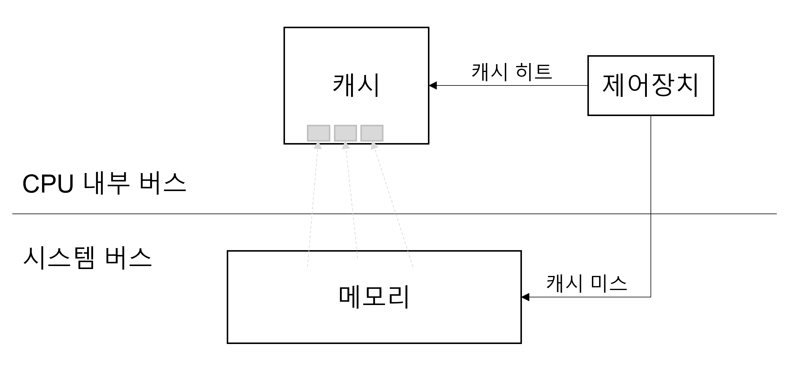

# 3.2.1 메모리 계층

## 메모리 계층


- 메모리 계층 구조란 여러가지 기억장치를 **속도, 용량, 성능**에 따라 계층적으로 나누어 둔 것
- 메모리 계층은 레지스터, 캐시, 메모리, 저장장치로 구성되어 있음
- 하위 계층으로 갈수록 용량이 늘어나고, 가격이 저렴하지만, 속도가 느림
- 반대로 상위 계층은 빠른 대신 용량이 작고 가격이 비쌈
- 즉, **계층 위로 올라갈수록 가격은 비싸지는데 용량은 작아지고 속도는 빨라지는 특징이 있음**
  - 계층 존재 이유는 경제성과 캐시 때문
  - 16GB RAM은 8만원 but, 16GB SSD는 훨씬 더 쌈 (경제성)
- 일상 속 경험 가능한 계층구조
  - 게임을 실행하다보면 '로딩중'이라는 메세지가 나오는데, 이는 하드디스크 또는 인터넷에서 데이터를 읽어 RAM으로 전송하는 과정이 아직 끝나지 않음을 의미

- **레지스터** : CPU 내부의 작은 메모리로, 휘발성이며 속도가 가장 빠르고, 기억 용량이 가장 적음
- **캐시** : L1, L2, L3 캐시를 지칭하고 휘발성이며, 속도가 빠르나 기억 용량이 적음
- **주기억장치(메모리)** : RAM을 가리키고 휘발성이며, 속도와 기억 용량은 보통임
  - RAM은 하드디스크로부터 일정량의 데이터를 복사해서 임시 저장하고 이를 필요 시 마다 CPU에 빠르게 전달하는 역할
- **보조기억장치(디스크)** : HDD, SDD를 일컬으며 비휘발성이다. 속도는 낮으며 기억 용량이 많음

## 캐시
- **캐시**(cache)는 **데이터를 미리 복사해 놓은 임시 저장소**이자 빠른 장치와 느린 장치에서 **속도 차이에 따른 병목 현상을 줄이기 위한 메모리**를 말함
- 이를 통해 데이터를 접근하는 시간이 오래 걸리는 경우를 해결하고 무언가를 다시 계산하는 시간을 절약할 수 있음
- 메모리와 CPU 사이의 속도 차이가 너무 크기 때문에 그 중간에 레지스터 계층을 둬서 속도 차이를 해결함
- 이처럼 **속도 차이를 해결**하기 위해 **계층과 계층 사이에 있는 계층**을 **캐싱 계층**이라고 함
- 예를들어, 캐시 메모리와 보조기억장치 사이에 있는 주기억장치를 보조기억장치의 캐싱 계층이라고 할 수 있음

### 지역성의 원리
- 캐시메모리는 병목현상을 줄이기 위한 범용메모리이고 이런 역할을 수행하기 위해서는 CPU가 원하는 데이터를 어느정도 예측할 수 있어야 함
- 왜냐하면 캐시의 성능을 좌우하는 것은 작은 용량의 캐시 메모리에 CPU가 사용할 의미있는 정보가 얼마나 들어있는가 이기 때문
- 이때 Hit rate(캐시 메모리 적중률)를 극대화 시키기 위해 지역성의 원리를 사용
- 지역성의 특성은 기억장치 내의 정보를 균일하게 참조하는 것이 아닌 어느 한 순간에 특정 부분을 집중 참조하는 것
- 캐시의 지역성은 시간 지역성과 공간 지역성으로 나뉨

### 시간 지역성
- 특정 데이터에 한번 접근해서 가져온 경우, 그 데이터가 가까운 미래에 또 한번 접근할 가능성이 높은 것
- 즉, 한 번 가져왔던 데이터를 또 쓸일이 있다는 의미
- 따라서 캐시는 반복으로 사용되는 데이터가 많을수록 높은 효율을 보일 수 있음
- 아래 코드에서 for 반복문으로 이루어진 코드 안의 변수 i에 계속해서 접근이 이루어짐
- 여기서 데이터는 변수i이고 최근에 사용했기 때문에 계속 접근해서 +1을 연이어 하는 것을 볼 수 있음

### 공간 지역성
- 특정 데이터와 가까운 주소가 순서대로 접근되었을 경우 공간적 지역성이라고 함
- 즉 앞으로 사용할 데이터들이 가져올 블록 안에 많이 모여있는 것을 뜻함
- 필요한 데이터들이 모여있다면 한번만 메모리에 접근해도 필요한 데이터들을 많이 가져올 수 있을 것
- 흩어져 있다면 catch miss 가 날 확률이 높아질 것이므로 효율성이 떨어지게 될 것
- 아래 코드에서 공간을 나타내는 배열 arr의 각 요소들에 i가 할당되며 해당 배열에 연속적으로 접근함을 알 수 있음

```javascript
let arr = Array.from({length : 10}, ()=> 0);
console.log(arr)
for (let i = 0; i < 10; i += 1) {
    arr[i] = i;
}
console.log(arr)
/*
[
    0, 0, 0, 0, 0,
    0, 0, 0, 0, 0
]
[
    0, 1, 2, 3, 4,
    5, 6, 7, 8, 9
]
*/
```

## 캐시히트와 캐시미스




### 캐시히트


- CPU가 값을 가져오려고 할 때 Cache에 해당하는 값이 있다면 Memory까지 가지 않고 Cache까지만 가서 값을 가져올 수 있는데, 이 경우를 Cache Hit이라고 함
- 캐시히트를 하게 되면 해당 데이터를 제어장치를 거쳐 가져오게 됨
- 위치가 가깝고 CPU 내부 버스를 기반으로 작동하기 때문에 빠름

### 캐시미스


- 반대의 경우로 CPU가 값을 가져오려고 할 때 Cache에 해당하는 값이 없다면 Memory까지 가서 값을 가져와야 하는데, 이 경우를 Cache Miss이라고 함
- 즉, 캐시에 원하는 데이터가 없어서 주기억장치에서 데이터를 찾아오는 것
- 시스템 버스를 기반으로 작동하기 때문에 느림

### 캐시매핑
- 캐시가 히트되기 위해 매핑하는 방법 
- CPU의 레지스터와 주 메모리(RAM) 간의 데이터를 주고받을 때 사용
- 매핑 프로세스란 주기억장치로부터 캐시 메모리로의 데이터 전송방식


- **직접 매핑(Directed Mapping)**
  - 메모리와 캐시의 주소를 순서대로 매핑하는 방법
  - 메모리 1~100, 캐시 1~10 일 때 1:1~10, 2:11~20 형태로 매핑
  - 처리가 빠르지만 충돌 발생이 잦음

- **연관 매핑(Associative Mapping)**
  - 순서를 일치시키지 않고 관련 있는 캐시와 메모리를 매핑하는 방법
  - 충돌이 적지만 모든 블록을 탐색해야 하기 때문에 속도가 느림

- **집합 연관 매핑(Set Associative Mapping)**
  - 직접 매핑과 연관 매핑을 합친 것
  - 순서를 일치시키되 집합을 둬서 저장하는 방식
  - 블록화되어 있기 때문에 검색이 조금 더 효율적임
  - 메모리 1~100, 캐시 1~10일 때 캐시 1~5에는 메모리 1~50의 데이터를 무작위로 저장


### 웹 브라우저의 캐시
- 대표적인 소프트웨어적인 캐시
- 사용자의 커스텀 정보, 인증 모듈 관련 사항 등 저장
- 추후 서버에 요청할 때 아이덴티티나 중복 요청 방지를 위해 사용됨

- **쿠키**
  - 만료기한이 있는 키-값 저장소
  - same site 옵션을 strict로 설정하지 않았을 경우 다른 도메인에서 요청했을 때 자동 전송됨
  - 4KB까지 데이터 저장 가능
  - 클라이언트나 서버에서 만료기한을 정할 수 있음 (보통 서버에서 정함)
  - document.cookie로 쿠키를 볼 수 없게 httponly 옵션을 거는 것이 중요

- **로컬 스토리지**
  - 만료기한이 없는 키-값 저장소
  - 10MB까지 데이터 저장 가능
  - 웹 브라우저를 닫아도 유지됨
  - 도메인 단위로 저장 / 생성 됨
  - HTML5를 지원하지 않는 웹 브라우저에서는 사용할 수 없음
  - 클라이언트에서만 수정 가능

- **세션 스토리지**
  - 만료 기한이 없는 키-값 저장소
  - 탭 단위로 생성, 탭을 닫으면 삭제됨
  - 5MB까지 데이터 저장 가능
  - HTML5를 지원하지 않는 웹 브라우저에서는 사용할 수 없음
  - 클라이언트에서만 수정 가능

### 데이터베이스의 캐싱 계층


- 데이터베이스 시스템을 구축할 때도 메인 데이터베이스 위에 레디스(redis) 데이터베이스 계층을 '캐싱 계층'으로 두어 성능을 향상시키기도 함