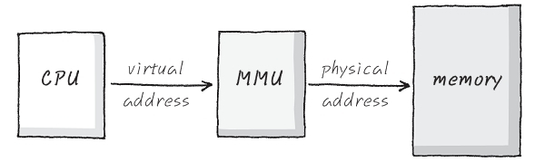
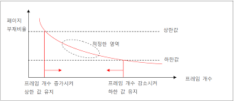
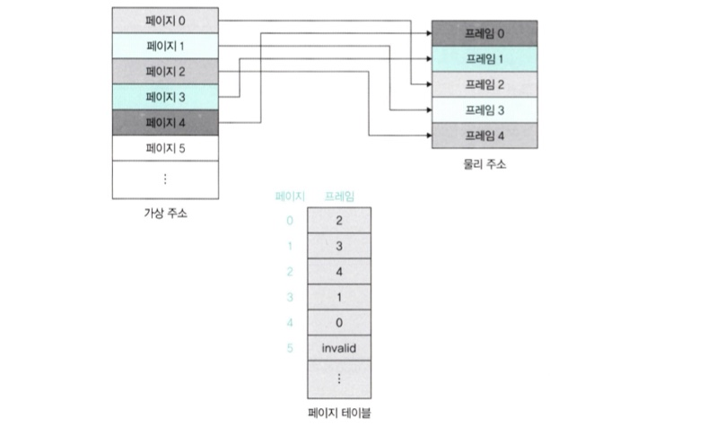
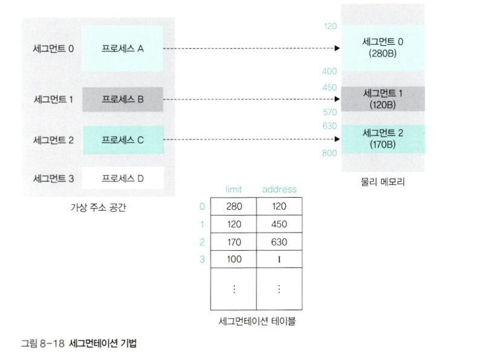
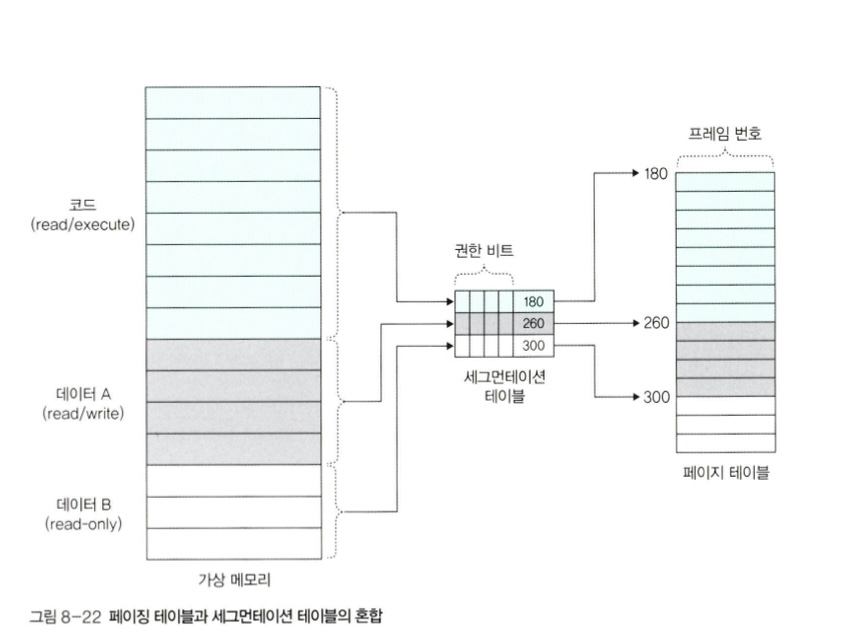

# 메모리 관리
## 1. 가상 메모리

  

### **기본 개념**
- 프로그래머는 메모리 크기에 맞는 응용 프로그램만 개발해야 하는데, 실제로 메모리 크기를 고려하여 프로그래밍하기란 매우 어렵다. 

- **가상 메모리(Virtual Memory)** : 이러한 물리적 메모리 크기의 한계를 극복하기 위해 나온 기술

- **프로세스를 실행할 때 실행에 필요한 일부만 메모리에 로드**하고 **나머지는 디스크에 두는 것**

- 이를 통해 프로세스 전체가 물리적 메모리에 있는 것처럼 수행

- [교재] 컴퓨터가 실제로 이용 가능한 메모리 자원을 **추상화**하여 이를 사용하는 사용자들에게 매우 큰 메모리로 보이게 만드는 것
   

### **가상메모리 관리**
- **가상 주소(logical address)** : 이때 가상적으로 주어지는 주소 

- **실제 주소(physical address)** : 실제 메모리상에 있는 주소
- 가상 주소는 **메모리 관리 장치(MMU)** 에 의해 실제 주소로 변환되며, 이 덕분에 사용자는 실제 주소를 의식할 필요 없이 프로그램 구축 가능
- 가상 메모리는 **가상 주소와 실제 주소가 매핑**되어 있고, 프로세스의 주소 정보가 들어 있는 **페이지 테이블**로 관리된다. 이때 속도 향상을 위해 TLB 사용
   

### **TLB(Translation Lookaside Buffer, 페이지 정보 캐쉬)**
- **메모리와 CPU 사이에 있는 주소 변환을 위한 캐시** 

- 최근에 일어난 가상 메모리와 물리 주소의 변환 테이블 저장
- CPU가 가상 주소를 가지고 메모리에 접근하려고 할 때 **우선은 TLB에 접근**하여 가상 주소에 해당하는 **물리 주소**를 찾고, 만약 TLB에 매핑이 존재하지 않는다면 **MMU가 페이지 테이블에서 해당되는 물리 주소로 변환한 후 메모리에 접근하게 된다.**
   

### **스와핑**
- 가상 메모리에는 존재하지만 실제 메모리 (RAM)에는 현재 데이터나 명령어 코드가 없는 경우, **페이지 폴트**가 발생 

- **스와핑(swapping)** : 메모리에서 당장 사용하지 않는 영역을 하드디스크로 옮기고 하드디스크의 일부분을 마치 메모리처럼 불러와 쓰는 것
   

### **페이지 폴트**

- **페이지 부재(Page Fault)** : 프로세스의 주소 공간에는 존재하지만 지금 이 컴퓨터의 RAM에는 없는 데이터에 접근헀을 경우에 발생 
- (캐시 미스와 비슷)

- 페이지 폴트와 그로 인한 스와핑 과정
  1. CPU는 물리 메모리를 확인하여 해당 페이지가 없으면 트랩을 발생해서 운영체제에게 알린다. 

  2. 운영체제는 CPU의 동작을 잠시 멈춘다.
  3. 운영체제는 페이지 테이블을 확인하여 가상 메모리에 페이지가 존재하는지 확인하고, 없으면 프로세스를 중단하고 현재 물리 메모리에 비어 있는 프레임이 있는지 찾는다. 물리 메모리에도 없다면 **스와핑** 발동!
  4. 비어 있는 프레임에 해당 페이지를 로드하고, 페이지 테이블을 최신화한다.
  5. 중단되었던 CPU를 다시 시작
   

### 페이지(page)
- 가상 메모리를 사용하는 최소 크기 단위

### 프레임(frame)
- 실제 메모리를 사용하는 최소 크기 단위
   
---

## 2. 스레싱
### **스레싱(thrashing)**

- 메모리의 **페이지 폴트율이 높은 것**을 의미 

- 어떤 프로세스가 너무 적은 양의 페이지 할당이 되어 있다고 가정 -> 해당 프로세스 실행할 때마다 page fault 발생 -> 페이지 교체하는데 많은 자원과 시간 소모
- 실행시간보다 페이지 찾는데 시간과 자원이 더 많이 소비되는 현상
- 일반적으로 발생하면 안 되는 상황
- CPU는 놀고 있게 되고, 메모리와 스토리지는 계속 데이터가 올라갔다 내려갔다 하며, 블필요한 리소스(시간)가 소모된다.
   

### 해결 방법
> 1. **작업 세트(working set)**
- 프로세스의 과거 사용 이력인 **지역성(locality)** 을 통해 결정된 페이지 집합을 만들어서 **미리 메모리에 로드**하는 것 

- 미리 메모리에 로드하면 탐색에 드는 비용을 줄일 수 있고 스와핑 또한 줄일 수 있다.
  

> 2. **PFF(Page Fault Frequency)**

- 페이지 폴트 빈도를 조절하는 방법 

- 상한선과 하한선을 만드는 방법
- 만약 상한선에 도달한다면 프레임을 늘리고 하한선에 도달하면 프레임을 줄이는 것
   
---

## 3-1. 메모리 할당 - **연속 할당**

- 메모리에 **연속적으로** 공간을 할당하는 것
   

### **고정 분할 방식**
- fixed partition allocation 

- 메모리를 미리 나누어 관리하는 방식
- 메모리가 미리 나뉘어 있기 대문에 융통성이 없다.
- 내부 단편화 발생
   

### **가변 분할 방식**
- variable partition allocation 

- 매 시점 프로그램의 크기에 맞게 동적으로 메모리를 나눠 사용
- 내부 단편화 발생 X
- 외부 단편화 발생할 수 있다.
- 가변 분할 방식 종류
  |이름|설명|
  |----|------|
  |최초적합|위쪽이나 아래쪽부터 시작해서 홀을 찾으면 바로 할당|
  |최적적합|프로세스의 크기 이상인 공간 중 가장 작은 홀부터 할당|
  |최악적합|프로세스의 크기와 가장 많이 차이가 나는 홀에 할당|
- 최초 적합

  
- 최적적합

  
- 최악적합

  
   

### 내부 단편화(internal fragmentation)
- 메모리를 나눈 크기보다 프로그램이 작아서 들어가지 못하는 공간이 많이 발생하는 현상 

- 주기억장치 내 사용자 영역 > 실행 프로그램
  

### 외부 단편화(external fragmentation)
- 메모리를 나눈 크기보다 프로그램이 커서 들어가지 못하는 공간이 많이 발생하는 현상 

- 총 메모리 공간은 충분하지만 실제로 할당할 수 없는 상황
- 주기억장치 내 사용자 영역 < 실행 프로그램
  

### 홀(hole)
- 할당할 수 있는 비어 있는 메모리 공간
   

## 3-2. 메모리 할당 - **불연속 할당**
- 메모리에 **불연속적으로** 공간을 할당하는 것
   

### **페이징(paging)**

- **고정 분할 방식**을 이용한 가상 메모리 관리 기법 

- 물리 주소 공간을 **같은 크기로 나누어** 사용
- 동일한 크기의 페이지 단위로 나누어 메모리의 서로 다른 위치에 프로세스를 할당
- 장점
  - **외부 단편화 생기지 X**
  - 물리 메모리를 같은 크기로 나누어 관리하기 때문에 메모리 관리가 수월 

  - 홀의 크기가 균일하지 않은 문제 해결
- 단점
  - 주소 변환이 복잡하다

   

### **세그멘테이션(segmentation)**

- **가변 분할 방식**을 이용한 가상 메모리 관리 기법 

- 페이지 단위가 아닌 의미 단위인 **세그먼트(segment)** 로 나누는 방식
- 프로세스는 코드, 데이터, 스택, 힙 등으로 이루어지는데, 코드와 데이터 등 이를 기반으로 나눌 수도 있으며 함수 단위로 나눌 수도 있음
- 장점
  - **내부 단편화 문제가 해소** 

  - **보호와 공유 기능 수행**
- 단점
  - **외부 단편화 문제**로 인해 추가적인 관리 불가피 

  - 홀 크기가 균일하지 않은 문제 발생
   

### **페이지드 세그멘테이션(paged segmentation)**

- 공유나 보안을 의미 단위의 세그먼트로 나누고, 물리적 메모리는 페이지로 나누는 것 

- **페이지로 분할된 가상 주소 공간에 서로 관련 있는 영역을 하나의 세그먼트로 묶어 세그먼테이션 테이블**로 관리하고, 각 세그먼트를 구성하는 페이지를 **해당 페이지 테이블로 관리**하는 방식
- 페이징 기법에 세그멘테이션을 추가하고, 중복되는 데이터를 세그멘테이션 테이블로 옮겨 오면 테이블의 크기 줄일 수 있다.
- 현재의 대부분의 OS에서 이 기법 활용

   

---

## 4. 페이지 교체 알고리즘
### 기본 개념
- 메모리는 한정되어 있기 때문에 swapping 많이 발생 

- **페이지 교체 알고리즘 : page fault 발생 시 어떤 페이지 프레임을 선택하여 교체할 것인지 결정하는 방법**
- 메모리에 앞으로 사용할 가능성이 적은 페이지를 대상으로 선정하여 page fault를 줄이고 시스템 성능 향상시킨다.
   

### 4-1. **오프라인 알고리즘**
- offline algorithm 
- **먼 미래에 참조되는 페이지**와 현재 할당하는 페이지를 바꾸는 알고리즘 

- 가장 좋은 방법
- 사용할 수 없는 알고리즘이지만 다른 알고리즘과의 성능 비교에 대한 기준 제공
   

### 4-2. **FIFO**

- First in First out 

- 가장 먼저 온 페이지를 교체 영역에 가장 먼저 놓는 방법
- 들어온 시간을 저장하거나 올라온 순서를 큐에 저장
   

### 4-3. **LRU**

- Least **Recently** Used
- 가정 : 가장 오랫동안 사용하지 않았던 데이터라면 앞으로도 사용할 확률이 적을 것이다. 

- 사용한 데이터를 큐에서 제거하여 맨 위로 다시 올리고, 프레임이 모자랄 경우 맨 아래에 있는 데이터를 삭제
   

### 4-4. **NUR**

- clock 알고리즘 

- LRU처럼 가장 최근에 참조되지 않은 페이지를 대상으로 선정한다는 점에서 LRU와 근사하지만 **교체되는 페이지의 참조 시점이 가장 오래되었다는 것을 보장하지 X**
- 과정
  - 먼저 0과 1을 가진 비트를 둠 
  
  - 1은 최근에 참조되었고, 0은 참조되지 않음을 의미
  - 시계 방향으로 돌면서 0을 찾음
  - 0을 찾은 순간 해당 프로세스 교체
  - 해당 부분을 1로 바꿈

   

### 4-4. **LFU**

- Least **Frequently** Used 

- 가장 참조 횟수가 적은 페이지를 교체
- 많이 사용되지 않은 것을 교체
   

---