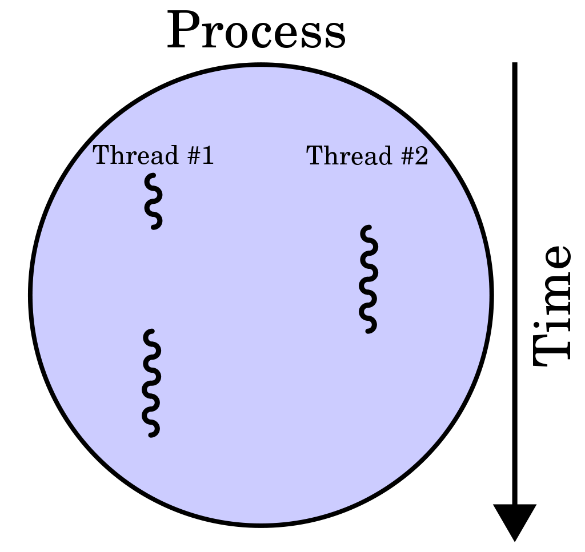
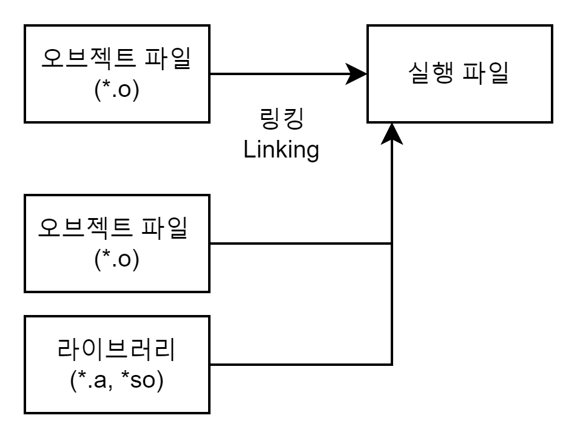

# 3.3.1_프로세스와 컴파일 과정
## 1. 프로세스
### 1.1 프로세스(process)
- 컴퓨터에서 연속적으로 실행되고 있는 프로그램
### 1.2 프로세스와 스레드의 구분
- 프로세스(process)
	
	- 운영체제로부터 자원을 할당받은 작업의 단위
	- 프로세스는 다른 프로세스의 자원에 접근할 수 없음
- 스레드(thread)
	
	
	- 한 프로세스 내에서 메모리를 공유하며 실행되는 작업 흐름의 단위
	- Stack만 따로 할당받고, Code와 Data와 Heap은 공유함

## 2. 컴파일
### 2.1 컴파일(compile)
- 큰 의미의 컴파일 : **인간이 이해할 수 있는 언어로 작성된 소스 코드**(고수준 언어 : C, C++, Java 등)를 **CPU가 이해할 수 있는 언어**(저수준 언어 : 기계어)로 **번역(변환)하는 작업**
- 소스 코드는 컴파일을 통해 기계어로 이루어진 실행 파일이 됨
- 이 파일을 실행하면 실행 파일 내용이 운영체제의 Loader를 통해 메모리에 적재되어 프로그램이 동작

## 3. 컴파일 과정

### 3.1 소스코드 작성
``` C
/* hello.c */

#include <stdio.h>

int main(int argc, char **argv)
{
    printf("Hello World!\n");

    return 0;
}
```

### 3.2 전처리(preprocess)
- 소스 코드 파일(hello.c)을 전처리된 소스 코드 파일(hello.i)로 변환하는 과정
![[Compile_02.png]]
- 전처리 작업
	1. 주석 제거 : 소스코드에서 주석을 전부 제거
	2. 헤더 파일 삽입 : include 지시문을 만나면 해당 헤더 파일에 있는 모든 내용을 복사해 소스 코드에 삽입
	3. 매크로 치환 및 적용 : define 지시문에 정의된 매크로 이름을 만나면 정의한 값으로 전부 치환

### 3.3 컴파일(compile)
- 작은 의미의 컴파일 : 전처리된 소스 코드 파일(hello.i)을 어셈블리어 파일(hello.s)로 변환하는 과정

- 컴파일 작업
	1. 오류 처리 (언어 문법 검사)
	2. 코드 최적화 작업
	3. Static 영역(Data, BSS 영역)의 메모리 할당
- 어셈블리어
	- 기계어(이진수로 이루어진 명령어)를 사람이 이해할 수 있게 부호화 한 것
	- 기계어와 1:1로 매칭됨

### 3.4 어셈블(assemble)
- 어셈블리어 파일(hello.s)을 오브젝트 파일(hello.o)로 변환하는 과정

- 오브젝트 파일
	- 오브젝트 코드 : 사람이 알아볼 수 없는 기계어
	- 오브젝트 파일이란 오브젝트 코드로 이루어진 파일
	- 특정한 파일 포맷을 가짐
- 오브젝트 파일 포맷
	
	- 링크와 관련된 섹션
		1. 심볼 테이블 섹션
			- 소스 코드에 사용되는심볼들의 이름과 주소가 정의 되어 있는 부분
			- 오브젝트 파일의 심볼 테이블에는 해당 오브젝트 파일의 심볼 정보만 있기 때문에, 다른 파일에서 참조되는 심볼의 정보는 없음
		2. 재배치 정보 섹션
			- 심볼의 위치가 확정되면 내용이 적힐 부분
			- 링크 과정을 통해 채워짐

### 3.5 링크
- 컴파일 이후, 실행하기 이전에 작성한 프로그램이 사용하는 다른 프로그램이나 라이브러리를 가져와 연결하는 과정
- 여러 개의 코드와 데이터를 모아서 연결하여 실행될 수 있는 한 개의 파일로 만드는 작업
- 링커 덕분에 큰 규모의 응용프로그램을 한 개의 소스 파일로 구성하는 대신 더 작은 모듈들로 나누어 개별로 관리할 수 있음 (링커가 서로 연결시켜주기 때문에)

- 정적 링킹과 동적 링킹
	
	1. 정적 링킹(Static Linking)
		- 확장자 : .lib
		- 실행 파일을 만들 때 프로그램에서 사용하는 모든 라이브러리 모듈을 복사
		- 장점 : 속도가 빠름, 불일치가 일어나지 않음
		- 단점 : 메모리를 많이 차지함, 라이브러리 소스 코드가 바뀔 때마다 실행파일을 재배포해야함
	2. 동적 링킹(Dynamic Linking)
		- 확장자 : dll
		- 실행 파일을 만들 때 모든 라이브러리 모듈을 복사하지 않고 해당 모듈의 주소만 가지고 있다가, 런타임에 해당 모듈의 주소로 가서 필요한 것을 들고오는 방식
		- 장점 : 메모리를 적게 차지함, 라이브러리 소스 코드가 바뀌어도 재배포 할 필요가 없음
		- 단점 : 정적 링킹 방식보다 느림, 불일치 발생
	3. 예시)
		- 3개의 프로그램에서  A라는 라이브러리를 사용하는 경우
			1. 정적 링킹 : 3개의 프로그램의 실행 파일에 각각 A의 정보가 담김, A의 정보가 3개 필요함
			2. 동적 링킹 :  A를 복사하는 것이 아니라 주소만 참조하기 때문에 A의 정보는 1개만 필요함
		- A 라이브러리에 수정 사항이 생긴 경우
			1. 정적 링킹 : 바뀔 때마다 매번 실행 파일을 재배포해야함 (버전 관리가 불가능함)
			2. 동적 링킹 : 수정 사항이 그대로 반영되기 때문에 재배포할 필요가 없음
		- A 라이브러리의 다른 버전이 같은 이름으로 관리되는 경우
			1. 정적 링킹 : 영향을 받지 않음 (불일치가 일어나지 않음)
			2. 동적 링킹 : 불일치가 일어나서 오류가 발생할 수 있음
		
		
	