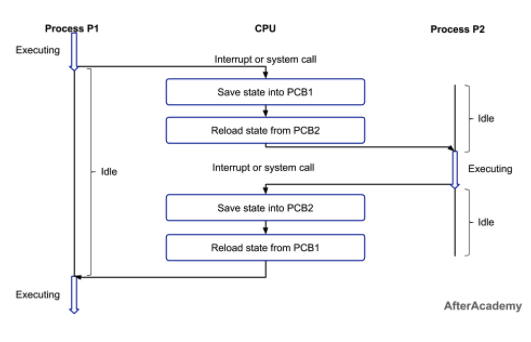

# PCB(Process Control Block)

- 프로세스 제어 블록
- 특정 프로세스를 관리할 필요가 있는 정보를 포함하는 커널의 자료구조
- 운영체제가 `프로세스 스케줄링을 위해` `컨텍스트`를 가지고 있는 `데이터베이스`
  - **컨텍스트** : 프로세스에 관한 모든 정보
  - 운영체제가 프로세스를 생성할 때마다 `고유한 PCB`로 나타냄
- 운영체제에서 프로세스에 대한 `메타데이터`를 저장한 데이터
  - **메타데이터** : 데이터에 관한 구조화된 데이터이자 데이터를 설명하는 작은 데이터
  - 대량의 정보 가운데에서 찾고 있는 `정보를 효율적으로 찾아내서 이용하기 위해` 일정한 규칙에 따라 `콘텐츠에 대해 부여되는 데이터`

## 1. PCB 생성 과정

- 프로그램이 실행되면 프로세스가 생성됨
- 프로세스 주소 값들에 메모리가 할당됨
- 프로세스의 메타 데이터들이 PCB에 저장되어 관리
- 커널 스택의 가장 앞부분에서 관리하여 일반 사용자 접근 차단(프로세스의 중요한 정보를 포함하기 때문)
- 프로세스 종료 시 삭제됨

## 2. PCB 구조

### PCB가 포함하는 정보

- **프로세스 스케줄링 상태** : '준비', '일시중단' 등 프로세스가 CPU에 대한 소유권을 얻은 이후의 상태
  - 프로세스 스케줄링 : 운영체제에서 프로세스의 CPU 할당 순서 및 방법을 결정짓는 것
  - 생성(create), 준비(ready), 실행    (running), 대기(waiting), 완료(terminated) 상태
- **프로세스  ID** : 해당 프로세스의 자식 프로세스 ID
- **프로세스 권한** : 컴퓨터 자원이나 IO 디바이스에 대한 권한 정보
- **프로그램 카운터** : 프로세스에서 실행해야 할 다음 명령어의 주소에 대한 포인터
- **CPU 레지스터** : 프로세스를 실행하기 위해 저장해야 할 레지스터에 대한 정보
- **CPU 스케줄링 정보** : CPU 스케줄러에 의해 중단된 시간 등에 대한 정보
  - 우선 순위, 최종 실행시각, CPU 점유시간
- **계정 정보** : 프로세스 실행에 사용된 CPU 사용량, 실행한 유저의 정보
- **I/O 상태 정보** : 프로세스에 할당된 I/O 디바이스 목록

## 3. 컨텍스트 스위칭

- 프로세스에 할당된 시간이 끝나거나 인터럽트에 의해 발생
- CPU가 어떤 하나의 `프로세스를 실행하고 있는 상태`에서 `다음 우선순위의 프로세스가 실행되어야 할 때` 기존의 프로세스의 상태 또는 레지스터 값을 저장하고 다음 프로세스를 `새로운 프로세스`의 상태 또는 레지스트 값을 `교체`하는 작업

### 컨텍스트

- CPU가 해당 프로세스를 실행하기 위한 해당 프로세스의 정보들

> 실제적으로 한 시점에 실행되고 있는 프로세스는 하나임
> 컨텍스트 스위칭이 매우 빨리 진행되기 때문에 동시구동되는 것처럼 보임
> 멀티 코어의 CPU는 여러 프로세스가 동시 진행되는 건 맞음
> 싱글 코어 기준으로 설명할 예정!

### 컨텍스트 스위칭 과정

1. 프로세스 P1 실행 중/ P2 준비상태
2. P1 준비상태로 전환
3. 인터럽트 또는 시스템 콜로 일부 중단이 발생하면 PCB1에 컨텍스트 저장. 레지스터 형태로 저장함
4. P2 PCB2를 로드 > 실행
5. PCB2에 저장
6. PCB1 리로드 & 재실행

### 컨텍스트 스위치에 드는 비용

- 유휴시간(idle time)
- 캐시미스 : 컨텍스트 스위칭이 발생하면 현재 캐시에 저장되어있던 기존 정보를 비워야 하는 상황>> 메모리 접속 횟수 증가함

### 스레드에서 컨텍스트 스위칭

- 동일한 프로세스에서 한 스레드에서 다른 스레드로 컨텍스트를 전환하는 유형
- 스레드는 메모리를 공유하기에 컨텐스트 스위칭할 때 프로그램 카운터, 레지스터, 스택 포인터와 같은 ID와 리소스만 전환하기 때문에 `효율적 저렴함`

> 스레드 : 프로세스 내에서 실제 작업을 수행하는 주체로 모든 프로세스는 한 개 이상의 스레드가 존재