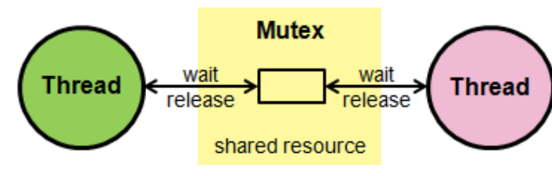
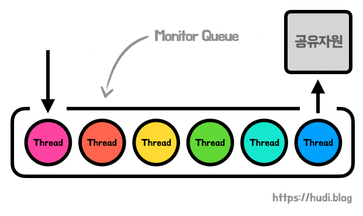

# 공유 자원과 임계 영역

## 1. 공유 자원 (Shared Resource)
- 여러 프로세스가 공동으로 이용하는 변수, 메모리,  파일, 데이터 등의 자원이나 변수 

- 공동으로 이용되기에 누가 언제 데이터를 읽거나 쓰느냐에 따라 결과가 달라질 수 있다.
   

### 1.1 경쟁 상태 (Race Condition)
- 공유 데이터에 대해 여러 프로세스가 동시에 접근, 변경을 시도하는 상황 

- 데이터의 일관성을 유지하기 위해서 수행되는 프로세스들이 순차적으로 공유자원에 접근해야 한다.
   

### 1.2 문제 상황 예시 (은행 입출금 문제)
- 프로세스 A와 B가 은행 잔고에 동시에 접근해서 둘 다 1000원을 읽었다. 

- A는 500원을 입금했고 B는 뒤이어 500원을 출금했다면 잔고는 1000원이 저장되어야 하지만, B가 더 나중에 저장했으므로 500원이 저장된다. => 문제 발생
   

---
 

## 2. 임계 영역 (Critical Section)
-  공유 자원의 접근 순서에 따라 실행 결과가 달라지는 프로그램의 영역 

- 둘 이상의 프로세스가 동시에 접근해서는 안 되는 공유 자원(자료 구조 또는 장치)에 접근하는 코드의 일부
   

### 2.1 임계 구역 해결 조건
- **상호 배제** : 한 프로세스가 임계 구역에 들어가면 다른 프로세스는 임계 구역에 들어갈 수 없다. 

- **한정 대기** : 어떤 프로세스도 무한 대기하지 않아야 한다.
- **진행의 융통성** : 한 프로세스가 다른 프로세스의 진행을 방해해서는 안 된다.
   

---
 

## 3. 임계 구역을 보호하기 위한 방법
### 3.1 **뮤텍스(Mutex)**
  
  

- 프로세스나 스레드가 공유 자원을 **lock()** 을 통해 잠금 설정하고 사용한 후에는 **unlock()** 을 통해 잠금 해제하는 객체 

- 잠근이 설정되면 다른 프로세스나 스레드는 잠긴 코드 영역에 접근할 수 없고 해제는 그와 반대
- 잠금 또는 잠금 해제라는 상태만 가짐
   

### 3.2 **세마포어(Semaphore)**

- 일반화된 뮤텍스 

- 간단한 정수 값과 두 가지 함수 `wait(P 함수)` 및 `signal(V 함수)`로 공유자원에 대한 접근 처리
  - `wait()` : 자신의 찰계가 올 때까지 기다리는 함수 

  - `signal()` : 다음 프로세스로 순서를 넘겨주는 함수
- 프로세스나 스레드가 공유 자원에 접근하면 세마포어에서 `wait()` 작업을 수행하고, 프로세스나 스레드가 공유 자원을 해제하면 세마포어에서 `signal()` 작업 수행
- 세마포어에는 조건 변수가 없고, 프로세스나 스레드가 세마포어 값을 수정할 때 다른 프로세나 스레드는 동시에 세마포어 값을 수정할 수 없다.
   

### 3.3 뮤텍스와 세마포어의 차이
- 동기화 대상의 갯수 

  - 뮤텍스 -> 동기화 대상이 오직 1개일 때 사용 

  - 세마포어 -> 동기화 대상이 1개 이상일 때 사용
- 0과 1로 이루어진 **바이너리 세마포어**는 구현의 유사성으로 인해 뮤텍스가 될 수 있다.
- 뮤텍스 -> 잠금을 기반으로 일어나는 **잠금 메커니즘**
- 세마포어 -> 신호를 기반으로 상호 배제가 일어나는 **신호 메커니즘**
   

### 3.4 모니터 (Monitor)

- 둘 이상의 스레드나 프로세스가 공유 자원에 안전하게 접근할 수 있도록 공유 자원을 숨기고 해당 접근에 대해 인터페이스만 제공 

- **모니터큐**를 통해 공유 자원에 대한 작업들을 순차적으로 처리
- 세마포어와 비교
  - 세마포어보다 구현하기 쉽다. 

  - 상호배제는 자동인 반면, 세마포어에서는 **상호 배제**를 명시적으로 구현해야 한다. 
   

---