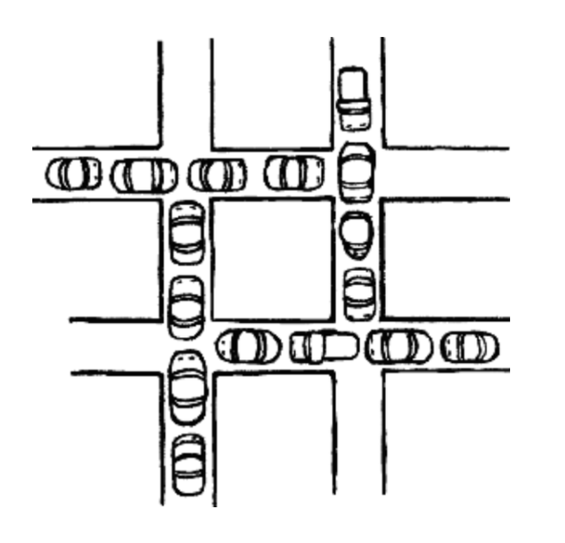

# 교착 상태 (DeadLock)

- 두 개 이상의 프로세스들이 서로 가진 자원을 기다리며 중단된 상태
   

## 1. 원인
- **상호 배제 (Mutual Exclusion)**  

  - 프로세스들이 필요로 하는 자원에 대해 배타적인 통제권 요구한다. 

  - ex) 하나의 차량은 그 순간에 하나의 구간만 차지할 수 있다.
- **점유 대기 (Hold and Wait)**
  - 프로세스가 할당된 자원을 가진 상태에서 다른 자원을 기다린다. 
  
  - ex) 각각의 차량들이 도로에서 하나의 구간을 차지하면서 나아가기를 기다리고만 있다.
- **비선점 (No preemption)**
   - 프로세스가 어떤 자원의 사용을 끝날 때까지 그 자원을 뺏을 수 없다. 

   - ex) 차량을 뺄 수 없는 상황
- **순환 대기 (Circular Wait)**
  - 각 프로세스는 순환적으로 다음 프로세스가 요구하는 자원을 가지고 있다. 

  - ex) 차량들이 서로 기다리고 있다.
   

## 2. 해결 방법
### 2.1 **예방(prevention)**
- **교착상태의 발생조건 중 하나라도 발생하지 않게 하는 것** 

- 각각의 조건을 방지(부정)하여 데드락 발생 가능성 차단
- 시스템의 처리량이나 효율성을 떨어뜨리는 단점 발생
   

### 2.2 **회피(avoidance)**
- **안정 상태(safe state)** : 시스템의 프로세스들이 요청하는 모든 자원을, 데드락을 발생시키지 않으면서도 차례로 모두에게 할당할 수 있는 상태 

- 회피 알고리즘 : 자원을 할당한 후에도 **시스템이 항상 safe state에 있을 수 있도록** 할당을 허용하자는 것
- **은행원 알고리즘**
  - 어떤 자원의 할당을  허용하는지에 관한 여부를 결정하기 전에, **미리 결정된 모든 자원들의 최대 가능한 할당량을 가지고 시뮬레이션 해서 safe state에 들 수 있는지 여부**를 검사하는 것 

  - 총 자원의 양과 현재 할당한 자원의 양을 기준으로 안정 또는 불안정 상태로 나누고 안정 상태로 가도록 자원을 할당하는 알고리즘
   

### 2.3 **탐지(detection) 및 회복(recovery)**
- **탐지 기법** 

  - 시스템에 데드락이 발생했는지 여부를 탐색 

  - 현재 시스템의 자원 할당 상태를 가지고 파악
- **회복 기법**
  - 데드락을 탐지 기법을 통해 발견했다면 **순환 대기**에서 벗어나 데드락으로부터 회복하기 위한 방법 사용 

    - 단순히 프로세스 1개 이상 중단시키기 
    
    - 자원 선점하기
   
---