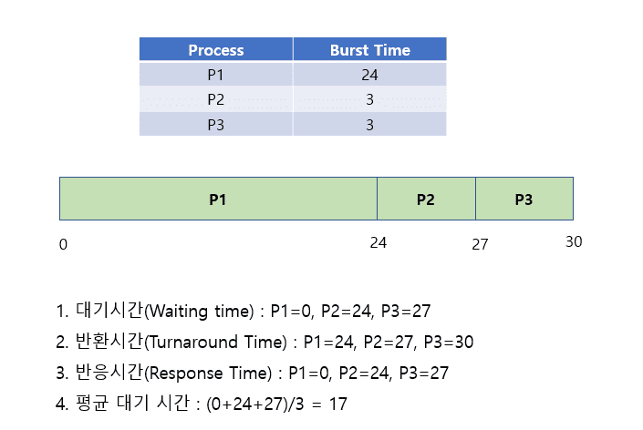
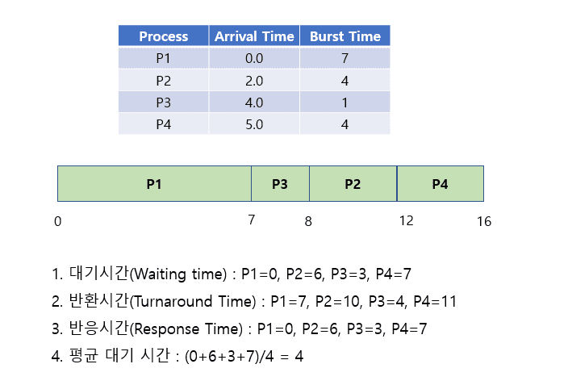

# CPU 스케줄링 알고리즘

## 1. CPU 스케줄링 (CPU Scheduling)
- CPU 이용률을 극대화하기 위해서는 멀티프로그래밍(multiprogramming)이 필요 

- 만약 CPU core가 하나라면 한 번에 하나의 프로세스만 실행 가능
- 이때 필요한 것이 **CPU 스케줄링**
- CPU 스케줄링 : 언제 어떤 프로세스에 CPU를 할당할지 결정하는 작업
   

## 2. CPU 스케줄러 (CPU Scheduler)
- CPU 스케줄러 : 메모리에 있는 프로세스들 중 어떤 프로세스를 실행할지 선택하고 CPU를 할당해주는 역할
- 스케줄링 결정하는 상황 

  1) 실행(running) 상태에서 대기(waiting) 상태로 전환(switching)될 때 ( ex : I/O 발생 ) 

  2) 실행(running) 상태에서 준비(ready) 상태로 전환(switching)될 때 ( ex : intterupt 발생 )
  3) 대기(waiting) 상태에서 준비(ready) 상태로 전환(switching)될 때 ( ex : I/O 완료 시 )
  4) 종료(Terminated)될 때
- 1, 4번 상황에서만 스케줄링이 발생하는 것 -> **비선점형(non-preemptive) 스케줄링**
- 이외의 모든 스케줄링 -> **선점형(preemptive) 스케줄링**
   

## 3. CPU 스케줄링 평가 기준 (CPU Scheduling Criteria)
- CPU 이용률 (CPU utilization) 

  - 시간당 CPU를 사용한 시간 비율 

  - 프로세서를 실행한 상태로 항상 유지하려고 해야 한다.

- 처리율 (Throughput)
  - 시간당 처리한 작업의 비율 

  - 단위 시간당 완료되는 작업 수가 많도록 해야 한다.

- 반환시간 (Turnaround Time)
  - 프로세스가 생성된 후 종료되어 사용하던 자원을 모두 반환하는 데까지 걸리는 시간 

  - 작업이 준비 큐(ready queue)에서 기다린 시간부터 CPU에서 실행된 시간, I/O 작업 시간의 합

- 대기시간 (Waiting Time)
  - 대기열에 들어와 CPU를 할당받기 까지 기다린 시간 

  - 준비 큐에서 기다린 시간의 총합

- 반응시간 (Response Time)
  - 대기열에서 **처음으로** CPU를 얻을 때까지 걸린 시간 

  - 대기시간은 준비 큐에서 기다린 모든 시간을 합친 것이지만, 반응 시간은 CPUT를 할당받은 최초의 순간까지 기다린 시간 한 번만을 측정
  

  -> CPU 이용률과 처리율 극대화 

  -> 반환시간, 대기시간, 반응시간 줄이는 것이 일반적
    

# 비선점형 방식
## 1. 비선점형 스케줄링
- 프로세스가 CPU를 점유하고 있다면 이를 뺏을 수 없는 방식 

- 필요한 문맥 교환만 일어나므로 오버헤드(overhead)가 상대적으로 적지만 프로세스의 배치에 따라 효율성 차이가 많이 난다.
   

## 2. FCFS (First Come First Served)
- 가장 먼저 요청한 프로세스에 CPU를 할당해주는 방식 

- 작성이 간단하고 이해하기 쉽다.
- 평균 대기 시간(Average Waiting Time)이 길어질 수 있다.
- 응답 시간(Response Time) 면에서 좋을 수 있다.
- Convey Effect(호위 효과)가 발생할 수 있다.
- 예시

  

   

## 3. SJF (Sortest Job First)
- 다음 CPU burst time의 길이를 고려해서 스케줄링을 결정하는 알고리즘 

- 실행되고 있는 프로세스는 끝까지 실행
- 평균 대기 시간을 줄일 수 있다.
- 다음 프로세스의 CPU burst time을 예측하는 것이 어렵다.
- 예시

  

   

## 4. Priority 스케줄링
- 각각의 프로세스에 우선순위 넘버가 있다.
- 가장 높은 우선순위의 프로세스에 CPU 할당
- SJF도 Priority 스케줄링이라고 할 수 있다. (다음 CPU burst time이 우선순위인 것처럼 작동하므로)
- 기아(Starvation) 문제 : 낮은 우선순위의 프로세스가 절대 실행되지 않는 문제
- 기아문제 해결하기 위해서 노화(aging) 사용 
  - 노화 : 시간이 지날수록 프로세스의 우선순위를 높여주는 방식
- 예시

  

   

---
## 출처
https://code-lab1.tistory.com/45
