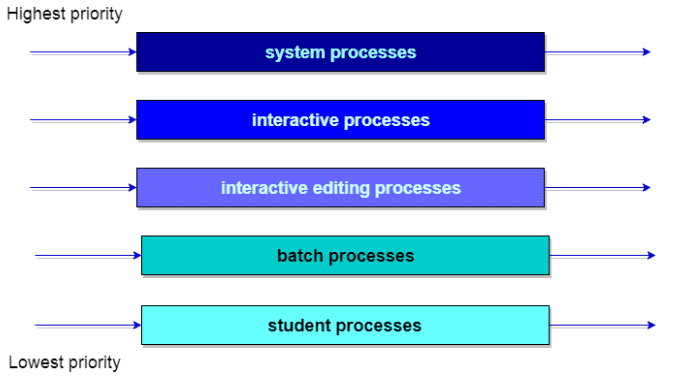

# 선점형 방식

## 1. 선점형 스케줄링
- 프로세스가 CPU를 할당받아 실행 중이더라도 운영체제가 이를 강제로 뺐을 수 있는 방식 

- CPU 처리 시간이 매우 긴 프로세스의 CPU 사용 독점을 막을 수 있어 효율적인 운영 가능
- 잦은 문맥 교환으로 오버헤드(Overhead)가 커질 수 있다.
   

## 2. Round Robin(RR)
- 각각의 프로세스에 동일한 CPU 할당 시간을 부여해서 해당 시간 동안만 CPU를 이용하게 한다. 

- 할당 시간 내에 처리를 완료하지 못하면 다음 프로세스로 넘어가므로 선점형 방식!
- n개의 프로세스각 있을 때 할당 시간을 q로 설정하면, 어떤 프로세스도 (n-1)q 시간 이상을 기다리지 않아도 된다.
- 응답 시간을 빠르게 할 수 있다.
- q가 커진다면 FCFS처럼 작동한다.
- process sharing
  - q가 매우 작아진 것 

  - n개의 프로세스가 프로세서 속도의 1/n 씩으로 작동함을 의미
- 예시

  
   

## 3. SRF(Shortest Remaining First)
- SJF : 중간에 실행 시간이 더 짧은 작입이 들어와도 기존 짧은 작업을 모두 수행하고 그다음 짧은 작업을 이어나간다. 

- **SRF** : 중간에 더 짧은 작업이 들어오면 수행하던 프로세스를 중지하고 해당 프로세스를 수행하는 알고리즘
- 예시

  

   

## 4. 다단계 큐
- 준비 큐가 여러 개의 큐들로 나뉜다.
- 각 큐는 각자의 스케줄링 알고리즘을 가지고 있다.
- 각 큐 사이에는 프로세스들이 이동할 수 없다.
- 일반적으로 Foreground 프로세스 -> Round Robin 방식 사용
- Background 프로세스 -> FCFS 사용
- 기아(Starvation) 문제 발생할 수 있다.
- 예시

  

   

---
