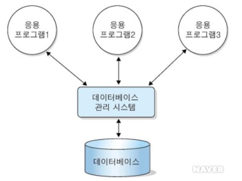

# 4.1.1 엔터티

## 데이터베이스 (DB, DataBase)
- **일정한 규칙, 혹은 규약을 통해 구조화되어 저장되는 데이터의 모음**
- 해당 데이터베이스를 제어, 관리하는 통합 시스템을 `DBMS (DataBase Management System)`이라고 함
- 데이터베이스 안에 있는 데이터들은 특정 DBMS마다 정의된 `쿼리 언어(query language)`를 통해 삽입, 삭제, 수정, 조회 등을 수행할 수 있음
- 데이터베이스는 실시간 접근과 동시 공유가 가능

- 위의 그림처럼 `데이터베이스 위에 DBMS`가 있고, 그 위에 응용 프로그램이 있으며, 이러한 구조를 기반으로 데이터를 주고받음
- 데이터베이스를 직접 응용 프로그램들이 조작하는 것이 아니라 `데이터베이스를 조작하는 별도의 소프트웨어`인 데이터베이스 관리 시스템(DBMS)가 존재하는 것!
- 즉, 데이터베이스 관리 시스템(DBMS)이란 데이터베이스를 관리하며 `응용 프로그램들이 데이터베이스를 공유하며 사용할 수 있는 환경을 제공`하는 소프트웨어임
- 예를들어, `MySQL`이라는 DBMS가 있고, 그 위에 응용 프로그램에 속하는 `Node.js`나 `php`에서 해당 데이터베이스 안에 있는 데이터를 끄집어내 해당 데이터 관련 로직을 구축할 수 있는 것!

## 엔터티 (Entity)
- `엔터티`는 사람, 장소, 물건, 사건, 개념 등 여러 개의 `속성`을 지닌 명사를 의미
- 예를들어 `회원`이라는 **엔터티**가 있다고 가정
- 회원은 `이름, 아이디, 주소, 전화번호`의 **속성**을 갖음
- 물론 이보다 많은 속성이 있지만, 서비스의 요구 사항에 맞춰 속성이 정해짐
- 예를들어, 주소라는 속성이 서비스의 요구사항과 무관한 속성이라면 주소라는 속성은 사라지게 됨

### 약한 엔터티와 강한 엔터티
- 엔터티는 `약한 엔터티`와 `강한 엔터티`로 나뉨
- A가 **혼자서는 존재하지 못하고 B의 존재여부에 따라 종속적**이라면, A는 약한 엔터티고 B는 강한 엔터티가 됨
- 예를 들어, 방은 건물 안에만 존재하기 때문에 `방`은 약한 엔터티, `건물`은 강한 엔터티

