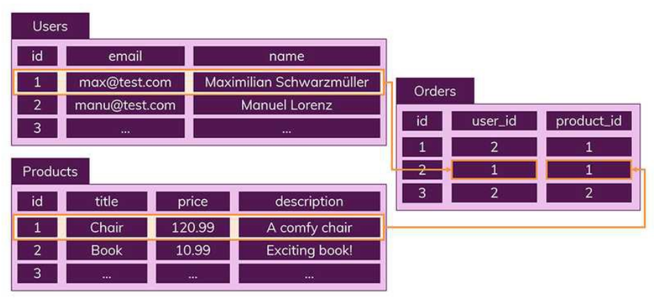

# 4.1.2 릴레이션

## 릴레이션 (Relation)
- `릴레이션`은 **데이터베이스에서 정보를 구분하여 저장하는 기본 단위**
- **엔터티에 관한 데이터**를 데이터베이스는 **릴레이션 하나에 담아서 관리**함
- 예를 들어, 회원이라는 엔터티가 데이터베이스에서 관리될 때 릴레이션으로 변화되는데, 이 릴레이션은 **관계형 데이터베이스**에서는 '`테이블`'이라고 함
  - NoSQL 데이터베이스에서는 '`컬렉션`'이라고 함

### 테이블과 컬렉션
- 데이터베이스의 종류는 크게 관계형 데이터베이스와 NoSQL 데이터베이스로 나눌 수 있음
- 대표적인 관계형 데이터베이스인 MySQL과 대표적인 NoSQL 데이터베이스인 MongoDB를 예로 들자!
- MySQL의 구조는 레코드-테이블-데이터베이스로 이루어져 있는 반면,
- NoSQL 데이터베이스의 구조는 도큐먼트-컬렉션-데이터베이스로 이루어짐
- 관계형 데이터베이스에서는 레코드가 쌓여서 테이블이 되고 테이블이 쌓여서 데이터베이스가 되는 것!

> [참고] SQL과 NoSQL의 차이
- `SQL (관계형 DB)`

  - SQL을 사용하면 RDBMS에서 데이터를 저장, 수정, 삭제 및 검색 할 수 있음
  - 관계형 데이터베이스에는 핵심적인 두 가지 특징이 있음
    - 데이터는 **정해진 데이터 스키마에 따라 테이블에 저장됨**
    - 데이터는 **관계를 통해 여러 테이블에 분산**됨

  - 데이터는 `테이블`에 `레코드`로 저장되는데, 각 테이블마다 명확하게 정의된 구조가 있음. 해당 구조는 필드의 이름과 데이터 유형으로 정의됨.

  - 따라서 **스키마를 준수하지 않은 레코드는 테이블에 추가할 수 없음**. 즉, 스키마를 수정하지 않는 이상은 정해진 구조에 맞는 레코드만 추가가 가능한 것이 관계형 데이터베이스의 특징 중 하나임

  - 또한, 데이터의 중복을 피하기 위해 '관계'를 이용함

  - 하나의 테이블에서 중복 없이 하나의 데이터만을 관리하기 때문에 다른 테이블에서 부정확한 데이터를 다룰 위험이 없어지는 장점이 있음

- `NoSQL (비관계형 DB)`
  - 말그대로 관계형 DB의 반대

  - **스키마도 없고, 관계도 없다!**
  - NoSQL에서는 레코드를 `문서(documents)`라고 부름

  - SQL과 핵심적인 차이
    - SQL은 정해진 스키마를 따르지 않으면 데이터 추가가 불가능했던 반면, 
    - NoSQL에서는 **다른 구조의 데이터를 같은 컬렉션에 추가가 가능**!

  - 문서(documents)는 Json과 비슷한 형태로 가지고 있음
  - **관계형 데이터베이스처럼 여러 테이블에 나누어담지 않고, 관련 데이터를 동일한 '`컬렉션`'에 넣음**

  - 따라서 위 사진에 SQL에서 진행한 Orders, Users, Products 테이블로 나눈 것을 NoSQL에서는 Orders에 한꺼번에 포함해서 저장하게 됨

  - 즉, 여러 테이블에 조인할 필요없이 이미 필요한 모든 것을 갖춘 문서를 작성하는 것이 NoSQL임! (NoSQL에는 조인이라는 개념이 존재하지 않음)

> [용어] 조인 (JOIN)
- 두 개 이상의 테이블들을 연결 또는 결합해서 데이터를 출력하는 것
 