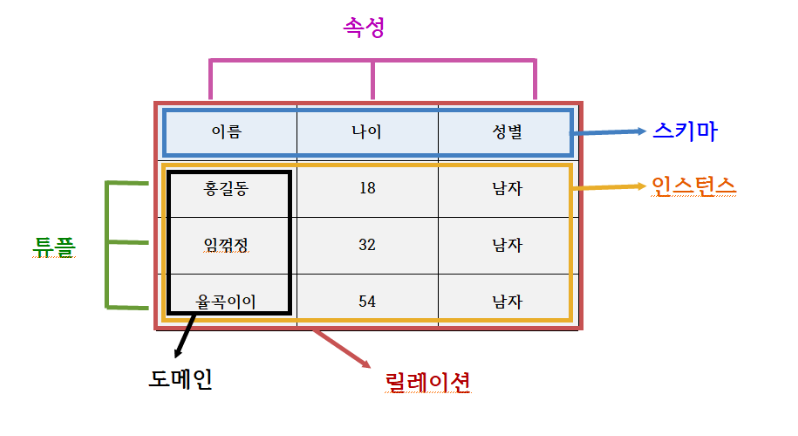

# 4.1.4 도메인

## 도메인 (Domain)

- 도메인이란 릴레이션에 포함된 **각각의 속성들이 가질 수 있는 값의 집합**
- 예를들어, `성별`이라는 속성이 있다면 이 속성이 가질 수 있는 값은 `{남자, 여자}라는 집합`이 됨
- 이처럼, 회원이라는 릴레이션에서는 이름, 아이디, 주소, 전화번호, 성별이라는 속성이 존재할 것이고,
  - 여기서 성별이라는 속성은 {남, 여}라는 도메인을 갖게됨
