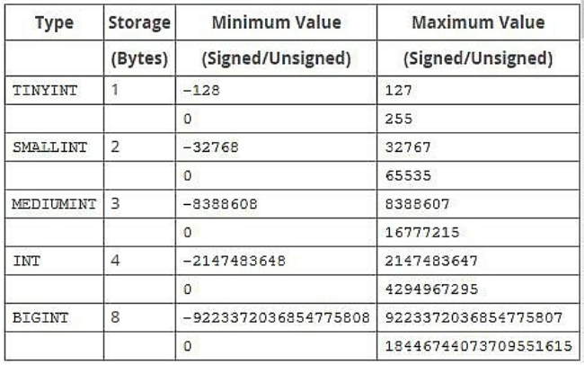
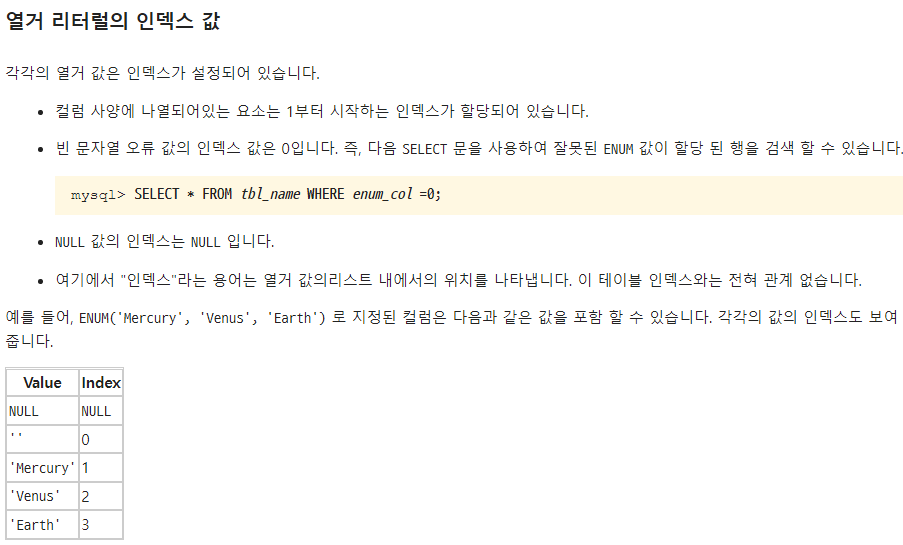

# 4.1.5 필드와 레코드
`member`
|name|ID|address|phonenumber|
|:---:|:---:|:---:|:---:|
|큰돌|kundol|서울|112|
|가영|kay|대전|114|
|빅뱅|big|카이루|119|

- 회원이란 엔터티는 member라는 테이블로 속성인 이름, 아이디 등을 가지고 있으며 name, ID, address 등의 필드를 가짐
- 이 테이블에 쌓이는 행(row)단위의 데이터를 레코드라고 함
- 레코드를 튜플이라고도 함

### book 테이블
- '`책`'이라는 엔터티 정의
- 이를 기반으로 테이블 생성
- `이름, 저자의 아이디, 출판년도, 장르, 생성 일시, 업데이트 일시`를 속성으로 갖는다고 가정
- 이 엔터티를 데이터베이스에 넣어 테이블로 만들려면 각 **속성에 맞는 타입을 정의**해야함!
- 타입은 MongoDB나 MySQL등 데이터베이스마다 차이가 있는데, MySQL 기준으로 설명

  - **책의 아이디**: INT
  - **책의 제목**: VARCHAR(255)
  - **책의 저자 아이디**: INT
  - **책의 출판년도**: VARCHAR(255)
  - **책의 장르**: VARCHAR(255)
  - **생성 일시**: DATETIME
  - **업데이트 일시**: DATETIME


    `book`|
    |:---|
    |id INT|
    |title VARCHAR(255)|
    |author_id INT|
    |publishing_year VARCHAR(255)|
    |genre VARCHAR(255)|
    |created_at DATETIME|
    |updated_at DATETIME|

  - 보통 한글을 속성이름으로 쓰진 않음
  - title, author_id 등으로 영어 이름에 매핑해서 쓰며 앞서 설명한 속성과 타입들이 들어간 것을 볼 수 있음
  - 위의 테이블을 MySQL로 구현하기위한 코드는 아래와 같음

```sql
CREATE TABLE book(
    id INT NOT NULL AUTO_INCREMENT,
    title VARCHAR(255),
    author_id INT,
    publishing_year VARCHAR(255),
    genre VARCHAR(255),
    created_at DATETIME,
    updated_at DATETIME,
    PRIMARY KEY (id)
);
```

## 필드 타입
- 필드는 타입을 갖음
- 예를들어 이름은 문자열, 전화번호는 숫자
- 타입들은 DBMS마다 다르며, 책에선 MySQL기준으로 설명

### 숫자 타입

- 숫자 타입에는 `TINYINT`, `SMALLINT`, `MEDIUMINT`, `INT`, `BIGINT` 등이 있음



### 날짜 타입

- 날짜 타입으로는 DATE, DATETIME, TIMESTAMP 등이 있음
  - `DATE`
    - 날짜 부분은 있지만 시간 부분은 없는 값에 사용
    - 지원범위는 1000-01-01에서 9999-12-31
    - 3바이트의 용량을 가짐
  - `DATETIME`
    - 날짜 및 시간 부분을 모두 포함하는 값에 사용
    - 지원범위는 1000-01-01 00:00:00에서 9999-12-31 23:59:59
    - 8바이트의 용량을 가짐
  - `TIMESTAMP`
    - 날짜 및 시간 부분을 모두 포함하는 값에 사용
    - 지원범위는 1970-01-01 00:00:01에서 2038-01-19 03:14:07
    - 4바이트의 용량을 가짐

### 문자 타입

- 문자 타입으로는 CHAR, VARCHAR, TEXT, BLOB, ENUM, SET이 있음

  - **CHAR와 VARCHAR**
    - CHAR 또는 VARCHAR 모두 그 안에 수를 입력해서 몇 자까지 입력할지 정함
    - CHAR(30)이면 최대 30글자까지 입력 가능
    - `CHAR`는 테이블을 생성할 때 선언한 길이로 고정되며 길이는 0에서 255사이의 값을 가짐
    - 레코드를 저장할 때 **무조건 선언한 길이 값으로 '고정'해서 저장**됨
    - `VARCHAR`는 가변 길이 문자열
    - 길이는 0에서 65535사이의 값으로 지정 가능
    - **입력된 데이터에 따라 용량을 가변시켜 저장**
    - 예를들어 10글자의 이메일을 저장할 경우 10글자에 해당하는 바이트 + 길이 기록용 1바이트로 저장하게 됨
    - 지정된 형태에 따라 저장된 CHAR의 경우 검색에 유리
    - 검색을 별로 하지않고 유동적인 길이를 가진 데이터는 VARCHAR로 저장하는 것이 좋음
  - **TEXT와 BLOB**
    - 두 개 타입 모두 큰 데이터를 저장할 때 쓰는 타입
    - `TEXT`는 **큰 문자열 저장**에 쓰며 주로 게시판의 본문을 저장할 때 씀
    - `BLOB`는 **이미지, 동영상 등 큰 데이터 저장**에 씀
      - but, 보통은 아마존의 이미지 호스팅 서비스인 S3를 이용하는 등 서버에 파일을 올리고 파일에 관한 경로를 VARCHAR로 저장함
  - ENUM과 SET
    - `ENUM`은 ENUM('x-small','small','medium','large','x-large')형태로 쓰이며, 이 중에서 하나만 선택하는 **단일 선택**만 가능하고 ENUM 리스트에 없는 **잘못된 값을 삽입하면 빈 문자열이 대신 삽입**됨
    - ENUM을 이용하면 x-small 등이 0,1 등으로 매핑되어 **메모리를 적게 사용**하는 이점을 얻음
    - ENUM은 **최대 65535개의 요소**들을 넣을 수 있음
    - `SET`은 ENUM과 비슷하지만 **여러 개의 데이터를 선택**할 수 있고 비트 단위의 연산을 할 수 있으며 **최대 64개의 요소**를 집어넣을 수 있음
    - ENUM이나 SET을 쓸 경우 공간적으로 이점을 볼 수 있지만 애플리케이션의 수정에 따라 데이터베이스의 ENUM이나 SET에서 정의한 목록을 수정해야 한다는 단점이 있음
  
    - > [참고] ENUM과 SET 비교
    -  ```
        - enum은 순서형입니다. 
        - 정확히 말하자면 0-65535까지의 정수값에 각각 별칭을 붙인거라 생각하시면 됩니다. 
        - 예를 들어 enum으로 '남자', '여자'라고 정의해놓으면 실제 내부적으로는 '남자' =  1, '여자' = 2 처럼 저장됩니다. 
        - 대신 사용할 때 알아보기 어려운 1, 2 같은 숫자 대신 '남자', '여자'처럼 바로 쓸 수 있죠. 
        - 문자열 타입과 다른 차이는, 미리 정해진 내용만 집어넣을 수 있고, 저장공간을 작게 차지한다는 점입니다.

        - set은 enum과는 다릅니다. 
        - set은 집합형으로, 하나의 필드에 여러가지 값을 한꺼번에 넣을 때 씁니다. 
        - 예를 들어 어떤 필드에 'a'라는 값이 올수도 있고 'b'라는 값이 올 수도 있고.. 여기에 'a','b' 두가지 값이 다 올 수도 있고.. 요럴 때 set을 씁니다.
        - set형은 내부적으로 8Byte로 저장되므로 64개까지 한 필드에 넣을 수 있습니다.
        ```
    - 


