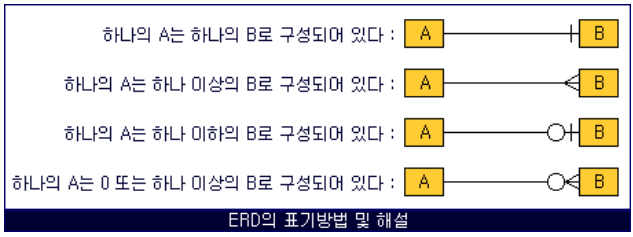
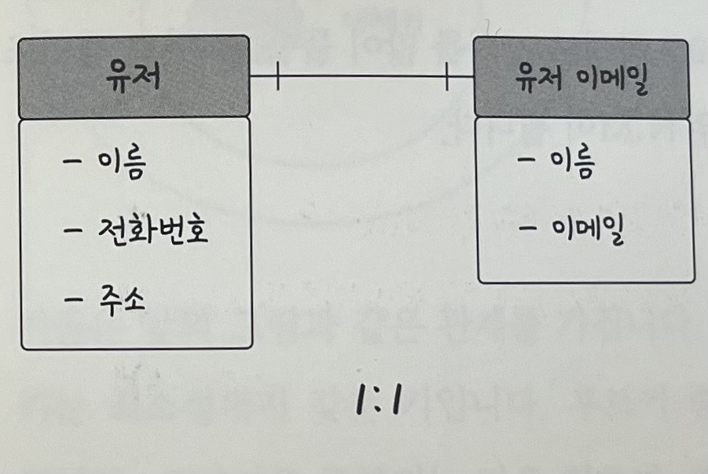
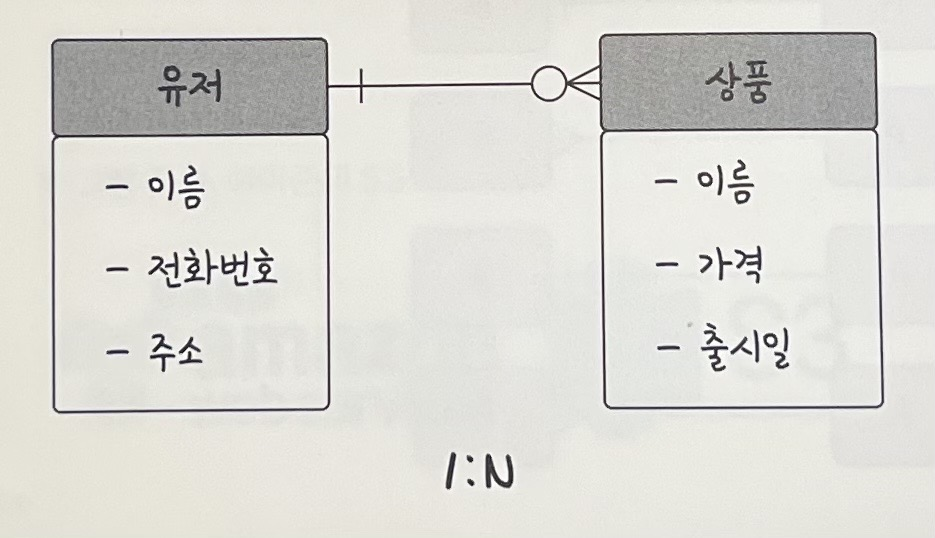
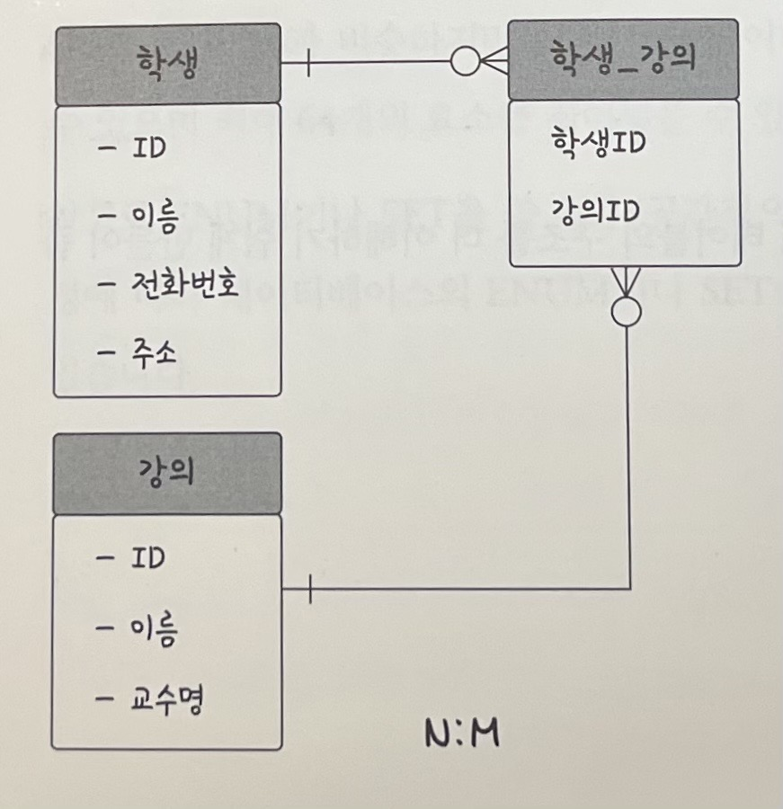

# 4.1.6 관계

## 관계
- 데이터베이스에 테이블은 하나만 있는 것이 아님
- 여러 개의 테이블이 있고 이러한 테이블은 서로의 관계가 정의되어 있음
- 이러한 관계를 **관계화살표**로 나타냄

### 1:1 관계

- `유저`당 `유저 이메일`은 한 개씩 존재 -> 1:1 관계
- 1:1 관계는 테이블을 두개의 테이블로 나눠 테이블의 구조를 더 이해하기 쉽게 만들어 줌

### 1:N 관계

- 한 `유저`당 여러개의 `상품`을 장바구니에 넣을 수 있음
- 1:N 관계
- 물론 하나도 넣지 않는 0개의 경우도 있으니, **0도 포함되는 화살표**를 통해 표현해야함
- 즉, 한 개체가 다른 많은 개체를 포함하는 관계

### N:M 관계

- `학생`과 `강의`의 관계
- 학생도 강의를 많이 들을 수 있고,
- 강의도 여러명의 학생을 포함 가능
- 이럴 경우 N:M 관계
- 중간에 `학생_강의`라는 테이블이 끼어있음
- **N:M은 테이블 두개를 직접적으로 연결해서 구축하진 않고, 1:N, 1:M이라는 관계를 갖는 테이블 두개로 나눠서 설정함**

