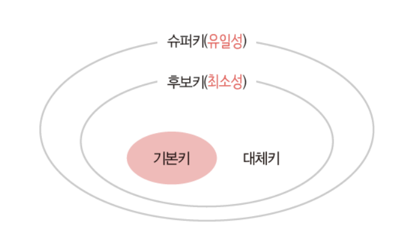
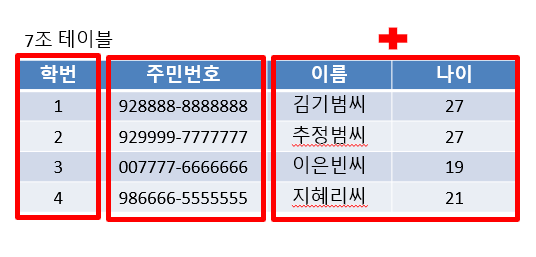
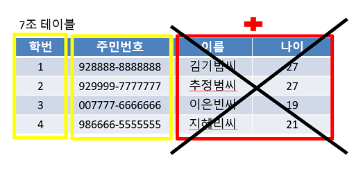
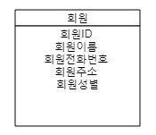
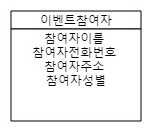
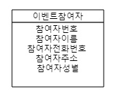
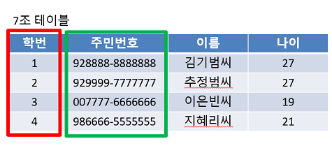
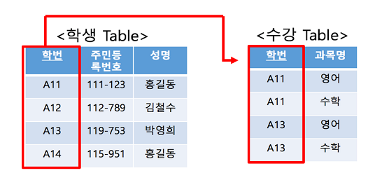

# 4.1.7 키

## 키

- 테이블 간의 관계를 조금 더 명확하게 하고 테이블 자체의 인덱스를 위해 설정된 장치
- 무언가를 식별하는 고유한 식별자(identifier) 기능
- 데이터베이스에서 조건에 만족하는 관계의 행을 찾거나 순서대로 정렬할 때 다른 행과 구별할 수 있는 유리한 기준이 되는 속성의 집합
- 기본키, 외래키, 후보키, 슈퍼키, 대체키가 있음

- 키들을 위의 그림과 같은 관계를 가짐
- **슈퍼키**는 유일성이 있고,
- 그 안에 포함된 **후보키**는 최소성까지 갖춘 키임
- 후보키 중에서 **기본키**로 선택되지 못한 키는 **대체키**가 됨
  - `유일성`이란 **중복되는 값이 없다**는 것
  - `최소성`이란 **필드를 조합하지 않고 최소 필드만 써서 키를 형성**할 수 있는 것

## 슈퍼키 (Super Key)
- 테이블에서 **각 행을 유일하게 식별할 수 있는 하나 또는 그 이상의 속성들의 집합**
- 슈퍼키는 `유일성`만 만족하면 슈퍼키가 될 수 있음
- 유일성이란 하나의 키로 특정 행을 바로 찾아낼수 있는 고유한 데이터 속성

- 7조라는 팀에 팀원은 4명이 있음 
- 이 4명을 구분할 수 있는 것은 절대 겹치지 않는 학번 일수도 있고, 주민번호일 수도 있음
- 이름과 나이를 **묶어서 하나의 속성으로 만드는 것도 가능**
  - 이름과 나이를 합쳐서 7조안에서 중복만 되지 않으면 가능하기 때문
  - 이름과 나이를 합쳐서 4명을 구분할 수 있으면 슈퍼키가 될 수 있음
- 학번과 주민번호를 묶어서 슈퍼키로 만들수도 있고, 학번과 주민번호과 이름을 합쳐서 슈퍼키로도 만들수 있고, 학번과 주민번호과 이름과 나이를 합쳐서 슈퍼키를 만들수도 있음 
  - **어떤 속성끼리 묶던 중복값이 안나오고 서로 구별만 할 수 있으면 됨**

## 후보키 (Candidate Key)
- 테이블에서 각 행을 **유일하게 식별**할 수 있는 **최소한의 속성들의 집합**
- 후보키는 **기본키가 될 수 있는 후보들**이며 `유일성`과 `최소성`을 동시에 만족해야함

- 7조라는 팀에 팀원은 4명이 있음 
- 이 4명을 구분하는 슈퍼키들이 모여 있는데, 슈퍼키들 중에서 속성은 **최소한의 갯수로 4명을 구분할 수 있어야** 후보키가 될 수 있음

- 학번 슈퍼키와 주민번호 슈퍼키는 속성들이 각 1개씩 이루어져 있음 
- 하지만 이름+나이 슈퍼키는 이름과 나이를 묶어서 2개의 속성으로 되어 있음
- 이름+나이 슈퍼키는 2개 이므로 각 1개의 속성인 주민번호와 학번 슈퍼키가 최소성을 만족한다고 할 수 있음

- 따라서 이름+나이 슈퍼키는 **갯수가 다른 것보다 많기 때문에 최소성을 만족하지 못해서 후보키가 될 수 없음**

## 기본키 (Primary Key)
- 기본키는 줄여 `PK` 또는 `프라이머리키`라고 부르며, `유일성`과 `최소성`을 만족하는 키
- **후보키들 중에서 하나를 선택한 키**로 최소성과 유일성을 만족하는 속성
- 테이블에서 기본키는 **오직 1개**만 지정할 수 있음
- 기본키는 테이블 안에서 유일하게 각 행들을 구별할 수 있도록 쓰임
- 기본키는 **NULL 값을 절대 가질수 없고**, **중복된 값을 가질 수 없음**
  - 각 행들을 구별하려면 값이 없어선 안되고, 중복되어서도 안되기 때문
- 기본키는 `자연키` 또는 `인조키` 중에 골라 설정함

### 자연키 (Natural Key)
- 회원 테이블을 만든다고 가정

- 회원이 늘어날때마다 각각의 속성들에 대응하는 값들을 갖고있는 로우가 하나씩 추가될 것
- 그럼 이제 해당 로우들을 각각 고유하게 구별할 수 있는 기본키(primary key)를 지정해야함
- 성별은 회원이 몇명이든 2개의 값밖에 들어갈 수 없음
  - 필연코 각 로우별 중복적인 값이 들어올수밖에 없는 속성이므로 기본키로 적합하지않음
- 이름도 동명이인이 충분히 있는만큼 적합하지않음
- 주소를 가지고 기본키로 설정하면 내가 가입한곳을 동생이 가입하기 힘든사태가 벌어질수도 있을 것
- 전화번호는 중복될수가 없는 값이지만, 살면서 전화번호가 바뀌는일은 생각보다 잦음 
  - 변경이 있는 값을 기본키로 하는건 좋지않음
  - **기본키는 각 로우를 확실히 구분하면서 최대한 변하지않는(가능하다면 영구한) 데이터가 되는것이 좋음**
- 그럼 남는건 회원ID뿐
  - 확실히 `회원ID`는 중복되지않으며, 변경될 여지도 거의없음
- 기본키만을 위한 불필요한 컬럼 없이 회원이라는 비즈니스에 필요한 속성을 가지고 기본키를 구해냄
- **기본키만을 위한 데이터가 아니라 비즈니스 모델에서 자연스레 나오는 속성으로 기본키를 정한다**고해서 `자연키`(Natural Key)라고 표현

### 인조키 (Artificial Key)

- 이벤트 참여 개인정보를 제공받는 테이블
- 이벤트 참여를 받을땐 회원 테이블과 달리 참여자로부터 고유한 값을 입력받지 않음
- 때문에 앞선 회원 테이블의 ID와같은 고유한 값이 없음
- 입력받는게 없으면 우리가 부여하면 되는것

- 참여자번호로 인해 우리는 참여자가 몇명이든 그들을 구분할 수 있는 속성을 갖게됨
- Oracle의 Sequence, MySQL의 Auto Increment로 설정 
- 비즈니스 모델과는 달리 **키를 위한 데이터**라는 측면에서 `인조키`(Artificial Key)라고 부름
- 자연키와는 대조적으로 변하지 않아, **보통 기본키는 인조키로 설정!**

## 대체키 (Alternate Key)
- 후보키가 두개 이상일 경우 그 중에서 어느 하나를 **기본키로 지정하고 남은 후보키들**
- 대체키는 기본키로 선정되지 않은 후보키

- 7조라는 팀에 팀원은 4명임 
- **후보키**로 **학번과 주민번호**가 뽑혔고, 둘 중에서 **기본키**는 **학번**이 됨 
- 학번이 기본키가 되고 남은 후보키인 **주민번호**는 **대체키**가 될 수 있음 
- **학번 기본키가 없어지게 되면 주민번호는 없어진 기본키를 대체**할 수 있게됨

## 외래키 (Foreign Key)
- 테이블이 다른 테이블의 데이터를 참조하여 테이블간의 관계를 연결하는 것
- 데이터를 좀더 조회하기 쉬움
- **다른 테이블의 데이터를 참조할 때 없는 값을 참조할 수 없도록 제약을 주는 것**
- 참조 될 테이블(A)이 먼저 만들어지고 참조하는 테이블(B)에 값이 입력되어야 함
- 이때, **참조될(A) 열의 값은 참조될(A) 테이블에서 기본키(Primary Key)로 설정되어 있어야함**
- 외래키는 참조되는 테이블의 기본키와 동일한 키 속성을 가짐
- 참조되는 부모테이블이 먼저 생성된 뒤 데이터를 넣고, 참조하는 자식 테이블이 다음에 생겨야됨
- 부모 테이블 먼저 삭제될 수 없음
  - 왜냐하면 부모테이블을 참조하는데 부모테이블이 삭제되면 자식테이블은 참조하는 것이 없어지기 때문에 외래키 오류가 생김
  - 외래키 관계에서 부모테이블을 삭제하려면 자식테이블 먼저 삭제한 후 부모테이블을 삭제해야함

- 부모 테이블은 학생 테이블이고, 자식 테이블은 수강 테이블임
- 학생테이블은 학번이 기본키이자 참조되는 참조키
- 수강테이블은 학번이 참조하는 키이자 외래키
- **외래키는 중복되어도 괜찮음**
  - 수강테이블의 학번