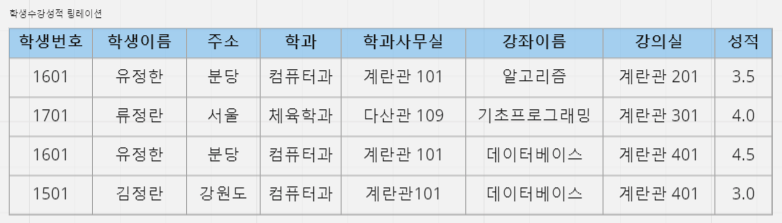
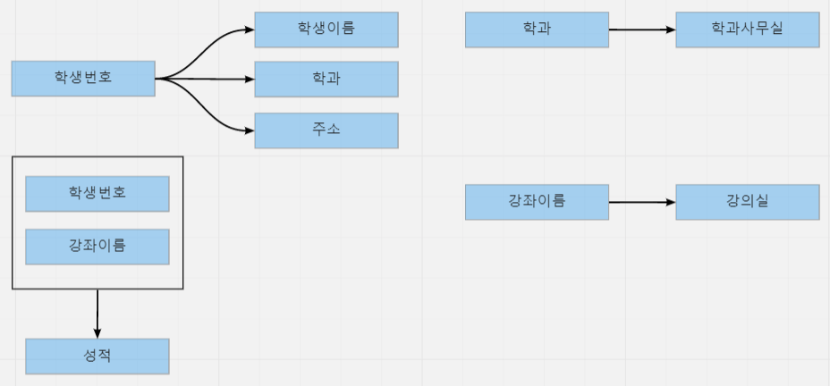
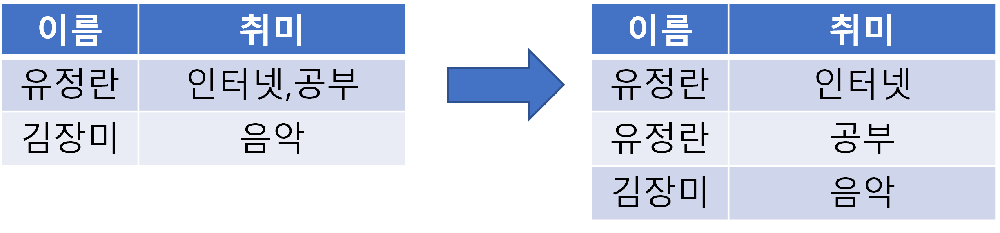
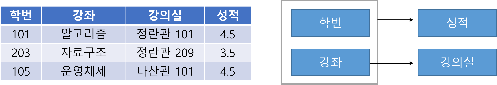
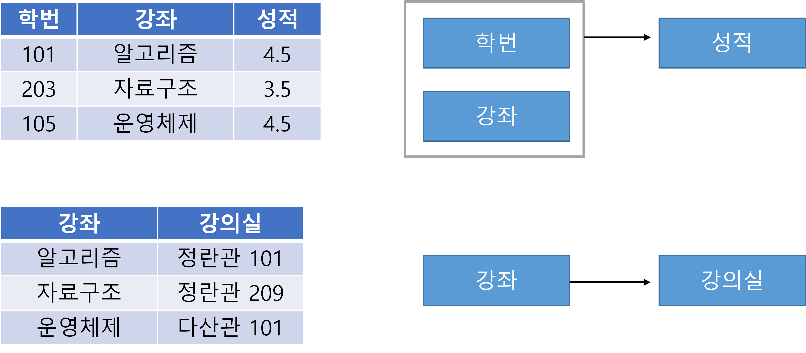
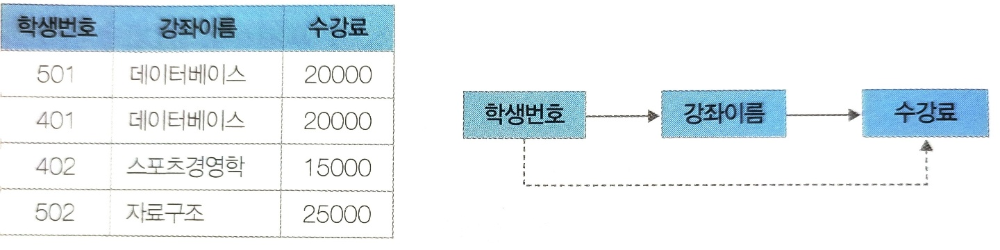
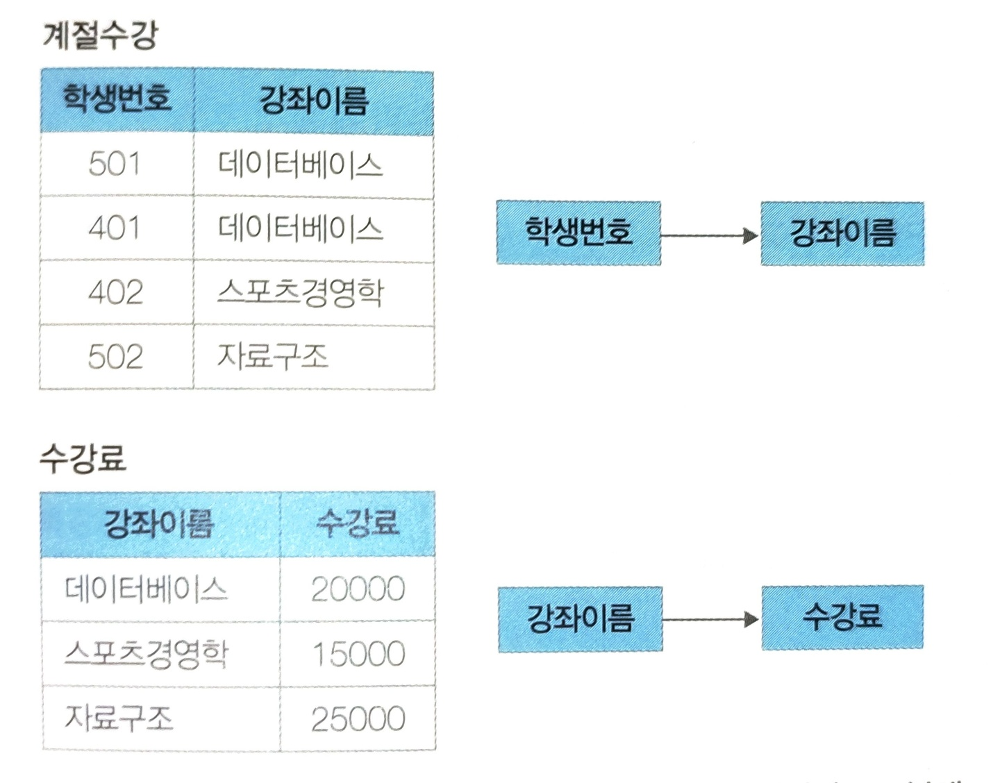
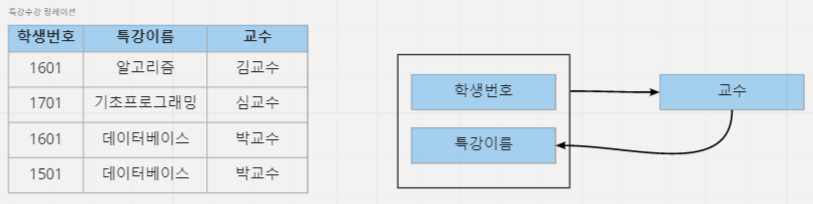
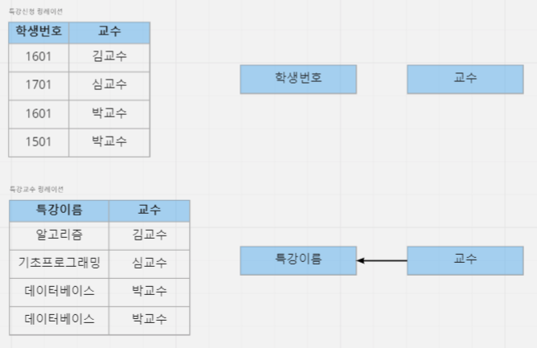

# 4.2.3 정규화 과정
## 1. **정규화(normalization)**
- **정규화** : 이상 현상이 발생하는 테이블을 수정하여 정상으로 만드는 과정 

- (1) 우선 테이블을 분석하여 **기본키**와 **함수 종속성**을 파악
- (2) 릴레이션을 분해하여 제거
- (3) 분해된 릴레이션에 **이상현상**이 남아 있다면 없어질 때까지 분해
   

## 1-1. 이상현상(anomaly)
- **이상** : 잘못 설계된 테이블로 삽입, 수정, 삭제와 같은 데이터 조작시 일어나는 일 

- ex) 회원이 한 개의 등급을 가져야 하는데 세 개의 등급을 갖거나 삭제할 때 필요한 데이터가 같이 삭제되고, 데이터를 삽입해야 하는데 하나의 필드 값이 NULL이 되면 안 되어서 삽입하기 어려운 현상
   

## 1-2. 함수 종속성(FD, Functional Dependency)
- **종속성** : 어떤 속성 A의 값을 통해 다른 속성 B의 값이 유일하게 정해지는 관계
 
- 학생 릴레이션 예시

  |학생번호|학생이름|학과|학과사무실|
  |---|---|---|---|
  |1|김수박|컴퓨터학과|공학관101호|
  |2|김연아|응용통계학과|수학관102호|
  |3|박진영|사회학과|사회관202호|
  |4|최한성|언어학과|언어관404호|
 

  - 학생번호를 알면 학생이름을 알 수 있다. 

  - **속성 A의 값을 알면 다른 속성 B의 값이 유일하게 정해지는 의존관계**
    - 속성 B는 속성 A에 **종속**한다 

    - 속성 A는 속성 B를 **결정**한다.
  - A -> B
  - A : B의 결정자
   

## 1-3. 이상현상과 결정자

 

- **이상현상** : 한 개의 릴레이션에 두 개 이상의 정보가 포함되어 있을 때 나타난다. 

- 학생수강성적 릴레이션 = 학생정보 + 강좌정보
  

1[anomaly](../../img/anomaly2.png)
 

- **결정자** : (학생정보, 강좌이름), 학생번호, 강좌이름, 학과 

- (학생번호, 강좌이름) : 기본키이면서 결정자
- 학생번호, 강좌이름, 학과 : 기본키가 아니면서 결정자
- 이상현상은 기본키가 아니면서 결정자인 속성이 있을 때 발생하므로 **릴레이션을 분해**해야 한다.
  

 

- 이와 같이 분해할 경우, 더 이상 이상현상이 발생하지 않는다.
    

## 2. **정규화 과정**
- 정규화 : 이상현상이 발생하는 릴레이션을 분해하여 이상현상을 없애는 과정 

- 릴레이션은 **정규형**이라는 개념으로 구분하며 정규형이 높을수록 이상현상은 줄어든다.
   

## 2-1. **제 1정규형**
- 정의 : **릴레이션 R의 모든 속성 값이 원자값(atomic value)을 가지면 제 1정규형이다.** 
- 예시

  
   

## 2-2. **제 2정규형**
- 제 2정규형 : 릴레이션의 기본키가 복합키일 때, 복합키의 일부분이 다른 속성의 결정자인지 여부 판단 

- 정의 : **릴레이션 R이 제 1정규형이고, 기본키가 아닌 속성이 기본키에 완전 함수 종속일 때 제 2정규형이라고 한다.**
- **완전 함수 종속(full functional dependency)**
  - A와 B가 릴레이션의 속성이고 A -> B 종속성이 성립할 때, B가 A의 속성 전체에 함수 종속하고, 부분집합 속성에 함수 종속하지 않을 경우 

  - (A1, A2) -> B인데 A1 -> B이면 불완전 함수 종속
- 예시
  
  
   

  - 삭제 이상 

    - 101번 학번의 학생이 수강을 취소하게 되면 알고리즘 과목의 강의실에 대한 정보가 사라진다.
  - 삽입 이상
    - '세계사'라는 과목이 '정란관102'로 새로 개설되어도 신청한 학생이 없어 학번화 성적에 `NULL`값을 넣어야 한다.  

  
   

## 2-3. **제 3정규형**
- 제 3정규형 : 속성들이 이행적으로 종속되어 있는지 여부를 판단 

- 정의 : **릴레이션 R이 제 2정규형이고 기본키가 아닌 속성이 기본키에 비이행적으로 종속할 때 제 3정규형이라고 한다.**
- 이행적 종속
  - A -> B, B -> C가 성립할 때 A -> C가 성립되는 함수 종속성
- 예시

  
   

  - 삭제이상 

    - 402 학번의 학생이 수강을 취소하게 되면 스포츠경영학 과목의 수강료에 대한 정보가 사라진다.
  - 삽입이상
    - 운영체제 과목이 개설되어 15,000원을 삽입해야 하는데, 아직 신청한 학생이 없어 학번을 `NULL`값으로 삽입해야하는 문제 발생
  - 수정이상 
    - 데이터베이스 수강료를 15,000원으로 변경할 경우 데이터 불일치가 발생할 가능성이 있다.
    

  
   

## 2-4. **BCNF**

- BCNF(Boyce Codd Normal Form) : 릴레이션에 존재하는 함수 종속성에서 모든 결정자가 후보키인 경우 

- 정의 : **릴레이션 R에서 함수 종속성 X -> Y가 성립할 때 모든 결정자 X가 후보키이면 BCNF 정규형이라고 한다.**
- 후보키
  - 기본키로 사용할 수 있는 속성들 

  - 유일성과 최소성을 만족해야 한다.

- 예시

  
   
  - 삭제이상 

    - 1601번의 학생이 수강을 취소하면 김교수의 정보가 사라진다.
  - 삽입이상
    - 최교수가 특강을 새로 열면 아직 신청한 학생이 없어 학생번호를 `NULL`값으로 삽입해야 한다.
  - 수정이상
    - 박교수가 특강이름을 데이터베이스 개론으로 변경할 경우 불일치가 발생할 수 있다.
- 이상현상의 원인
  - 교수는 특강이름을 결정하는 결정자이면서 후보키가 아니다. 

  - 이와 같이 결정자이면서 후보키가 아닌 속성이 존재하면 이상현상이 발생한다.  

  

   

## 2-5. 정리
- 제 4정규형은 다치종속성을 가진 릴레이션에 관한 내용 

- 제 5정규형은 프로젝트 - 조인 정규형이라고 부르며 조인종속성을 가진 릴레이션
- **대부분의 릴레이션은 BCNF까지 정규화하면 실제적인 이상현상은 없어진다.**
   
---