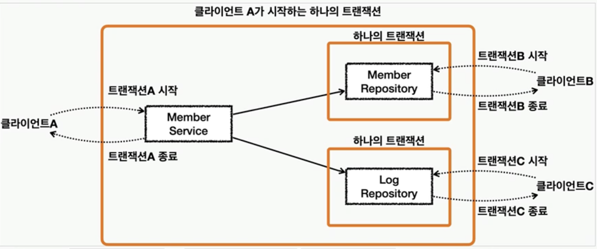

# 4.3.1 트랜잭션

## 트랜잭션이란?
- **데이터베이스에서 하나의 논리적 기능을 수행하기 위한 작업의 단위**
- 데이터베이스에 접근하는 방법은 쿼리임
- 즉, 트랜잭션은 **여러개의 쿼리들을 하나로 묶는 단위**
- 트랜잭션의 특징 (**ACID 특징**)
  - `원자성`
  - `일관성`
  - `독립성`
  - `지속성`
---

## 원자성 (Atomicity)
- `"all or nothing"`
- **트랜잭션이 데이터베이스에 모두 반영되던지, 아니면 전혀 반영 되지 않아야 함**
- 트랜잭션 내의 모든 명령은 반드시 완벽히 수행되어야 하며, 모두가 완벽히 수행되지 않고 어느 하나라도 오류가 발생하면 트랜잭션 전부가 취소되어야 함
- 트랜잭션을 커밋했는데 문제가 발생하여 롤백하는 경우, 그 이후에 모두 수행되지 않음을 보장하는 것
- 예시)
  - 1000만원을 가진 홍철이가 0원을 가진 규영이에게 500만원을 이체한다고 가정
  - 홍철 잔고 조회 -> 홍철 잔고에서 500만원을 뺌 -> 규영 잔고에 500만원을 넣음
  - 위 3단계의 operation중 데이터베이스 사용자는 어떤 과정도 볼 수 없고 참여할 수 없음
  - 과정이 모두 끝난 후의 상황인 홍철 500만원, 규영 500만원인 상황만 볼 수 있음
  - 여기서 작업을 '취소'한다고 했을때, 홍철이는 다시 1000만원, 규영이는 0원을 가져야함
    - 일부 operation만 적용된 상황인 홍철 500만원, 규영 0원은 가능하지 않음! (all or nothing)
- 또한, 트랜잭션 단위로 여러 로직들을 묶을 때 외부 API를 호출하는 것이 있으면 안됨
  - 만약 있다면 롤백이 일어났을 때 어떻게 해야할 것인지에 대한 해결 방법이 있어야 하고, 트랜잭션 전파를 신경 써서 관리해야 함

### 커밋과 롤백
- 커밋 (commit)


  - **여러 쿼리가 성공적으로 처리**되었다고 확정하는 명령어
  - **트랜잭션 단위로 수행**되며 **변경된 내용이 모두 영구적으로 저장**되는 것
  - **"커밋이 수행되었다."** == **"하나의 트랜잭션이 성공적으로 수행되었다."**
  - 위의 그림처럼 update, delete, insert 쿼리가 하나의 트랜잭션 단위로 수행되고 이후에 데이터베이스에 영구 저장됨

- 롤백 (rollback)


  - 에러나 여러 이슈 때문에 트랜잭션 전으로 돌려야 할때 롤백 사용
  - 롤백이란 트랜잭션으로 처리한 하나의 묶음 과정을 일어나기 전으로 돌리는 일 (취소)

- 커밋과 롤백 덕에 데이터의 무결성이 보장 됨
- 또한, 데이터 변경 전에 변경 사항을 쉽게 확인 가능하고, 해당 작업을 그룹화 할 수 있음


### 트랜잭션 전파



- `트랜잭션`이란 **더 이상 나눌 수 없는 단위 작업**
- 전체가 다 성공하든지 아니면 전체가 다 실패해야 함
- 중간에 예외가 발생해서 작업을 완료할 수 없다면 아예 작업이 시작되지 않은 것처럼 초기 상태로 돌려놔야 함, 이것이 트랜잭션!
- 하나의 SQL 명령을 처리하는 경우는 DB가 트랜잭션을 보장해준다고 믿을 수 있음 
- 하지만 **여러 개의 SQL이 사용되는 작업을 하나의 트랜잭션으로 취급해야 하는 경우**가 있음
- 중간에 실패가 발생해서 그 전에 처리한 SQL 작업까지 모두 취소하는 작업을 트랜잭션 롤백이라고 함
- 반대로 SQL이 모두 성공적으로 마무리 됐으면 DB에 알려줘서 작업을 확정시켜야 함, 이것이 트랜잭션 커밋
- 모든 트랜잭션은 시작하는 지점과 끝나는 지점이 있음
- 애플리케이션 내에서 트랜잭션이 시작되고 끝나는 위치가 트랜잭션의 경계 
- **JDBC 의 트랜잭션**은 **하나의 Connection을 가져와 사용하다가 닫는 사이에서 일어남**
- 이렇게 하나의 DB 커넥션 안에서 만들어지는 트랜잭션을 로컬트랜잭션이라고 함
- JdbCTemplate은 하나의 템플릿 메소드 안에서 Datasource의 getConnection() 메소드를 호출해서 Connection 오브젝트를 가져오고, 작업을 마치면 Connection을 확실하게 닫아주고 템플릿 메소드를 빠져나옴 
- 결국 템플릿 메소드 호출 한 번에 한 개의 DB 커넥션이 만들어지고 닫히는 일까지 일어남
- 따라서 **템플릿 메소드가 호출될 때마다 트랜잭션이 새로 만들어지고 메소드를 빠져나오기 전에 종료됨**
- 이러면, **각 메소드들이 JdbcTemplate을 사용한다고 가정**하면, 여러 메소드들을 **하나의 트랜잭션으로 묶을 수 없음**
- 따라서 하나의 트랜잭션으로 묶기위해 직접 DB Connection을 생성하고, 트랜잭션을 시작하고, Connection 오브젝트를 각 메소드들에게 전달하는 방식을 생각할 수 있음
- 이를 위해선 **Connection을 메소드의 파라미터로 전달하며 수행해야함!**
- 이때, 이를 `넘겨서 수행하지 않고 여러 트랜잭션 관련 메서드의 호출을 하나의 트랜잭션에 묶이도록 하는 것`을 `트랜잭션 전파`라고함!!!

> [참고] JDBC
- Java DataBase Connectivity의 약자로 JDBC는 자바 언어로 데이터베이스 프로그래밍을 하기 위한 라이브러리

> [참고] 커넥션
- 애플리케이션과 데이터베이스의 연결을 뜻하는 것으로, 애플리케이션에서 데이터베이스에 접속하고 접속을 종료하는 일련의 과정


```java
@Service
@Transactional(readOnly = true)
public class MemberService {
  private final MemberRepository memberRepository;

  public MemberService(MemberRespository memberRepository) {
    this.memberRepository = memberRepository;
  }
}
```
- 위 코드처럼 Spring 프레임워크에서는 `@Transactional` 애너테이션을 통해 여러 쿼리 관련 코드들을 하나의 트랜잭션으로 처리함!

---

## 일관성 (Consistency)
- '허용된 방식'으로만 데이터를 변경해야 하는 것
- 데이터베이스에 기록된 모든 데이터는 여러 가지 조건, 규칙에 따라 유효함을 가져야 함
- 예시)
  - 홍철이는 1000만원이 있고, 범석이는 0원이 있다고 가정
  - 이때 범석이가 홍철이에게 500만원을 입금할 수 있나?
    - 불가능! 0원으로부터 500만원이 나오는 것은 불가능하기때문

---

## 격리성 (Isolation)
- 트랜잭션 수행 시 서로 끼어들지 못하는 것
- 복수의 병렬 트랜잭션은 서로 격리되어 마치 순차적으로 실행되는 것 처럼 작동되어야 함
- 데이터베이스는 여러 사용자가 같은 데이터에 접근할 수 있어야 함
- 순차적으로하면 쉽게 되겠지만, 성능이 나빠질 것임
- 격리성은 여러개의 격리 수준으로 나뉘어 격리성을 보장함


### 트랜잭션에서 발생할 수 있는 문제들
1) `Dirty Read`

   - **한 트랜잭션이 실행 중일 때 다른 트랜잭션에 의해 수정되었지만 아직 '커밋되지 않은' 행의 데이터를 읽을 수 있을 때 발생**

   - 한 트랜잭션(T1)이 데이터에 접근하여 값을 A에서 B로 변경했고, 아직 커밋을 하지 않았을 때

   - 다른 트랜잭션(T2)이 해당 데이터를 Read하면

   - T2가 읽은 값은 B가 될 것. 하지만 T2가 가진 데이터는 꼬이게 됨

 

2) `Non-Repeatable Read`

   - **한 트랜잭션 내의 같은 행에 두 번 이상 조회가 발생했는데, 그 값이 다른 경우**

   - 한 트랜잭션(T1)이 데이터를 Read하고 있음
   - 이때 다른 트랜잭션(T2)가 데이터에 접근하여 값을 변경/삭제 후 커밋을 하면

   - 그 후 T1이 다시 해당 데이터를 Read할 때 변경/삭제된 데이터를 찾게 됨

 

3) `Phantom Read`
   - **한 트랜잭션 내에서 동일한 쿼리를 보냈을 때 해당 조회 결과가 다른 경우**

   - 트랜잭션(T1) 중에 특정 조건으로 데이터를 검색하여 결과를 얻었음

   - 이 때 다른 트랜잭션(T2)가 접근해 해당 조건의 데이터 일부를 삭제/추가 했을 때, 아직 끝나지 않은 T1이 해당 조건으로 데이터를 조회하면 T2에서 추가/삭제된 데이터가 함께 조회/누락 됨

   - 그 후 T2가 롤백을하면 데이터가 꼬임


### 격리 수준
- 위와 같은 문제들 때문에, ANSI표준에서 트랜잭션의 `격리성`과 `동시 처리 성능` 사이의 Trade-off를 두고 `4단계 격리수준`을 나눔

- 아래로 내려갈수록 격리 수준이 높아져서 언급된 이슈는 적게 발생하지만 동시 처리 성능은 떨어짐

1) `Read Uncommitted`

   - 한 트랜잭션에서 커밋하지 않은 데이터에 다른 트랜잭션이 접근 가능

   - 즉, **커밋하지 않은 데이터를 읽을 수 있음**

   - 이 수준은 당연히 위에서 언급한 모든 문제에 대해 발생 가능성이 존재
   - 대신,  동시 처리 성능은 가장 높음
   - 발생 문제점 : **Dirty Read, Non-Repeatable Read, Phantom Read**


2) `Read Committed` 

   - **커밋이 완료된 데이터만 읽을 수 있음**

   - Dirty Read가 발생할 여지는 없으나, Uncommitted Read 수준보다 동시 처리 성능은 떨어짐
   - 대신 Non-Repeatable Read 및 Phantom Read는 발생 가능
     - 어떤 트랜잭션이 접근한 행을 다른 트랜잭션이 수정 가능
     - 트랜잭션 A가 같은 행을 다시 읽을 때 다른 내용이 발견될 수 있음
     - Non-Repeatable Read 발생 가능
   - 데이터베이스들은 보통 Committed Read를 디폴트 수준으로 지정함
   - 발생 문제점 : **Non-Repeatable Read, Phantom Read**


3) `Repeatable Read`

   - **트랜잭션 내에서 한 번 조회한 데이터를 반복해서 조회해도 같은 데이터가 조회됨**

   - 이는 개별 데이터 이슈인 Dirty Read, Non-Repeatable Read는 발생하지 않지만,
   - 결과 집합 자체가 달라지는 Phantom Read는 발생가능
     - 새로운 행을 추가하는 것은 막지 않음
     - 이후에 추가된 행이 발견될 수도 있음
     - Phantom Read 발생 가능
   - 발생 문제점 : **Phantom Read**


4) `Serializable`

   - 가장 엄격한 격리 수준

   - 위 3가지 **문제점을 모두 커버 가능**
   - 하지만 **동시 처리 성능은 급격히 떨어질 수 있음**


   - 참고로 MySQL과 Oracle의 격리 수준은 다르다.

     - MySQL : Repeatable Read

     - Oracle : Read Committed

---

## 지속성 (Durability)
- 성공적으로 수행된 트랜잭션은 영원히 반영되어야 하는 것
- 데이터베이스에 시스템 장애가 발생해도 원래 상태로 복구하는 회복 기능이 있어야 함을 뜻함
- 데이터베이스는 이를 위해 체크섬, 저널링, 롤백 등의 기능을 제공함

> [참고] 체크섬
- 중복 검사의 한 형태
- 오류 정정을 통해 송신된 자료의 무결성을 보호하는 단순한 방법

> [참고] 저널링
- 파일 시스템 또는 데이터베이스 시스템에 변경 사항을 반영(commit)하기 전에 로깅하는 것
- 트랜잭션 등 변경 사항에 대한 로그를 남기는 것

