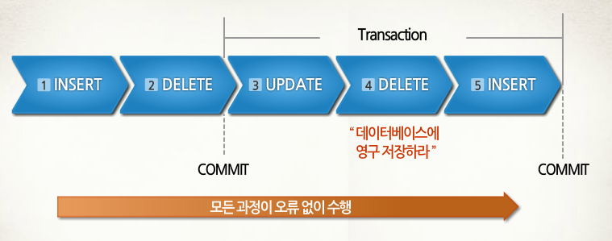
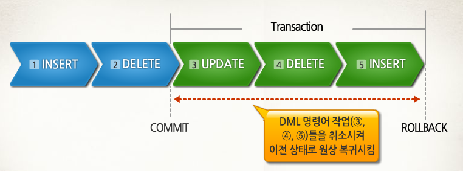

# 4.3.1 트랜잭션

## 트랜잭션이란?
- **데이터베이스에서 하나의 논리적 기능을 수행하기 위한 작업의 단위**
- 데이터베이스에 접근하는 방법은 쿼리임
- 즉, 트랜잭션은 **여러개의 쿼리들을 하나로 묶는 단위**
- 트랜잭션의 특징 (**ACID 특징**)
  - `원자성`
  - `일관성`
  - `독립성`
  - `지속성`

## 원자성 (Atomicity)
- `"all or nothing"`
- **트랜잭션이 데이터베이스에 모두 반영되던지, 아니면 전혀 반영 되지 않아야 함**
- 트랜잭션 내의 모든 명령은 반드시 완벽히 수행되어야 하며, 모두가 완벽히 수행되지 않고 어느 하나라도 오류가 발생하면 트랜잭션 전부가 취소되어야 함
- 트랜잭션을 커밋했는데 문제가 발생하여 롤백하는 경우, 그 이후에 모두 수행되지 않음을 보장하는 것
- 예시)
  - 1000만원을 가진 홍철이가 0원을 가진 규영이에게 500만원을 이체한다고 가정
  - 홍철 잔고 조회 -> 홍철 잔고에서 500만원을 뺌 -> 규영 잔고에 500만원을 넣음
  - 위 3단계의 operation중 데이터베이스 사용자는 어떤 과정도 볼 수 없고 참여할 수 없음
  - 과정이 모두 끝난 후의 상황인 홍철 500만원, 규영 500만원인 상황만 볼 수 있음
  - 여기서 작업을 '취소'한다고 했을때, 홍철이는 다시 1000만원, 규영이는 0원을 가져야함
    - 일부 operation만 적용된 상황인 홍철 500만원, 규영 0원은 가능하지 않음! (all or nothing)
- 또한, 트랜잭션 단위로 여러 로직들을 묶을 때 외부 API를 호출하는 것이 있으면 안됨
  - 만약 있다면 롤백이 일어났을 때 어떻게 해야할 것인지에 대한 해결 방법이 있어야 하고, 트랜잭션 전파를 신경 써서 관리해야 함

### 커밋과 롤백
- 커밋 (commit)

  - **여러 쿼리가 성공적으로 처리**되었다고 확정하는 명령어
  - **트랜잭션 단위로 수행**되며 **변경된 내용이 모두 영구적으로 저장**되는 것
  - **"커밋이 수행되었다."** == **"하나의 트랜잭션이 성공적으로 수행되었다."**
  - 위의 그림처럼 update, delete, insert 쿼리가 하나의 트랜잭션 단위로 수행되고 이후에 데이터베이스에 영구 저장됨

- 롤백 (rollback)

  - 에러나 여러 이슈 때문에 트랜잭션 전으로 돌려야 할때 롤백 사용
  - 롤백이란 트랜잭션으로 처리한 하나의 묶음 과정을 일어나기 전으로 돌리는 일 (취소)

- 커밋과 롤백 덕에 데이터의 무결성이 보장 됨
- 또한, 데이터 변경 전에 변경 사항을 쉽게 확인 가능하고, 해당 작업을 그룹화 할 수 있음

### 트랜잭션 전파

