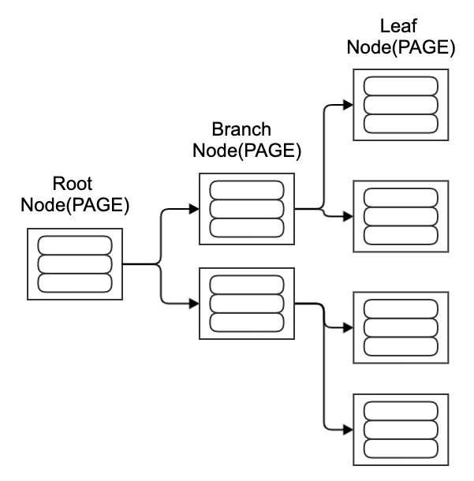
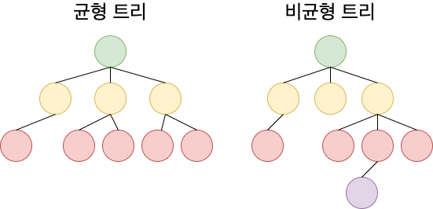
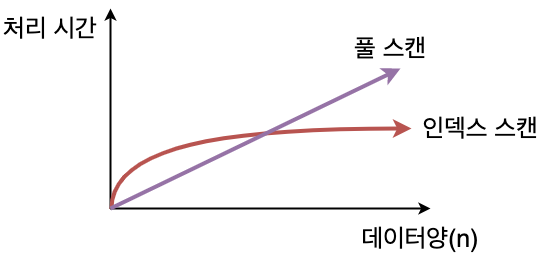
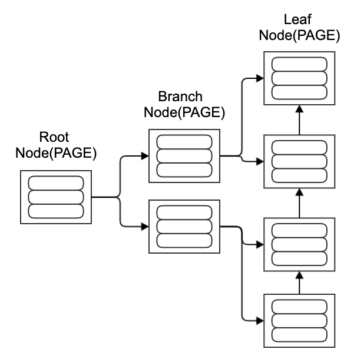
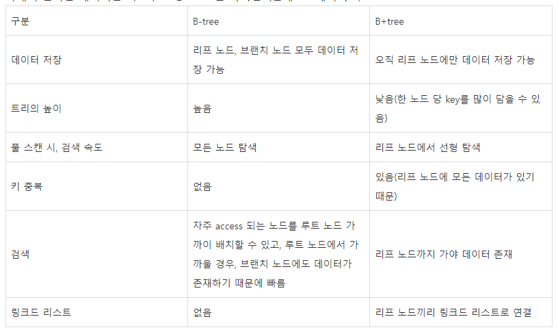

# 4.5.2 B-트리
## 1. B-트리(B-tree, Balanced tree)

### 1.1 B-tree 구조
- 이진 트리를 확장한 구조
- B-tree의 핵심은 데이터가 정렬된 상태로 유지되어 있다는 것
 
. 
- 1계층 : 루트 노드 / 2계층 : 브랜치 노드 / 3계층 : 리프 노드
- B-tree는 Binary search tree와 유사하지만, 한 노드 당 자식 노드가 2개 이상 가능
- key 값을 이용해 찾고자 하는 데이터를 트리 구조를 이용해 찾는 것

### 1.2 B-tree가 빠른 이유
- 항상 정렬된 상태로 특정 값보다 크고 작은 부등호 연산에 문제가 없음
- 참조 포인터가 적어 방대한 데이터 양에도 빠른 메모리 접근이 가능
- 데이터 탐색뿐 아니라, 저장, 수정, 삭제에도 항상 O(logN)의 시간 복잡도를 가짐
- 어떤 값에 대해서도 같은 시간에 결과를 얻을 수 있다 == 균일성

- 데이터 양에 비례하여 효과 상승

- 풀 스캔이 테이블의 크기에 비례하는 형태로 실행 시간이 늘어가는데에 비해 인덱스를 사용한 경우 실행 시간의 저하는 보통 원만한 곡선을 그리게 됨

## 2. (참고)B+tree

### 2.1 B+tree
 
- B+tree는 B-tree의 확장개념
- B-tree의 경우 branch 노드에 key와 data를 담을 수 있지만, **B+tree의 경우** 브랜치 노드에 key만 담아두고, data는 담지 않음
- 오직 리프 노드에만 key와 data를 저장하고, 리프 노드끼리 Linked list로 연결되어 있음

### 2.2 B+tree의 장점
- 리프 노드를 제외하고 데이터를 담아두지 않기 때문에 메모리를 더 확보함으로써 더 많은 key들을 수용할 수 있음
- 풀 스캔 시, B+tree는 리프 노드에 데이터가 모두 있기 때문에 한 번의 선형탐색만 하면 되기 때문에 B-tree에 비해 빠름 (B-tree의 경우에는 모든 노드를 확인해야 함)

### 2.3 B-tree와 B+tree의 비교
