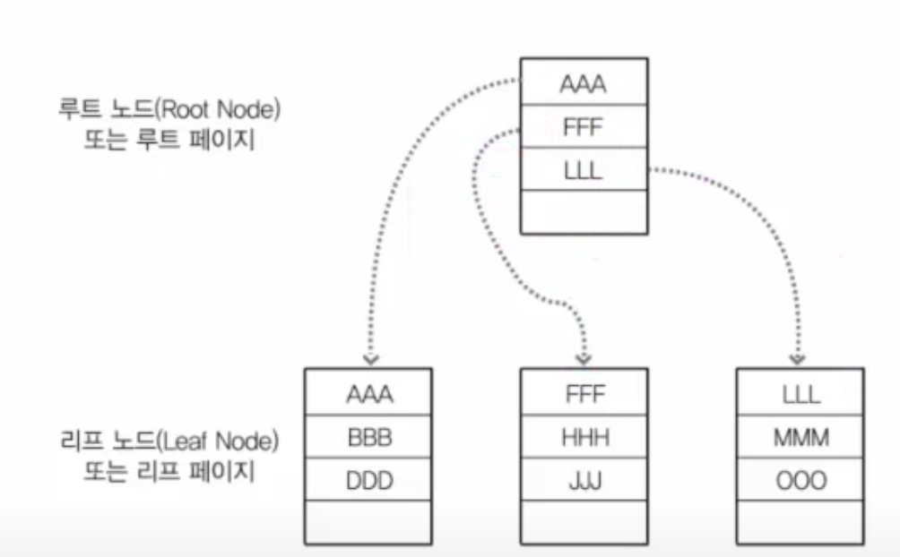
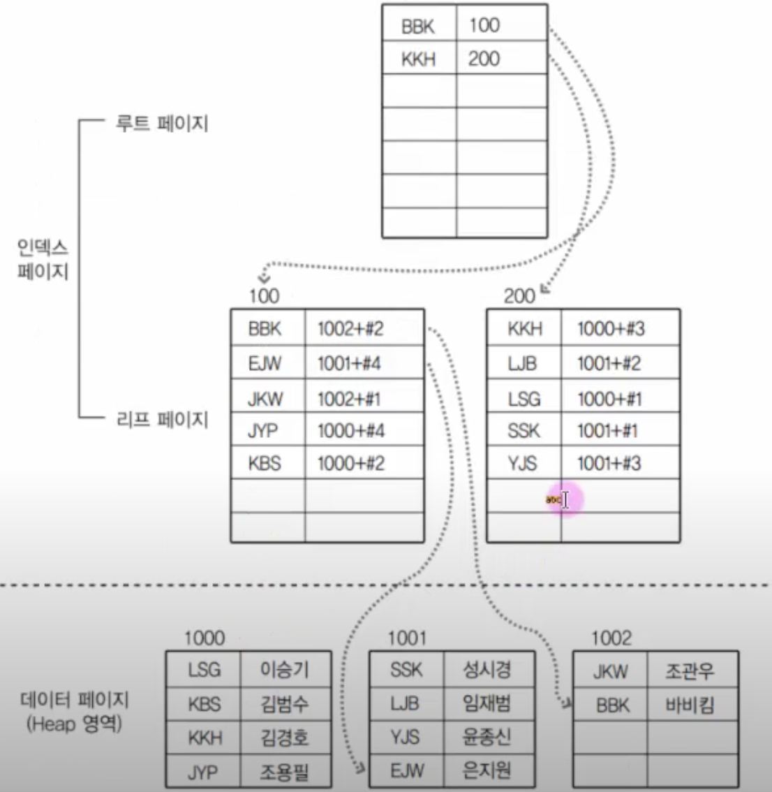
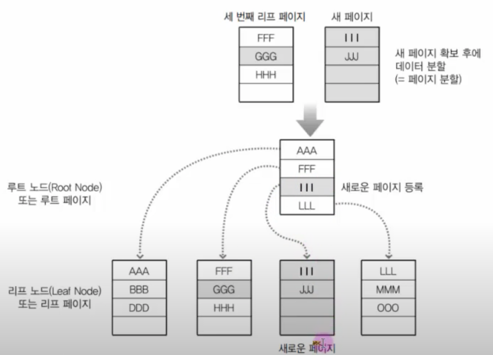
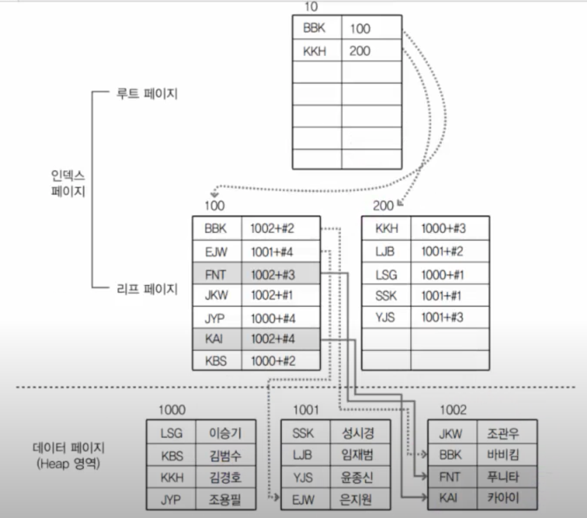

# 4.5.3 인덱스 만드는 방법

## 1. 인덱스의 종류

### 1.1 클러스터형 인덱스
- 클러스터형 인덱스는 단어들이 정렬되어 있는 영어사전과 같은 개념
- 테이블당 1개만 생성할 수 있으며 클러스터가 적용된 속성을 기준으로 자동으로 정렬됨
- 기존의 데이터를 정렬해야 하기 때문에 시간이 오래 걸림
- 명시적으로 index를 생성하지 않더라도 primary key가 적용된 속성은 클러스터형 인덱스 역할을 하며 거의 동일한 용어로 사용됨
- 속성에 unique을 추가하면 해당 속성은 보조인덱스 역할을 하는데, unique not null을 하면 클러스터형 인덱스와 같은 역할을 함
- 하지만 만약 a속성에 primary key, b속성에 unique not null을 하면 primary key가 우선순위를 가져 a속성이 클러스터 인덱스가 됨

- 해당 테이블에 클러스터형 인덱스가 적용되면 데이터는 위의 구조로 바뀜
- 이전에는 AAA ~ OOO의 순서가 없었지만 클러스터형 인덱스가 적용되고 사전순으로 정렬되었으며 각 데이터는 페이지에 들어감

- 하지만 만약 "III"와 "GGG"가 추가된다면?
- 첫번째 페이지의 용량이 다 차게되어 페이지 분할이 일어나게 됨
- 만약 더 많은 데이터가 추가되면 그 만큼의 페이지가 추가되고, 페이지 내부에서 다시 정렬하게 됨
- 또 루트 페이지가 다 차게되면 또 루트 페이지에서도 페이지 분할이 일어나고, 새로운 루트 페이지가 생기고 DB에 많은 부하를 작업이 수행하게 됨
- 그렇기 때문에 클러스터 인덱스의 경우 **select를 자주 하는 테이블에서 사용하는 것**이 좋으며 insert, update, delete를 자주하는 테이블에 클러스터 인덱스를 넣게 된다면 그 만큼 부하가 생김

---

### 1.2 보조 인덱스(비 클러스터형)

- 보조 인덱스는 책 뒤의 찾아보기와 같은 역할
- 찾고 싶은 키워드를 알고 있으면 찾아보기에서 해당 키워드가 몇페이지에 있는지 알 수 있음
- 클러스터형 인덱스는 테이블 당 1개만 생성할 수 있지만 보조 인덱스는 테이블 당 여러개 생성할 수 있음
- 보조 인덱스는 해당 열에 unique 또는 unique null 을 추가하여 만들 수 있습니다. 
- 클러스터형 인덱스와는 다르게 보조 인덱스는 해당 속성을 보조인덱스로 만들었다고 해서 데이터가 정렬되지 않음
- 대신에 아래처럼 새로운 페이지가 생김

-  데이터 페이지는 정렬되지 않고, 대신 리프 페이지가 새로 만들어진 후 리프 페이지의 데이터들이 정렬됨
-  각 데이터마다 실제 데이터 영역의 주소값이 저장되어 있음

---

## 2. 검색 vs 삽입, 삭제, 수정

### 2.1 검색
1. 클러스터 인덱스
	
	- 클러스터 인덱스의 경우 검색에서 좋은 성능을 보임 
	- 리프 노드들이 이미 정렬되어 있기 때문에 DDD라는 데이터를 찾을 때 루트 페이지- 리프 페이지, 총 2번의 페이지 참조가 일어나게 됨

2. 보조 인덱스
		
		- 보조 인덱스의 경우 BBK라는 데이터를 찾고 싶을 때 루트 페이지 - 리프 페이지 - 데이터 페이지, 총 3번의 페이지 참조가 일어나기 때문에 상대적으로 성능이 좋지 않음

## 2.2 삽입, 삭제, 수정
1. 클러스터 인덱스
	
	- 클러스터 인덱스의 경우 III라는 새로운 데이터를 입력하게 하게 되면 해당 리프 페이지의 공간이 부족하게 되어 새로운 페이지가 생성됨
	- 또한 새로운 데이터가 들어왔기 때문에 페이지 내부적으로 정렬하는 작업도 수행되어야 함

2. 보조 인덱스
	
- 보조 인덱스의 경우 새로운 데이터가 들어왔을 경우 페이지 분할이 일어나지 않았고 내부적으로 정렬작업도 하지 않음
- 삽입, 삭제, 수정 하는 경우라면 보조 인덱스가 클러스터 인덱스보다 더 좋은 성능을 보여줌

**검색의 경우 클러스터 인덱스가 보조 인덱스보다 더 좋은 성능을 보여주고, 
삽입,삭제,수정의 경우 보조 인덱스가 클러스터 인덱스보다 더 좋은 성능을 보임**

---

## 3. 혼합형 인덱스 (클러스터 + 보조)

- 대부분의 경우 클러스터 인덱스와 보조 인덱스를 같이 사용함

	

- 위 구조의 경우 위에는 보조 인덱스, 아래쪽은 클러스터형 인덱스가 있음
- 보조 인덱스 페이지의 리프 페이지의 데이터 value값에는 원래 데이터의 주소가 들어가야 하지만 다른 데이터가 들어가 있음 == 인덱스 페이지의 루트 페이지의 key값
- key 값을 사용해 실제 데이터가 존재해 있는 데이터 페이지로 이동함

- 혼합형의 장점 = **데이터 삽입,삭제,수정이 용이하다**
	- 만약 보조 인덱스 페이지의 리프 페이지의 value값이 데이터 페이지를 그대로 참조하고 있으면 데이터 페이지의 데이터가 수정되는 경우 그 주소값도 바뀔 수 있기 때문에 보조 인덱스의 리프 페이지의 value값이 계속 수정되어야 함
	- 하지만 위의 구조라면 데이터 페이지의 마지막에 새로운 데이터가 들어왔다고 하여도 단순히 클러스터형 인덱스 페이지의 루트페이지만을 참조하고 있기 때문에 데이터를 따로 수정할 필요가 없음
	- 결과적으로 데이터를 검색하는데는 약간의 성능저하가 있을 수 있지만 삽입,삭제,수정하는데 큰 성능상의 이점을 가져옴

- ex) '임재범'이란 Name을 가진 사람의 주소를 검색하는 과정
	1. (페이지 10 확인) 보조 인덱스 루트페이지 '은지원'보다 큰 값이므로, 200번 페이지 참조
	2. (페이지 200 확인) '임재범'은 클러스터형 인덱스의 키 값 LJB임을 확인 후, 클러스터형 인덱스 루트 페이지 참조
	3. (페이지 20 확인) 'LJB'는 'KBS'보단 크고 'SSK'보단 작으므로 1001번 페이지 확인
	4. (페이지 1001 확인) 'LJB'값을 찾고 그에 해당하는 주소가 '서울' 인것을 찾아냄