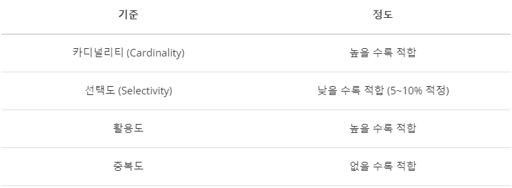

# 4.5.4 인덱스 최적화 기법

## 1. 인덱스 칼럼의 데이터 줄이기
- 인덱스가 차지하는 공간을 줄여야 함
- 정수 :  int(4byte)를 사용해도 충분한 칼럼에 Bigint(8byte)를 사용하는 경우
- 텍스트 : 이름을 저장하는 칼럼에 varchar(255)를 사용하는 경우
 
## 2. 인덱스를 과도하게 사용하지 않기
- 너무 많은 인덱스는 새로운 Row를 등록할때마다 인덱스를 추가해야하고, 수정/삭제시마다 인덱스 수정이 필요하여 성능상 이슈가 있음
-  많은 인덱스들로 인해 옵티마이저가 잘못된 인덱스를 선택할 확률이 높음

## 3. Insert보다는 Select에 보수적인 로직을 구성하기
- DB의 처리과정에서 가장 느린 로직이 INSERT와 UPDATE
- 하지만 실제 서비스에서는 INSERT 횟수보다 SELECT횟수가 훨씬 많음
- 따라서 우리는 SELECT에 초첨을 맞춰 로직을 구성해야 함

## 4. 인덱스 컬럼 효과적으로 선정하기

### 4.1 카디널리티 (Cardinality)
- 카디널리티가 높을 수록 인덱스 설정에 좋은 컬럼
  = 한 컬럼이 갖고 있는 값의 중복 정도가 낮을 수록 좋음
- 컬럼에 사용되는 값의 다양성 정도, 즉 중복 수치를 나타내는 지표
- ex) 10개 rows를 가지는 ‘학생’ 테이블에 ‘학번’과 ‘이름’ 컬럼이 있을 경우

	-   ‘학번’은 학생마다 부여 받으므로 10개 값 모두 고유한 값
	    = 중복 정도가 낮으므로 카디널리티가 낮음
	-   ‘이름’은 동명이인이 있을 수 있으니 1~10개 사이의 값을 가집니다.
	    = 중복 정도가 ‘학번’에 비해 높으므로 카디널리티가 높음

### 4.2 선택도 (Selectivity)
- 선택도가 낮을 수록 인덱스 설정에 좋은 컬럼 (5~10%)
- 데이터에서 특정 값을 얼마나 잘 선택할 수 있는지에 대한 지표
- 계산식 : 컬럼의 특정 값의 row 수 / 테이블의 총 row 수 * 100  
- ex) 10개 rows를 가지는 ‘학생’ 테이블에 ‘학번’, ‘이름’, ‘성별’ 컬럼이 있을 때 (학번은 고유하고, 이름은 2명씩 같고, 성별은 남녀 5:5 비율)
	-   ‘학번’의 선택도 = 1/10x100 = 10%
	-   ‘이름’의 선택도 = 2/10x100 = 20%
	-   ‘성별’의 선택도 = 5/10x100 = 50%
- 즉, 선택도는 특정 필드값을 지정했을 때 선택되는 레코드 수를 테이블 전체 레코드 수로 나눈 것

### 4.3 활용도
- 활용도가 높을 수록 인덱스 설정에 좋은 컬럼
- 해당 컬럼이 실제 작업에서 얼마나 활용되는지에 대한 값 
- 쿼리를 날릴 때 **WHERE 절에 자주 활용되는지**를 판단하면 됨
- ex) ‘학생’ 테이블에 ‘학번’, ‘이름’, ‘전화번호’가 있을 때 (인덱스는 ‘학번’, ‘전화번호’) 다음 중 인덱스가 영향을 주는 쿼리는?
	1.  `SELECT '학번' FROM '학생';`
	2.  `SELECT '전화번호' FROM '학생' WHERE '이름' = "김철수";`
	3. `SELECT * FROM '학생' WHERE '학번' = 1;`
	- 정답 : 3번 (WHERE절에 인덱스가 걸림)

### 4.4 중복도
- 중복도가 없을 수록 인덱스 설정에 좋은 컬럼
- 중복 인덱스 여부에 대한 값
- 인덱스 성능에 대한 고려 없이 마구잡이로 설정하거나, 다른 부서 다른 작업자의 분리된 요청으로  
같은 컬럼에 대해 인덱스가 중복으로 생성된 경우가 발생할 수 있음

