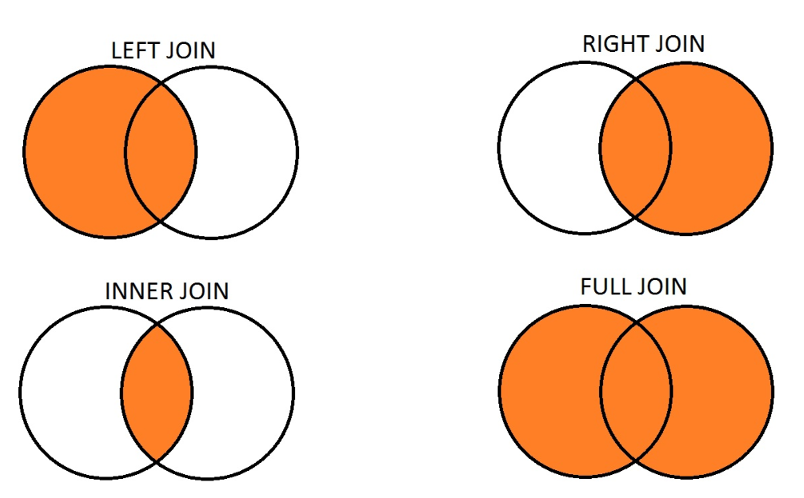
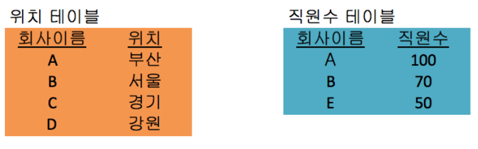
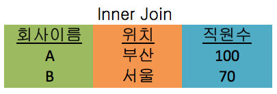
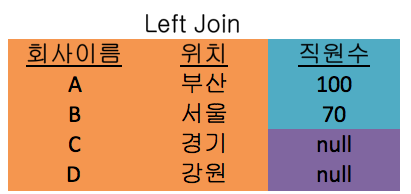
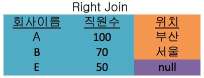
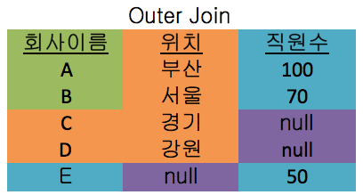

# 조인의 종류

## 조인(join)

- 하나의 테이블이 아닌 두 개 이상의 테이블을 묶어서 하나의 결과물을 만드는 것
- **DB별 쿼리**
  - MySQL : `JOIN`
  - MongoDB : `lookup`
    - mongoDB의 조인 연산은 RDBMS보다 성능이 떨어지기 떄문에 지양하기!

## 조인의 종류



- 내부 조인(inner join) : 왼쪽 테이블과 오른쪽 테이블의 두 행이 모두 일치하는 행이 있는 부분만 표기
- 왼쪽 조인(left outer join) : 왼쪽 테이블의 모든 행이 결과 테이블에 표기
- 오른쪽 조인(right outer join) : 오른쪽 테이블의 모든 행이 결과 테이블에 표기
- 합집합 조인(full outer join) : 두 개의 테이블을 기반으로 조인 조건에 만족하지 않는 행까지 모두 표기



### 1. 내부 조인

```sql
SELECT * FROM TableA A
INNER JOIN TableB B ON
A.key = B.key

```



- 공통된 필드 '회사이름'을 기준으로 두 테이블에 공통으로 속한 회사 이름과 그에 따른 다른 값(위치, 직원수)을 양쪽 테이블에서 가져옴
- 

### 2. 왼쪽 조인

```sql
SELECT * FROM TableA A
LEFT JOIN TableB B ON
A.key = B.key

```



- 왼쪽 테이블 A를 기준으로 완전한 레코드 집합을 생성
- 테이블 B는 일치하면 레코드를 반환하고 없으면 null 반환

### 3. 오른쪽 조인

```sql
SELECT * FROM TableA A
RIGHT JOIN TableB B ON
A.key = B.key

```



- 오른쪽 테이블 B를 기준으로 완전한 레코드 집합을 생성
- 테이블 A는 일치하면 레코드를 반환하고 없으면 null 반환

### 4. 합집합 조인

```sql
SELECT * FROM TableA A
FULL OUTER JOIN TableB B ON
A.key = B.key

```



- 양쪽 테이블에서 일치하는 레코드와 함께 모든 레코드 집합 생성
- 키가 일치하지 않는 경우 null로 채움
