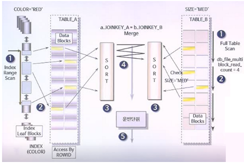

# 조인의 원리

- 중첩 루프 조인
- 정렬 병합 조인
- 해시 조인

## 1. 중첩 루프 조인(NLJ, Nested Loop Join)

- 중첩 for 문과 같은 원리로 조건에 맞는 조인을 하는 방법
- 단점
  - 랜덤 접근에 대한 비용이 많이 증가함
  - 대용량의 테이블에서는 사용하지 않음
- 조인해야 할 데이터가 많지 않은 경우에 유용하게 사용

### 1.1 NLJ 논리

1. 드라이빙 테이블 선정(기준이 되는 테이블)
2. where절에 정의된 검색 조건을 만족하는 데이터 걸러냄
3. 이 값을 가지고 조인 대상 테이블을 반복적으로 검색하면서 조인 조건을 만족하는 최종 결과값 얻어냄

```sql
SELECT e.name, e.sal // 근로자 이름과 월급 출력
FROM emp e, dept d // 근로자, 부서 테이블 조회
WHERE e.deptno = d.deptno; // 근로자 부서번호 맵핑
```
- employees 테이블이 드라이빙 테이블. 
- 옵티마이저는 맨 먼저 employees 테이블의 한 로우를 읽어 해당 로우의 department_id 값을 찾음
- 이 값을 기준으로 해서 departments 테이블에서 이와 같은 값을 가진 로우를 검색.
- 검색이 완료되면 다시 employees 테이블의 두 번째 로우를 읽음
- departments 테이블에서 데이터를 검색하며 이와 같은 방식을 반복

### 1.2 NLJ 특징

1. 첫 번째 로우를 받는 시간은 빠르지만, 전체 결과를 받기까지는 시간이 걸린다.
2. 메모리가 필요없는 조인 방법으로 추가적인 메모리 비용이 들지 않는다.
3. 전체적인 성능은 driving table에 있는 데이터가 몇 건인지가 관건이 되며, 드라이빙 테이블의 크기가 전체 쿼리를 수행하는데 큰 영향을 미친다.
4. 거의 대부분의 경우 inner table 검색시 인덱스를 사용해서 검색이 수행되므로 innser table의 인덱스 효율이 좋아야 한다.
5. 적은 수의 로우를 검색하는 경우 NLJ을 사용한다.
6. `일반적으로 조인 조건에 '=' 연산자가 사용될 경우 옵티마이저는 NLJ을 선택하게 된다.`

## 2. 정렬 병합 조인(SMJ Sort Merge Join)

- 각 테이블을 조인할 필드 기준으로 정렬한 후 조인 작업 수행
- **적용하는 경우**
  1. 조인할 때 적절한 인덱스가 없는 경우
  2. 대용량의 테이블을 조인할 경우
  3. 조인조건으로 범위 비교 연산자가 있을 경우 사용
  4. 인덱스 사용에 따른 랜덤엑세스의 오버헤드가 많은 경우
- 드라이빙 테이블이 별도로 존해하지 않으며, 두 테이블이 모두 독립적으로 동등한 레벨에 있게 된다.

### 2.1 SMJ 특징

1. 첫 번째 로우를 받는 시간은 좀 느리지만, 전체 로우가 반환되는 시간은 빠르다.
    -  두 테이블의 데이터를 각각 정렬한 뒤에 병합하므로 정렬작업이 끝날 때까지는 어떤 로우도 반환되지 않기 때문
2. 정렬 작업을 위해 추가적인 메모리를 사용함
   - 메모리 사용량은 `SORT_AREA_SIZE` 파라미터에 명시됨
   -  정렬 작업을 수행하면서 위 파라미터에 명시된 값 이상의 메모리를 사용할 경우, `TEMP 테이블스페이스를 사용`하게 되므로 `디스크 I/O가 발생`하게 됨
3. NLJ 보다는 많은 양의 데이터를 처리할 때 유리함
   - 메모리만 사용해서 정렬 작업을 수행한다면 `넓은 범위의 값을 검색하는데 유용`
4. 두 테이블 데이터의 `정렬 작업이 전체 성능에 영향`을 많이 끼침
   - SELECT 리스트에서 불필요한 컬럼은 제거해서 정렬 작업을 수행할 때 좀 더 부하를 적게 해줘야 함
5. 일반적으로 `조인조건에서` 사용되는 연산자가 >, >=, <, <= 와 `같은 비동등 연산자가 사용될 경우` 옵티마이저는 `SMJ를 사용`하게 된다.
6. 두 테이블의 사이즈 차이가 큰 경우 불리함



### 2.2 동작과정

1. 먼저 왼쪽과 오른쪽에 있는 TABLE_A와 TABLE_B를 동시에 ACCESS
2. 여기서 COLOR에 인덱스가 걸려있기에 TABLE_A는 인덱스 스캔
3. TABLE_B는 테이블 풀스 캔
4. 조회된 데이터들은 TABLE_A에서 읽은 데이터는 JOINKEY_A를 기준으로, TABLE_B에서 읽은 데이터는 JOINKEY_B를 통해 별도의 공간에서 SORT 작업
5. 두 개의 정렬 작업이 모두 완료되었다면 정렬한 결과를 차례로 Scan 해 나가면서 연결고리의 조건으로 Merge 하여 리턴

### 2.3 성능 개선 포인트

 1. access 속도 향상시키기
   - Access 할 때 FULL TABLE SCAN이냐 INDEX RANGE SCAN이냐 하는 등 테이블을 Access 하는 방법을 다양한 방법을 통해 최적화시키기
2. 정렬 속도 향상
   - 조인 조건 컬럼이 이미 정렬되어 있다면 정렬을 하는 작업을 단축시켜 검색 속도 향상에 도움이 될 것
3. 양쪽의 정렬까지 완료되는 속도 맞추기
4. SORT_AREA_SIZE 최적화
   - Temporary Table Space를 사용하면 딜레이가 생기므로 SORT_AREA_SIZE를 적당한 크기로 설정해두는 것이 속도 향상에 도움

## 3. 해시 조인(Hash Join)

- 조인될 두 테이블 중 하나를 해시 테이블로 선정하여 조인될 테이블의 조인 키 값을 해시 알고리즘으로 비교하여 매치되는 결과값을 얻는 방식
- 비용 기반 옵티마이저를 사용할 때만 사용될 수 있는 조인 방식
- `'=' 비교를 통한 조인에서만 사용`
- 주로 많은 양의 데이터를 조인해야 하는 경우에 주로 사용


https://coding-factory.tistory.com/758
