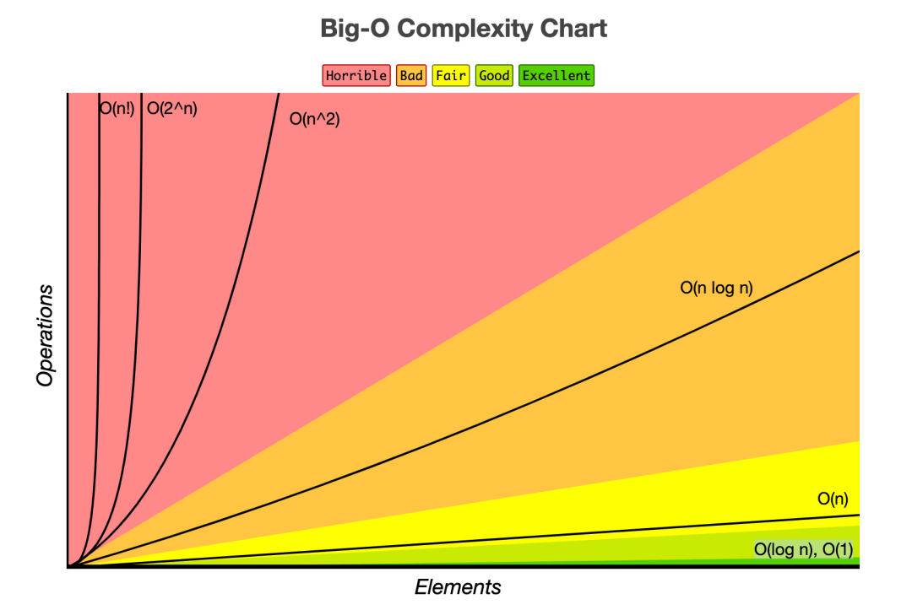

# 5.1.1 복잡도

## 0. 자료구조(data structure)
- 효율적으로 데이터를 관리하고 수정, 삭제, 탐색, 저장할 수 있는 데이터의 집합

<br>

- 우리가 자료구조를 배우는 이유<br>

  (1) 데이터를 체계적으로 저장하고, 효율적으로 활용한다.

  (2) 자료구조를 알면 특정한 상황에 놓인 문제를 수월하게 해결할 수 있다.
<br><br><br>

---
## 1. 복잡도
- 좋은 알고리즘 : 실행 시간도 짧으면서 저장공간도 적게 쓰는 알고리즘

- 두 가지 다 만족하기는 어렵고, 시간과 공간은 대체적으로 반비례적인 경향
- 최근 대용량 시스템이 보편화됐으므로 프로그램을 구현할 때에는 공간복잡도보다는 시간복잡도가 우선
<br><br><br>

## 1-1. 시간 복잡도(Time Complexity)
- 문제를 해결하는 데 걸리는 시간과 입력의 함수 관계

- 명령문의 실행 빈도수에 따라 대략적으로 소요 시간을 나타내기 위해 사용
<br><br><br>

- 시간 복잡도가 필요한 이유
  - 효율적인 코드로 개선하는 데 쓰이는 척도

  - 입력값이 커질수록 그에 비례하여 연산 횟수가 커지기 때문에 **시간복잡도를 고려한 효율적인 알고리즘 필요**
  - 입력값이 커짐에 따라 증가하는 시간의 비율을 최소화한 알고리즘 구성
<br><br><br>

## 1-2. 빅오(Big-O) 표기법
- 시간 복잡도는 어떠한 알고리즘의 로직이 '얼마나 오랜 시간'이 걸리는지를 나타내는 데 쓰이며, 보통 **빅오 표기법**으로 나타냄

- **빅오 표기법** : 입력 범위 n을 기준으로 해서 로직이 몇 번 반복되는지 나타내는 것

- 최악의 경우 고려
예시

  ```python
  4n^2 + 3n + 21

  O(n^2)
  ```
<br><br>

## 1-3. 빅오(Big-O) 표기법의 종류

|O(1)|상수 시간<BR>입력의 크기와 상관없이 항상 같은 시간이 걸리는 알고리즘|배열, 해시 테이블|
|---|---|---|
|O(log n)|로그시간<BR>문제를 해결하는데 필요한 단계들이 연산마다 줄어드는 알고리즘|이진탐색, 힙 삽입/삭제|
|O(n)|선형시간<BR>입력값이 증가됨에 따라 시간 또한 같은 비율로 증가하는 알고리즘<BR>모든 입력값을 적어도 한 번 이상은 살펴봐야 한다.|정렬되지 않은 리스트에서 최대값 최소값 탐색|
|O(n log n)|선형로그시간<BR>데이터의 수가 2배로 늘 때, 연산 횟수는 2배 조금 넘게 증가한다.|힙 정렬, 병합 정렬|
|O(n^2)|제곱시간<BR>2중 반복을 도는 알고리즘|버블 정렬|
|O(2^n)|지수시간<BR>입력값의 제곱만큼 증가하는 알고리즘|피보나치(재귀), 부분집합의 모든 경우의 수를 도출|
|O(n!)|팩토리얼 시간<BR>빅오 중 가장 느린 알고리즘|순열의 모든 경우의 수 도출|

<BR><BR>




<BR>

- O(1) < O(log n) < O(n) < O(n log n) < O(n²) < O(n³) < O(2n) < O(n!)

<BR><BR><BR>

---