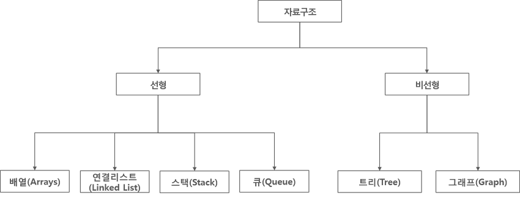
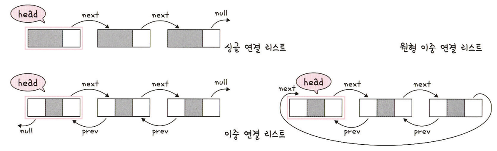

# 5.2.1 연결 리스트(Linked List)


<br><br>

## 0. 선형 자료 구조
- 자료를 구성하는 데이터가 일렬로 나열되어 있는 자료 구조
<br><br>


<br><br>

- 대표적인 자료 구조
  - **선형 구조 : 배열, 연결리스트, 스택, 큐, 데크**
  - 비선형 구조: 트리, 그래프
<br><br><br>

---

## 1. 연결 리스트
- 데이터를 감싼 노드를 포인터로 연결해서 공간적인 효율성을 극대화시킨 자료구조

- 삽입/삭제 : O(1)
- 탐색 : O(n)
<br><br><br>

## 1-1. 연결 리스트 종류

<br><br>

- **싱글 연결 리스트** : only next 포인터

- **이중 연결 리스트** : next 포인터 + prev 포인터
- **원형 이중 연결 리스트** : 이중 연결 리스트 같지만 마지막 노드의 next 보인터가 헤드 노드를 가리키는 것
<br><br><br>

## 1-2. 장단점
|장점|단점|
|---|---|
|- 리스트의 길이가 가변적<br>- 메모리의 할당이 따로 필요 없기 때문에 삽입이나 삭제가 많은 문제에 활용하기 적당<br>- 삽입/삭제가 빠르고 용이<br>- O(1)|- 어떤 노드를 탐색하거나 데이터를 변경할 때, 한 번에 찾아낼 수 없고, 반드시 연결 리스트 전부 탐색해야함<BR>- 자료 수정 및 탐색이 느리다.<BR>- O(n)|

<br><br><br>

## 1-3. 코드
> 자료구조에 대한 구현보다는 간단하게 연결 가능한 노드만 정의해서 노드를 가지고 연결 리스트의 동작 살펴보기

<br><br>

- 노드 정의
  ```python
  class ListNode:
      def __init__(self, val=0, next=None):
          self.val = val    # data
          self.next = next  # next link(다음 인자를 가리킴)
  ```
<br>

- 연결 리스트의 생성

  - 보통 헤더를 선언하여 연결리스트를 생성하고,
헤더를 통해 다른 모든 노드를 탐색하고 참조할 수 있다.

  - `head`를 직접 이동시키지 않고, `node=head`로 `head`주소를 참조하여 사용
  - (원래 헤더는 data를 포함하고 있지 않으며, 헤더의 다음 노드부터 데이터를 가지나 편의상 임의의 값을 넣고 다음 노드부터 사용해도 되고, `head`노드 부터 사용해도 된다.)
  ```python
  head = ListNode(0)
  ```

<br>

- 노드 추가(삽입)
```python
#add new_node
curr_node = head

new_node = ListNode(1)
curr_node.next = new_node
curr_node = curr_node.next

curr_node.next = ListNode(2)
curr_node = curr_node.next

curr_node.next = ListNode(3)
curr_node = curr_node.next

curr_node.next = ListNode(4)
curr_node = curr_node.next
```
<br>

- 전체 연결리스트 출력 (탐색)
```python
#print all node
node = head
while node:
    print(node.val)
    node = node.next
''' 출력결과 : 0,1,2,3,4 '''
```

<br>

- 노드 탐색하여 삭제
```python
#delete node by value
node = head
while node.next:
    if node.next.val == 2:
        next_node = node.next.next
        node.next = next_node
        break
    node = node.next
    
node = head
while node:
    print(node.val)
    node = node.next
''' 출력결과 : 0,1,3,4 '''
```

---