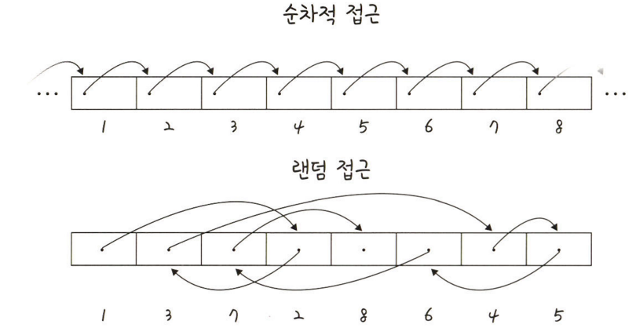

# 5.2.2 배열(Array)
## 2. 배열
- 인덱스를 갖고 있어 순차적으로 데이터가 삽입/삭제될 수 있는 형태의 자료 구조

- 삽입/삭제 : O(n)
- 탐색 : O(1)
   

## 2-1. 배열의 특징
- 같은 타입의 변수들로 구성되어 있음
- 크기가 정해져 있음
- 인접한 메모리 위치에 있는 데이터를 모아놓은 집합
- 중복을 허용하고 순서가 있음
   

## 2-2. 장단점
|장점|단점|
|---|---|
| - 인덱스를 활용하기에 원하는 값에 쉽게 접근 가능 - O(1)|- 중간에 삽입/삭제하기 어렵다. - O(n)|
  

## 2-3. 랜덤 접근과 순차적 접근
- 배열의 경우, **랜덤 접근(random access)** 이 가능

  

  - **랜덤 접근(직접접근)** : 동일한 시간에 배열과 같은 순차적인 데이터가 있을 때 임의의 인덱스에 해당하는 데이터에 접근할 수 있는 기능

  - **순차적 접근** : 저장된 순서대로 검색해야 하는 접근법
   

## 2-4. 배열과 연결리스트 비교
||배열(Array)|연결 리스트(Linked List)|
|---|---|---|
|장점|인덱스를 통한 빠른 접근 가능|삽입/삭제 용이|
|단점|삽입/삭제 오래 걸림|랜덤 접근 불가능, 처음부터 탐색을 진행해야 함|
|용도|빠른 접근이 요구되고, 데이터의 삽입/삭제가 적을 때 사용|삽입/삭제 연산이 잦고, 검색 빈도가 적을 때 사용|
   

---
