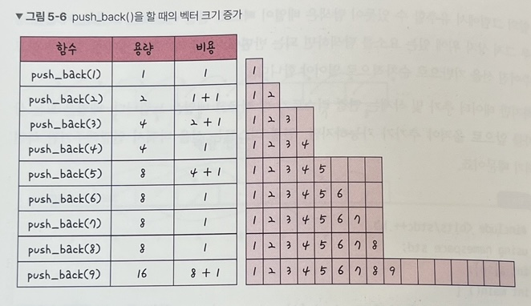
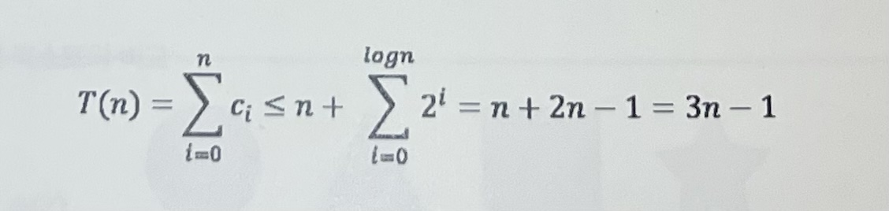
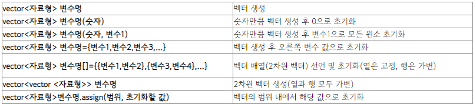
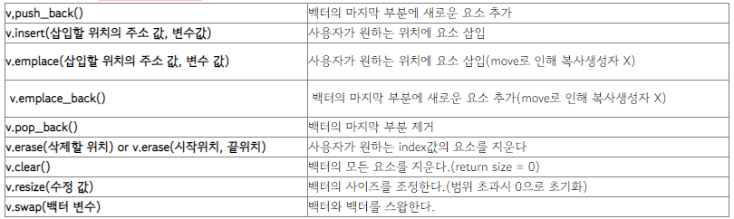

# 5.2.3 벡터

## 벡터 (vector)
- 동적으로 요소를 할당할 수 있는 `동적 배열`
- 배열인데, `동적으로 크기를 확장 또는 축소가 가능`하게 되어있는 자료구조
  - 배열의 문제 중 하나인 고정크기 문제를 해결
- 벡터는 동적 배열 구조 클래스이기 때문에 `초기화 과정에 데이터의 크기를 제공하지 않아도 됨`
  - 예를들어 배열의 경우 크기를 10으로 선언하면 10이 최대이며 더 늘릴 수가 없기 때문에 초기에 넉넉히 공간을 잡아줘야 함
  - 하지만 벡터의 경우 처음에 크기를 10으로 선언해도 나중에 필요에 따라서 추가하거나 줄일 수 있음
- 컴파일 시점에 개수를 모른다면 벡터를 써야함
- 배열의 특징을 그대로 가져옴
  - `중복을 허용`
  - `순서가 있음`
  - 데이터의 위치를 알고 있으면 `랜덤 접근이 가능`함
  - 하지만 중간에 데이터를 삽입 또는 제거하려면 땡기거나 밀어야 되는 단점도 그대로 가져옴
- 탐색과 `맨 뒤의 요소를 삭제하거나 삽입`하는 데 `O(1)`이 걸림 (끝부분에 삽입할땐 빠름)
- 맨 뒤나 `맨 앞이 아닌 요소`를 삭제하고 삽입하는 데 `O(n)`의 시간이 걸림


### push_back() 시간복잡도
- **뒤에서부터 삽입**하는게 `push_back()`
- 벡터의 크기가 증가되는 시간복잡도가 `amortized O(1)`
- push_back()을 한다고해서 매번 크기가 증가하는 것이 아니라, 2의 제곱승+1 마다 크기를 2배씩 늘림



- Ci 를 i번째 push_back()을 할 때 드는 비용(cost)라고 한다면, Ci는 1 또는 1+2^k 이라는 것을 알 수 있음
- n번 push_back()을 한다고 했을때 드는 비용 T(n)은 아래와 같은 식임
- 이를 n으로 나누게 되면 **push_back()을 할때 평균적으로 드는 비용**
- 이것이 바로 3이기때문에, 이는 1이라는 상수 시간보다는 크지만 **상수 시간에 가까운 amortized 복잡도**를 가지는 것




### 벡터의 선언 및 초기화




```c++
#include <iostream>
#include <vector>
int main() {
	// 크기가 0인 벡터 선언
	std::vector<int> vec1;

	// 크기가 10인 벡터 선언
	std::vector<int> vec2(10);
	
	// 크기가 10이고, 모든 원소가 3으로 초기화된 벡터 선언
	std::vector<int> vec3(10, 3);

	// 지정한 초기값으로 이루어진 크기가 5인 벡터 선언
	std::vector<int> vec4 = { 1,2,3,4,5 };

	// 벡터 배열 생성(행은 가변인지만, 열은 고정)
	std::vector<int> vec5[] = { {1,2},{3,4} };
	
	// 2차원 벡터 생성(행과 열 모두 가변)
	std::vector<std::vector<int>> vec6;

	// 벡터 범위를 5로 지정하고 10으로 초기화
	std::vector<int> vec7 = { 1,2,3,4,5 };
	vec7.assign(5, 10);
}
```

### 벡터에 요소 삽입, 삭제, 변경




```c++
#include <iostream>
#include <vector>

int main() {
	// 크기가 0인 벡터 선언
	std::vector<int> vec;

	vec.push_back(10);
	vec.push_back(20);	//vec={10, 20}

	vec.insert(vec.begin() + 1, 100);	//vec={10, 100, 20}
	
	vec.pop_back();		//vec={10,100}
	
	vec.emplace_back(1);	//vec={10,100,1}
	vec.emplace_back(2);	//vec={10,100,1,2}
	vec.emplace(vec.begin() + 2, -50);	//vec={10,100,-50,1,2}

	vec.erase(vec.begin() + 1);	//vec={1,-50,1,2}
	vec.resize(6);	//vec={1,-50,1,2,0,0}
	vec.clear();	//vec=empty()
```


