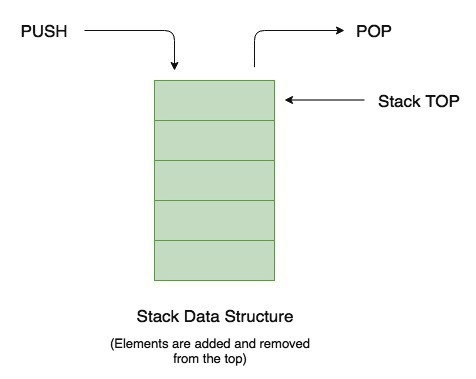

# 5.2.4 스택



- 스택은 **가장 마지막으로 들어간 데이터가 가장 첫번째로 나오는** 성질 (`LIFO`, Last In First Out)을 가진 자료구조
- 재귀적인 함수, 알고리즘에 사용되며 **웹 브라우저 방문 기록** 등에 쓰임
- **삽입 및 삭제** => `O(1)`
- **탐색** => `O(n)`

```c++
#include <iostream>
#include <stack>
using namespace std;


int main(void)
{
	stack<int> s; // 스택생성

	// 삽입(1) - 삽입(2) - 삽입(3) - 삭제() - 삽입(4) - 삽입(5) - 삭제()

	s.push(1);
	s.push(2);
	s.push(3);
	s.pop();
	s.push(1);
	s.push(4);
	s.pop();

	cout << "Is it empty?: " << (s.empty() ? "Yes" : "No") << '\n';

	// 스택의 최상단 원소부터 출력
	while (!s.empty()) // empty : 요소가 없으면 true, 있으면 false
	{
		cout << s.top() << ' '; // top은 맨 위에 있는 요소를 반환한다.
		s.pop(); // 삭제
	}
}
```